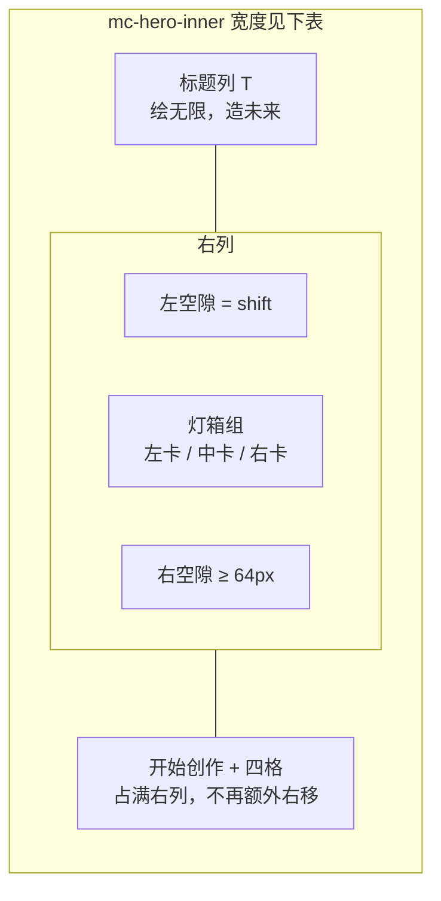
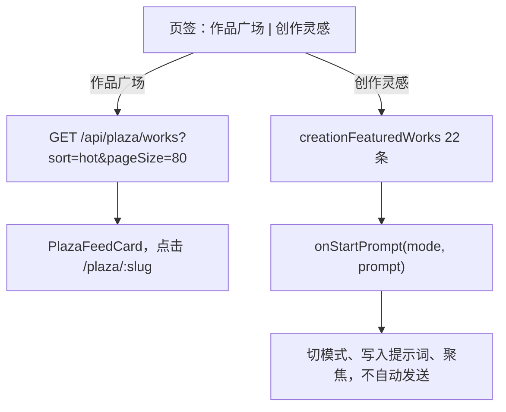
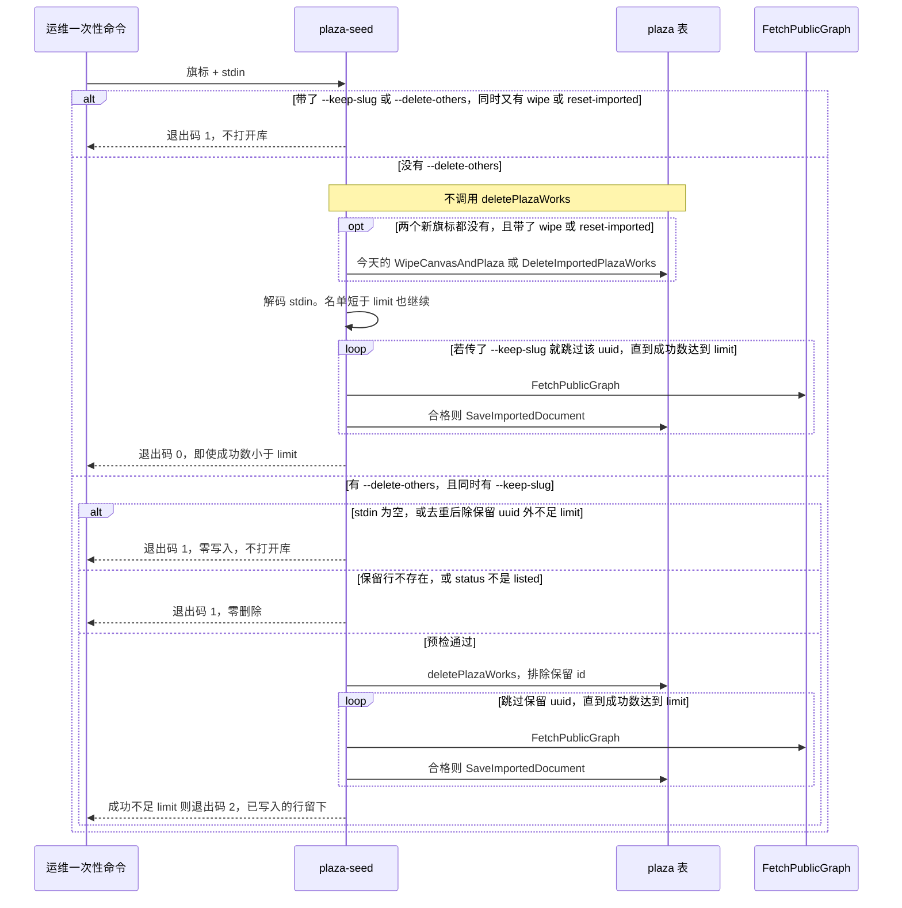
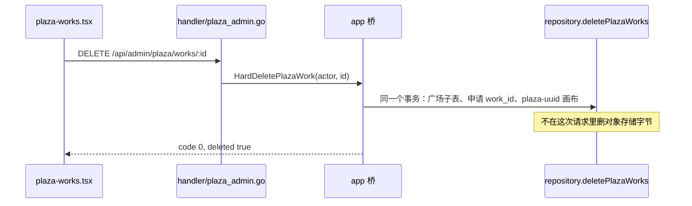
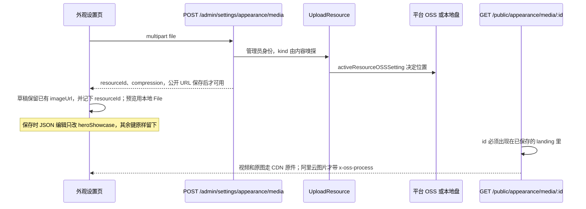

# 首页灯箱、创作灵感与广场重导（v1.5.37）

| 项 | 值 |
| --- | --- |
| 状态 | Draft |
| 作者 | 画布TV |
| 日期 | 2026-09-25 |
| 目标版本 | v1.5.37（一次发版；下面的 PR 是逻辑切片，不是多次上线） |
| 数据库 schema | 保持 `CurrentSchemaVersion = 43`（`backend/internal/database/migrations.go`） |
| 外观 JSON | 保持 `appearanceSchemaVersion = 9`（`backend/internal/app/appearance.go`）。海报与创作模块的新字段写在已有 `landing` JSON 里 |
| 公开首页 | 不改。线上 `/` 已经是漫创页，和 `publicHomepage` 无关：`web/src/main.tsx` 在公开壳里进 `public-application.tsx` → `GuestHomePage` → `ManchuangHomePage`。`publicHomeHref` 不看这个字段，`RootHome` 也固定渲染 `ManchuangHomePage`。`AppearanceSetting.PublicHomepage` 的默认值仍是 `welcome`（`defaultAppearanceSetting` / `normalizePublicHomepage`），本批不改这个默认值，也不要去找一个不存在的开关。不加皮肤加载器 |

**对外文案禁令。** `CHANGELOG.md`、管理端提示、前台按钮、空态和错误 `msg` 不得出现 libtv、lumlum、liblib 或对应域名。用户可见说法只用「公开画布导入」「参考站视觉」。本文是工程说明，可以写导入源的真实主机和文件名，实现时不要把这些字符串抄进 UI。

不要修改 `backend/internal/handler/agent.go`。

---

## Overview

v1.5.36 的漫创首页把「绘无限，造未来」绝对定位在海报灯箱上面，海报行又铺满 `.mc-hero-inner`，标题和横向海报叠在一起。开始创作只有整卡变亮，四格入口右侧是空的 40px 方块。创作页「作品广场」后面还挂着视频 / 图片 / 文本三个筛选，影策原来的 22 条精选灵感（`creationFeaturedWorks`）没有入口。广场管理只能下架。首页海报和四格只能填 URL，不能按 OSS 开关上传，也不会留下压缩地址。

本批只做六件事，并且在 v1.5.37 一次发完：

1. 标题「绘无限，造未来」留在左侧，不再盖住海报。海报卡片尺寸不改：仍是 `aspect-ratio: 5 / 2.8`，中卡仍是 `clamp(340px, 34.72vw, 500px)`。1440px 视口上中卡仍是今天的 500×280，不改成 `fr` 轨道，也不把 `shift` 设成 0。侧卡是中卡的 0.78，比自己的轨道宽 36px，多出的部分画在中卡下面。灯箱组边框按轨道求和。右移量是 `shift = max(0, L / 3)`，其中 `L = 右列宽 − 灯箱组边框 − 64px`，只减一次 64px。右缘视觉空隙是 `64px + 2L/3`，不贴边。1440px 上为了放下这组未缩小的海报，标题列缩短到 96px，`L = 48px`，`shift = 16px`，右空隙 96px。更宽的屏幕标题列最多 280px，`shift` 变大。视口 `< 960px` 才改成标题在上、只留中卡。
2. 「开始创作」在悬停时跟鼠标走一层聚光。四格右侧放上加号、火花、场记板、分镜四枚小图标。海报和底部弧形轨已经有的「悬停才加载一条压缩预览视频」保持不动。
3. 广场只留 slug `0251b9ae0e304f7fb96e353eecfe2204`（《山海奇都之听月楼惊变》）。其余作品硬删除后，用现有双源 `FetchPublicGraph` 从候选清单导入 60 个节点图合格的公开画布。不用 `plaza-featured.json` 充数。管理端可以硬删除，不只是下架。
4. 创作页用「作品广场」「创作灵感」两个页签切换。灵感页签渲染那 22 条静态数据。删掉视频 / 图片 / 文本三个筛选按钮。
5. 海报只需要媒体和链接。开始创作和四格同样可以上传图片或预览视频。OSS 开着就进对象存储并给出压缩 URL；没开就落本地，有 ffmpeg 再出压缩件，没有就用原件并在管理端说明。
6. 发版方式沿用现在的 VERSION、CHANGELOG、部署、推送。schema 不升。

---

## Background & Motivation

### 首页灯箱现在为什么叠在一起

`web/src/pages/public-home/manchuang-home.css`：

- `.mc-hero-inner`：`width: min(1440px, calc(100% - 40px))`，`display: block`，`padding: 88px 0 260px`。
- `.mc-hero-copy`：`position: absolute; left: 0; top: 118px; max-width: min(420px, 32vw); z-index: 8`。
- `.mc-hero-title`：`width: min(720px, 86vw)`。父级只有 420px，标题图仍按最高 720px 画出来，继续向右盖住海报。
- `.mc-hero-banners`：`grid-template-columns: minmax(0, 1fr) clamp(340px, 34.72vw, 500px) minmax(0, 1fr)`，`gap: 12px`，卡片 `aspect-ratio: 5 / 2.8`。
- 视口 1440px 时中卡被 clamp 在 500px，高度 `500 * 2.8 / 5 = 280px`。`.mc-hero-inner` 在这个视口是 `min(1440px, 1440px - 40px) = 1400px`，左右轨各 `(1400 - 500 - 24) / 2 = 438px`。若内容盒真是 1440px，侧轨才是 458px。侧卡并不小，而且整行从内容区左缘开始，所以绝对定位的标题一定压在左卡和中卡上。
- 现有 920px 媒体查询把标题改回文档流，并隐藏左右卡。这只修了窄屏。

悬停预览已经在 `BannerCard`（`manchuang-home.tsx`）里：进入时给按钮加 `is-playing` 并 `play()` 预先写在 DOM 里的 `<video preload="none">`。底部 `HeroRail` 是另一条路径：`pointerenter` 才创建唯一一个 `<video>`，离开就拆掉。这两处不要重写。

聚光变量已经在 `.mc-gate` 上（`--mx: 50%; --my: 40%`）。`glowCards` 只对 `.mc-enterprise-card, .mc-resource-card, .mc-capability-button, .mc-pricing-card, .mc-flow-step, .mc-canvas-stage` 写坐标。`.mc-capability-button::after` 用 `radial-gradient(... at var(--mx) var(--my))`。`.mc-hero-create` 不在这个名单里，悬停只有 `filter: brightness(1.16)` 和 `translateY(-2px)`。

四格图标是空元素：

```tsx
<i className={`mc-hero-tile-icon is-${tile.id}`} aria-hidden="true" />
```

CSS 只给了 `width/height: 40px; border-radius: 12px; background: rgba(255,255,255,0.1)`。默认四格 id 在 `defaultHeroShowcase()`（`web/src/lib/manchuang-landing.ts`）：`tile-model`、`tile-agent`、`tile-director`、`tile-review`。角标 `.mc-hero-tile b` 是 `top: 8px; right: 8px`，会压住右侧图标，要一起挪开。

海报数据默认来自 `web/src/lib/home-posters.json`，经 `mergeManchuangLanding` 填进 `heroShowcase.banners`。线上若已在外观里存过 `landing`，以前端合并结果为准，本批不重置海报内容。类型里有 `workId?`，管理表单没有这个字段，也不要加。

### 创作灵感和广场筛选

`CreationFeaturedWorks`（`web/src/pages/create/creation-workspace.tsx`）只调 `listPlazaWorks({ page: 1, pageSize: 80, sort: "hot" })`，失败时把列表清成 `[]`，没有本地 JSON 回退。这是对的，保持。

它的筛选条是「全部作品」+ `WORK_TAGS`（`web/src/lib/plaza-catalog.ts`）+ 三个模式按钮：

```tsx
{(["video", "image", "text"] as const).map((value) => (
  <button ...>{t(`mode.${value}`)}</button>
))}
```

文案是画布命名空间里的「视频 / 图片 / 文本」。本批删掉这三个按钮。`WORK_TAGS` 仍只出现在作品广场页签里。

22 条灵感在 `web/src/pages/create/creation-inspirations.ts` 的 `creationFeaturedWorks`，类型是：

```ts
type CreationInspiration = {
  title: string;
  description: string;
  image: string;
  mode: CreationMode; // "video" | "image" | "text"
  prompt: string;
  featured?: boolean;
  source?: string;
};
```

`web/test/creation-inspirations.test.ts` 锁定 22 条、标题唯一、`prompt.length > 35`、封面文件存在于 `web/public/`、其中 8 条带 `source`，`inspirationSource.license` 为 `CC0-1.0`。页面目前没有 import 这个模块。父组件 `web/src/pages/create/index.tsx` 已经把 `onStartPrompt` 传进来，子组件参数名是 `_onStartPrompt`，没有使用。点灵感应当走这条已经接好的路径：`setAgentMode(false)`、`selectMode(mode)`、`setPrompt(prompt)`、聚焦输入框。不自动提交，也不跳进 `/plaza/:slug`。

`web/src/pages/plaza/tour.tsx` 的复制失败分支还会 `featuredBySlug(slug)`，从 `web/src/lib/plaza-featured.json` 造一份本地图。广场重导之后这条路径会把已经删掉的作品又复制出来。要去掉。`PortalHomePage`（`portal-home.tsx`）也读了这份 JSON，但没有任何路由引用它。本批不删文件、不删未挂载页面，只保证创作页和参观复制不再用它当广场数据源。

### 广场导入和删除的现状

公开列表在 `plaza.Service.ListWorks`：`pageSize <= 0 || pageSize > 48` 时被改成 24，不是钳到 48。创作页请求 80，实际只拿回 24 条。导入 61 条之后这个脚枪会让广场看起来像没导全。管理列表 `AdminWorks` 在 `pageSize > 100` 时改成 20。管理页 `plaza-works.tsx` 只请求 `pageSize: 50`，且只有 `status === "listed"` 才显示下架。

下架是 `POST /api/admin/plaza/works/:id/take-down` → `plaza.Service.TakeDown`：把 `status` 写成 `taken_down`，记审计 `plaza.work.take_down`。公开读取 `listedWork` 对非 `listed` 返回 404。没有硬删除接口。

导入入口有两个，底层是同一个函数：

- CLI：`infinite-canvas-backend plaza-seed`（`backend/cmd/server/main.go`、`plaza_seed.go`），stdin 是 `[]PlazaExternalSeedItem`。
- 管理接口：`POST /api/admin/plaza/seed-external`。本批的清库重导不走这个 HTTP 接口，避免把 60 次外网抓取放进请求超时里。

`app.Service.SeedPlazaExternal`（`backend/internal/app/plaza_seed.go`）对每条调用 `fetchSeedCanvas` → `auth.Service.FetchPublicGraph`。合格条件在两处重复，都要保留：

- `publicGraphUsable`：`ImportedNodeCount >= 3 && ImportedConnectionCount >= 1`（`backend/internal/auth/libtv.go`）。
- `plaza.Service.SaveImportedDocument`：文档 `nodes` 不少于 3 且 `connections` 不少于 1，否则 400「没有制作过程」。

`FetchPublicGraph` 的顺序已经是双源，不要调换：

1. `fetchAdaptedGraph(..., requireCopy=false)`，请求 `https://api.liblib.tv/api/canvas/project/detail?uuid=`，头里带库存的 LibTV token。未启用或没 token 时直接失败。
2. 第一步结果不合格时再 `FetchLumlumPublicCanvas`，`GET https://api.lumlum.tv/api/v1/public_canvas/{id}`，不带 token。

成功上限现在写死 `report.Imported >= 80`。`DisplayOnly` 字段存在但种子函数不看它，不合格图一律跳过。这正是要的行为。

已导入行的 `source_project_id` 是 `ext:{uuid}`。`DeleteImportedPlazaWorks` 会删掉所有 `ext:%`，包括要保留的那一条，不能直接用。`WipeCanvasAndPlaza` 还会 `DELETE FROM canvas_projects` 和分享、单元链接。重导禁止调用它。

保留作品在候选文件 `.local/plaza-seed-80.json` 里。该文件是 80 个不重复 uuid。保留行的 uuid 和 slug 都是 `0251b9ae0e304f7fb96e353eecfe2204`，存下来的标题字符串是 `《山海奇都之听月楼惊变》`（书名号在字符串里，不是散文里的括号）。这一文件里每一行的 `authorId` 都是 `4feba512bfa52a601ce593358b0fbd78`，没有 `plaza-demo`。`.local/plaza-seed-liblib.json` 是另外 19 个 uuid，`authorId` 全是 `plaza-demo`，而且不含保留 slug，不能单独当这次的名单。两份文件都在 `.local/`，不进 git。

`SeedPlazaExternal` 今天只把空字符串和 `plaza-demo` 换成 `FirstAdmin()`。80 人这份文件的作者 id 会原样写进 `plaza_works.author_id` 和 `canvas_projects.user_id`（没有外键，公开作者会显示成「创作者」）。重导时若 `authorId` 在本地 `users` 里不存在，改为 `FirstAdmin()`。`plaza-demo` 这条替换只和 19 条那份文件有关。

`saveImportedCanvasProject` 把图存成管理员画布，id 为 `plaza-{imported.ProjectUUID}`。硬删除导入作品时只删这种 id，并且 `user_id` 必须等于该作品的 `author_id`。

### 上传现在停在 URL 文本框

外观资源上传是按槽位的：`POST /api/admin/settings/appearance/assets/:slot`，槽位只有 `logo | logo-dark | video | poster | landing-video`（`web/src/services/api/appearance.ts`）。Logo 强制本地盘；其余走 `UploadResource`，由 `activeResourceOSSSetting` 决定平台 OSS 或本地（`backend/internal/app/resource.go`）。登录页海报上限 10MB，视频槽 256MB（`appearancePosterMaxBytes`、`appearanceVideoMaxBytes`）。

首页海报不走这个上传。`appearance-settings-page.tsx` 的「首页海报与创作模块」是四列文本框：标题、图片 URL、悬停视频 URL、链接。保存进 `system_settings` 的外观 JSON，`Landing` 是 `json.RawMessage`，后端不解析灯箱结构。

图片压缩只在浏览器：`ossProcessedImage`（`web/src/lib/oss-image.ts`）对阿里云、`cdn.j11.net`、`liblib.art`、`liblib.cloud`、以及 host 以 `j11.net` 结尾的 URL 追加

```text
x-oss-process=image/resize,w_{width},m_lfit/format,webp/quality,q_80
```

`width` 钳在 32–1920，已有该参数则不重复追加。相对路径会用 `https://canvas.j11.net` 当 base，host 落在 `j11.net` 上，所以创作灵感的 `/short-drama-styles/*.jpg` 不能再套这个函数。

视频侧，`maybeStartPlaybackTranscode`（`backend/internal/app/video_transcode.go`）只处理本地 H.265 / MPEG-4，OSS 原件明确不转码。`runH264Transcode` 用 ffmpeg 出 H.264 + AAC、CRF 23、原尺寸偶数化。后端镜像 `backend/Dockerfile` 没有安装 ffmpeg。压缩必须能在没有 ffmpeg 时退回原件。

对象存储的 CDN 直链由 `ossCDNObjectURL` 拼出来，不带签名，可以长期放在首页。没有 CDN 的签名地址 TTL 是 `directResourceURLTTL = 5 * time.Minute`。这种 URL 不能写进 `landing` JSON。

公开读外观文件的现成路由是 `GET /api/public/appearance/assets/:slot`，一个槽一个文件，不够给多张海报用。

---

## Goals & Non-Goals

### Goals

- 桌面端标题和海报不重叠。海报比例保持 `5 / 2.8`。中卡继续用今天的 `clamp(340px, 34.72vw, 500px)`，1440px 视口上仍是 500×280，禁止改成 `1fr` 或 `0.72fr`。侧卡宽是中卡的 0.78。灯箱组按「轨道宽 = 侧卡 − 36px」求和后右移 `L/3`，右空隙至少 64px。装不下时缩短标题列或把 12px 列间隙收成 0，不缩小海报。
- 视口宽度 `< 960px` 时标题在上、只留中卡、不右移、不重叠。这覆盖原来的 `< 900px`，也盖住三卡组在数学上放不下的一段。
- 「开始创作」悬停聚光跟随指针；`prefers-reduced-motion: reduce` 时关掉。
- 四格右侧 40px 圆角方块里有对应 SVG，角标不再盖住图标。
- 保留指定 slug 的广场作品，硬删除其他广场作品，再导入 60 个合格公开图。
- 管理端对任意状态的作品可硬删除，带确认，写审计，级联快照和互动行。
- 创作页两个页签。灵感只用本地 22 条。广场页签去掉视频 / 图片 / 文本。
- 海报、开始创作、四格都能上传图片和可选预览视频；存储跟随平台 OSS 开关；响应里带压缩 URL 和压缩方式。
- 公开媒体只允许被当前 `landing` 引用的资源 id。
- 一次版本号 v1.5.37。schema 仍是 43。

### Non-Goals

- 不新做首页，不改 `public-application.tsx` 的 `/`，不改 `publicHomepage` 的默认值，不加皮肤加载器，不改 GitHub 仓库名。`portal-home.tsx` 仍然没有任何路由引用，文件留着。
- 不改底部弧形轨的运动和它悬停才创建一条视频的方式。开始创作和四格只有在投影后的 `previewUrl` 非空时才悬停播放，做法与 `BannerCard` 相同（`preload="none"`，进入播放，离开暂停并回到 0）。没有预览地址就不放 `<video>`。
- 不把 22 条灵感写进 `plaza_works`，不做灵感后台 CRUD。
- 不删除 `web/src/lib/plaza-featured.json` 和未挂载的 `portal-home.tsx`。
- 不调用 `WipeCanvasAndPlaza`，不清理普通用户画布。
- 不升 schema，不为旧海报字段做兼容层以外的双读。已存的 `imageUrl` / `href` 继续有效。
- 不改 `backend/internal/handler/agent.go`。
- 不在本批把 ffmpeg 装进生产镜像。没有 ffmpeg 就用原件并提示。
- 不改广场投稿、审核、下架的现有语义。硬删除是加出来的第二条操作。
- 不自动在进程启动时重导广场。

---

## Proposed Design

### 1. 首页几何

标题和灯箱改成同一行的两列。标题列参加布局，不再 `position: absolute`。灯箱组的边框宽度等于网格轨道之和。右移只使用下面这一句：`L = 右列宽 − 灯箱组边框 − 64px`，`shift = max(0, L / 3)`。不要写成 `(L − 64px) / 3`，64px 已经在 `L` 里减过一次。右空隙 = `右列宽 − shift − 灯箱组边框` = `64px + 2L/3`。`L ≥ 0` 时右空隙至少 64px。



只有这一行的内容宽改成 `min(1840px, 100%)`。导航仍是 `min(1240px, calc(100% - 28px))`。右缘的 64px 留在右列里面，不再从这一行的外边距里预扣，否则 1440px 视口会少掉 64px，未缩小的灯箱组就放不下。书法资源文件不动。标题图改为 `width: 100%`，不再用 `min(720px, 86vw)`。`padding-top: 30px` 对齐现在的 `top: 118px` 减行内 `padding-top: 88px`。

盒子只有一套。侧卡视觉宽度是 `side = 0.78 * center`。网格轨道是 `side - 36px`，不是 `side`。灯箱组边框是：

```text
cluster = 2 * (side - 36px) + center + 2 * gap
```

`gap` 默认 12px。中卡不要再写 `margin-inline: -36px`。负外边距不会缩小轨道，上次把 72px 从宽度里减掉、轨道却仍按 390px 排，边框是 1232px、墨水是 1304px，多出来的部分会被 `.mc-hero { overflow: hidden }` 裁掉。侧卡自己的 `width` 仍是 `side`，左卡 `justify-self: start`，右卡 `justify-self: end`，所以每张侧卡比轨道多出的 36px 朝中卡画。灯箱组和 `.mc-hero-banners` 都 `overflow: visible`，这 36px 才能画到中卡下面。多出来的 36px 朝内，不伸出灯箱组边框：左卡从 0 画到 `side`，右卡的右缘对齐组的右缘。12px 的列间隙占掉其中 12px，中卡盒子实际盖住侧卡位图 24px。中卡 `z-index: 2`，侧卡 `z-index: 1`，侧卡 `opacity: 0.75`。这 36px 是轨道内缩，不是第二套负外边距。`.mc-hero` 继续 `overflow: hidden`，因为灯箱组边框落在行内，侧卡不会探出组的边框。

中卡在 1440px 和 1920px 视口都是 500×280，和今天的 clamp 一样。下面的表按这个边框算，不是按「侧卡轨道也是 390px」算。

| 视口 | 行宽 W | 中卡 | 侧卡视觉宽 | 灯箱组边框 | 标题列 | L | shift | 右空隙 |
| --- | --- | --- | --- | --- | --- | --- | --- | --- |
| 1920 | 1840 | 500×280 | 390 | 1232 | 280 | 264 | 88 | 240 |
| 1680 | 1680 | 500×280 | 390 | 1232 | 280 | 104 | 35 | 133 |
| 1440 | 1440 | 500×280 | 390 | 1232 | 96 | 48 | 16 | 96 |
| 1280 | 1280 | 444×249 | 346 | 1090 | 78 | 48 | 16 | 96 |
| 1024 | 1024 | 356×199 | 277 | 862 | 72 | 26 | 9 | 81 |
| ≤959 | 堆叠 | 仍用 clamp，只留中卡 | 隐藏 | 无 | 100% | 不适用 | 无灯箱组 | 无 |

标题列是 `clamp(72px, W - cluster - 64px - 48px, 280px)`。中间那项把首选的 `L` 留成 48px，所以标题还没顶到 280px 时 `shift` 是 16px、右空隙是 96px。1440px 上这一项正好是 96px，中卡仍是 500×280。标题列从今天会溢出的 420–720px 缩短到 96px，两行书法会变小，这是为了不缩小海报。视口再宽，标题列最多长到 280px，多出来的宽度全部进 `L`，`shift` 跟着变大。1280px 的中卡是 444px，因为 `34.72vw` 今天在这个视口就是 444px，不是新的缩小。

视口 960–981px 时 `34.72vw` 已经被 clamp 抬到 340px，12px 间隙会把 `L` 压成负数。这一段只把 `gap` 设为 0，卡片像素不变，灯箱组少 24px。960px、gap 0、标题列 72px 时：`cluster = 798`，`L = 26`，`shift = 9`，右空隙 81px。

视口 `< 960px` 堆叠，和现在 920px 查询里对灯箱做的事一样：标题在上且 `max-width: 100%`，左右卡 `display: none`，中卡没有负外边距、没有右移，`.mc-hero-actions` 单列。不要在 900–1779px 用 `0.72fr 1fr 0.72fr`，那个布局会把 1440px 的中卡收成大约 400px，并且 `shift = 0`。现有 `@media (max-width: 920px)` 里的导航隐藏、流程时间线和定价单列不动。灯箱规则从那条查询里挪到 `max-width: 959px`，避免两套规则抢同一批属性。

任何宽度都不要用 `transform: scale()` 改卡片布局尺寸。中卡悬停可以继续 `scale(1.04)`，那只是 hover，不参加宽度计算。`prefers-reduced-motion` 里把 `.mc-hero-banner` 加进已经关掉 transform 的那条规则。

箭头现在按整行的 50% 定位（`.mc-hero-banner-nav.is-prev/is-next`）。灯箱组变窄之后，箭头改挂在灯箱组上。中卡左缘在 `track + gap`，44px 按钮再往外 8px，所以是 52px：

```css
.mc-hero-banner-nav.is-prev {
  left: calc(var(--mc-track-side) + var(--mc-banner-gap) - 52px);
}
.mc-hero-banner-nav.is-next {
  right: calc(var(--mc-track-side) + var(--mc-banner-gap) - 52px);
}
```

圆点和箭头放进 `.mc-hero-banner-cluster`，跟卡片一起吃 `margin-left: var(--mc-shift)`。开始创作和四格不进这个 cluster，它们占满右列，不再额外右移。

`.mc-hero-inner` 是容器，`100cqi` 在子元素 `.mc-hero-top` 上取行宽。网格用 `align-items: start`，不要写 `flex-start`。`100%` 在 cluster 上是右列的宽度，不是整行。

```css
.mc-hero-inner {
  width: min(1840px, 100%);
  padding: 88px 0 260px;
  container-type: inline-size;
}
.mc-hero-top {
  --mc-center: clamp(340px, 34.72vw, 500px);
  --mc-side: calc(var(--mc-center) * 0.78);
  --mc-overlap: 36px;
  --mc-banner-gap: 12px;
  --mc-track-side: calc(var(--mc-side) - var(--mc-overlap));
  --mc-cluster: calc(var(--mc-track-side) * 2 + var(--mc-center) + var(--mc-banner-gap) * 2);
  --mc-right-min: 64px;
  --mc-title: clamp(72px, calc(100cqi - var(--mc-cluster) - var(--mc-right-min) - 48px), 280px);
  display: grid;
  grid-template-columns: var(--mc-title) minmax(0, 1fr);
  align-items: start;
}
.mc-hero-copy {
  position: relative;
  left: auto;
  top: auto;
  width: 100%;
  max-width: none;
  padding-top: 30px;
  z-index: 4;
}
.mc-hero-title,
.mc-hero-title img { width: 100%; }
.mc-hero-banner-cluster {
  --mc-shift: max(0px, calc((100% - var(--mc-cluster) - var(--mc-right-min)) / 3));
  width: var(--mc-cluster);
  margin-left: var(--mc-shift);
  overflow: visible;
}
.mc-hero-banners {
  display: grid;
  width: 100%;
  overflow: visible;
  grid-template-columns: var(--mc-track-side) var(--mc-center) var(--mc-track-side);
  gap: var(--mc-banner-gap);
  align-items: center;
}
.mc-hero-banner { aspect-ratio: 5 / 2.8; }
.mc-hero-banner.is-main { position: relative; z-index: 2; margin-inline: 0; }
.mc-hero-banner.is-side { position: relative; z-index: 1; width: var(--mc-side); opacity: 0.75; }
.mc-hero-banner.is-side.is-left { justify-self: start; }
.mc-hero-banner.is-side.is-right { justify-self: end; }
@media (max-width: 981px) and (min-width: 960px) {
  .mc-hero-top { --mc-banner-gap: 0px; }
}
@media (max-width: 959px) {
  .mc-hero-top { display: block; }
  .mc-hero-copy { max-width: 100%; margin-bottom: 18px; }
  .mc-hero-banner-cluster { width: 100%; margin-left: 0; }
  .mc-hero-banners { grid-template-columns: minmax(0, 1fr); }
  .mc-hero-banner.is-side { display: none; }
  .mc-hero-banner.is-main { width: 100%; }
}
```

轨道之和就是 `--mc-cluster`：1440px 和 1920px 上是 `2 * 354 + 500 + 24 = 1232`。`justify-self` 让侧卡的 390px 画进这 1232px 里面，不再另加 72px。

### 2. 开始创作聚光和四格图标

`glowCards` 的选择器加上 `.mc-hero-create`。坐标仍然写在卡片自己身上，不写到 `.mc-gate`，避免整页跟着亮。

```css
.mc-hero-create { position: relative; overflow: hidden; isolation: isolate; }
.mc-hero-create::before {
  content: "";
  position: absolute;
  inset: 0;
  z-index: 0;
  pointer-events: none;
  opacity: 0;
  background:
    radial-gradient(180px 140px at var(--mx, 50%) var(--my, 40%), rgba(255, 255, 255, 0.28), transparent 60%),
    radial-gradient(320px 200px at var(--mx, 50%) var(--my, 40%), rgba(163, 224, 40, 0.22), transparent 68%);
  mix-blend-mode: screen;
  transition: opacity 0.2s ease;
}
.mc-hero-create:hover::before { opacity: 1; }
.mc-hero-create > * { position: relative; z-index: 1; }
```

亮度和 `translateY(-2px)` 保留，聚光是加在上面的。`prefers-reduced-motion: reduce` 时 `::before { display: none }`，并去掉这一张卡的 `translateY`。不要给四格加聚光。

四格图标按默认 id 画 20×20 的 `currentColor` SVG，放进现有 40×40、圆角 12px 的盒子，背景改为 `rgba(255,255,255,0.16)`。盒子已经在文字右边（`justify-content: space-between`）。映射：

| id | 默认标题 | 图标 |
| --- | --- | --- |
| `tile-model` | 新模型 | 加号 |
| `tile-agent` | Agent 助手 | 四角火花 |
| `tile-director` | 导演台 | 场记板 |
| `tile-review` | 逐帧拉片 | 三格分镜 |

未知 id 用加号。角标从 `right: 8px` 改到标题行内，跟在 `<strong>` 后面，避免盖住图标。图标是装饰，`aria-hidden` 保留。不要用空 `<i>` 再靠 CSS 画，把 SVG 放进组件，按 `tile.id` 分支即可，不必上图标库。

管理员若改了四格标题但没改 id，图标仍跟 id 走。默认四条的 id 不要在种子数据里改掉。

海报和弧形轨的悬停视频逻辑不改。`BannerCard` 继续用 `ossProcessedImage(imageUrl, 中卡 1400 / 侧卡 800)`。若该 URL 已带 `x-oss-process`，函数会原样返回。

### 3. 创作页两个页签



`CreationFeaturedWorks` 增加 `tab: "plaza" | "inspirations"`，默认 `plaza`。标题改成 `role="tablist"`，两个按钮是 `role="tab"`，用 `aria-selected`，不要用 `aria-pressed`。选中态的颜色可以跟现在的筛选按钮一样。筛选按钮如果还留在广场页签里，它们继续用 `aria-pressed`。

- 哈希 `#inspirations` 打开灵感页签，`#plaza` 和没有哈希打开广场。页签切换用 `history.replaceState` 改哈希，不新增路由。导航里已有的 `/create#plaza` 继续落到广场。
- 广场页签删掉 `video` / `image` / `text` 三个按钮，以及只为它们服务的 `filter === "video" | "image" | "text"` 分支。`全部作品` 和 `WORK_TAGS` 留在这个页签。
- 灵感页签不显示标签条。数据就是 `creationFeaturedWorks`，不请求广场接口。封面用 `item.image` 原路径，不经过 `ossProcessedImage`。副标题用 `description`。可以在卡片上写模式名（文本 / 图片 / 视频），这是卡片信息，不是被删掉的筛选。不要显示 `source`（Storyteller 等），来源只留在数据和测试里。
- 点击灵感调用 `onStartPrompt(item.mode, item.prompt)`。把参数名从 `_onStartPrompt` 改回去。不要 `navigate(/plaza/...)`。
- 两个页签都沿用现在的 16 条分页和 `IntersectionObserver`。灵感最多 22 条，滚一次就完。
- 计数文案：广场仍是「N 个作品」；灵感是「22 个灵感」。
- `tour.tsx` 的 `onCopy` 在没有 `workId` 时直接失败「作品不存在」，删掉 `featuredBySlug` / `featuredTourProject` 的调用。若这两个函数随后没有引用，可以留在 `plaza-catalog.ts`，不要为了删干净去改 `plaza-featured.json`。

列表上限要先改，否则页签仍只看到 24 条。`ListWorks` 里 `pageSize > 48` 不要再写成 24；钳到 80：

```go
if pageSize <= 0 {
    pageSize = 24
}
if pageSize > 80 {
    pageSize = 80
}
```

创作页继续请求 `pageSize: 80`。61 条在一页里。`AdminWorks` 同样改成钳到 100，不要超过 100 就落回 20。`web/src/pages/admin/plaza-works.tsx` 今天写死 `pageSize: 50` 且没有翻页，导入之后会看不见最后 11 条，删除按钮也点不到它们。这一页改成请求 `pageSize: 100`（或按返回的 `total` 做翻页）。61 条用 100 的一页就够。这处改动算在硬删除那个 PR 里，不要只写在这里。

### 4. 广场：留一条、删其余、导入 60



保留键是 slug，不是标题：

```text
0251b9ae0e304f7fb96e353eecfe2204
```

公开地址仍是 `https://canvas.j11.net/plaza/0251b9ae0e304f7fb96e353eecfe2204`。导入循环跳过这个 uuid / slug，不更新这一行的封面、标题、快照和计数。

CLI 增加三个旗标。不带 `--keep-slug` 且不带 `--delete-others` 时，今天的 `--wipe-canvas-plaza` 和 `--reset-imported` 行为不动，但本批运行手册不使用它们。一带上新旗标，旧旗标就变成错误：

| 旗标 | 本批正式运行的值 | 不传时 |
| --- | --- | --- |
| `--keep-slug` | `0251b9ae0e304f7fb96e353eecfe2204` | 空。空则不允许 `--delete-others`，直接退出码 1 |
| `--delete-others` | 打开 | 不删除，只按今天的 upsert 导入 |
| `--limit` | `60` | `80`，取代写死的 `report.Imported >= 80` |

今天的 `runPlazaSeed` 在读 stdin 之前就处理 `--wipe-canvas-plaza` 和 `--reset-imported`（`backend/cmd/server/plaza_seed.go`）。`--reset-imported` 走 `DeleteImportedPlazaWorks`，会删掉每一个 `source_project_id LIKE ext:%`，保留 slug 如果也是导入行就会先被删掉。`--wipe-canvas-plaza` 调用 `WipeCanvasAndPlaza`，无用户条件地清空 `canvas_projects`、`canvas_shares`、`canvas_unit_links`。新旗标不能加进那个旧循环的后面。

三条路径。只有 `--delete-others` 会调用 `deletePlazaWorks`。另外两条路径一步都不进下面的预检和删除。

**两个新旗标都没有。** 保持今天的顺序，不要套用下面的预检：

1. 若带了 `--wipe-canvas-plaza`，先 `WipeCanvasAndPlaza`。否则若带了 `--reset-imported`，先 `DeleteImportedPlazaWorks`。这仍然发生在读 stdin 之前，和现在的 `runPlazaSeed` 一样。
2. 解码 stdin。JSON 不合法则失败。空数组 `[]` 是合法输入，导入 0 条，退出码 0。
3. `SeedPlazaExternal`，limit 用默认 80。名单短于 80 也退出码 0，不写 `shortfall` 失败。不跳过任何 uuid，因为没有 `--keep-slug`。

**只有 `--keep-slug`，没有 `--delete-others`。** 不调用 `deletePlazaWorks`，也不要求保留行已经 `listed`，也不要求候选条数不少于 limit。

1. 若同时还带了 `--wipe-canvas-plaza` 或 `--reset-imported`，在 `database.Open` 之前退出码 1。
2. 解码 stdin。JSON 不合法则失败。空数组退出码 0，删除数是 0。
3. 打开库，按 `--limit`（默认 80）导入。uuid 等于 `--keep-slug` 的记录跳过，不更新那一行。作者不存在时改用 `FirstAdmin()`。不合格图跳过。成功数小于 limit 时退出码 0。
4. 测试要锁住这一条：`--keep-slug` 单独出现、保留行是 `listed`、去掉保留 uuid 之后的候选数大于 limit、结果 `deleted = 0`。

**`--delete-others`。** 必须同时有 `--keep-slug`，否则在 `database.Open` 之前退出码 1。这一条才跑预检和删除。任何预检失败都还没有调用 `deletePlazaWorks`：

1. 先解析旗标，先不调用 repository，也不要 `database.Open`。只要同时还出现 `--wipe-canvas-plaza` 或 `--reset-imported`，退出码 1。`WipeCanvasAndPlaza` 从这条路径不可达。
2. 再解码 stdin。JSON 不合法，或解码结果是空数组，退出码 1，零写入。
3. 按 uuid 去重（trim，小写）。先出现的、带标题和封面的记录优先。丢掉空 uuid。数一数不等于保留 slug 的 uuid。这个数小于 `--limit` 就退出码 1，仍然零写入，并且仍然不打开库。不要为了凑数先去拉公网。保留 uuid 自己不计入这 60 个。
4. 现在才打开数据库。`PlazaWorkBySlug(keep)` 必须命中，而且 `status` 必须是 `listed`。缺失、或是 `taken_down` / `unlisted`，退出码 1，零删除。种子不会把这一行改成 `listed`，也不会改它的 `allowProcessView`。验收「61 条都是 listed 且允许参观」依赖这一行在开跑前已经是 listed；命令不会替它改状态。
5. 只调用下一节的 `deletePlazaWorks`（排除保留 id 之后的那一批）。不要调用 `WipeCanvasAndPlaza`，不要调用 `DeleteImportedPlazaWorks`。
6. 再导入。作者 id 在本地 `users` 不存在时改用 `FirstAdmin()`。仍要求 `fetchSeedCanvas` 合格。不要读 `displayOnly`，不要读 `plaza-featured.json`。跳过保留 uuid。若 `canvas_projects.id = plaza-{uuid}` 已经属于别的 `user_id`，这一条记失败，错误写「画布主键仍被其他用户占用」，不要删那一行。本批正式运行里，被删作品的作者就是原来的 `4feba512bfa52a601ce593358b0fbd78`，`deletePlazaWorks` 会按这个 `author_id` 删掉对应的 `plaza-{uuid}`，随后 `FirstAdmin()` 才能插入。
7. 成功数达到 `limit` 就停。中途上游失败留下的是「保留行 + 已经成功的若干条」。退出码 2，不回滚这些成功行。报告里的 `shortfall = limit - imported`。再跑一次带 `--delete-others` 会先删掉这些半成品再导，这是故意的。不要在已经成功之后无目的地重跑。退出码 2 只属于这一条路径。

`POST /api/admin/plaza/seed-external` 仍调用 `AdminSeedPlazaExternal` → `SeedPlazaExternal`，limit 固定 80，请求体里不能出现删除旗标。HTTP 不能清空广场。

报告在现有 `PlazaSeedReport` 上加字段，不新造接口：

```go
type PlazaSeedReport struct {
    Imported int      `json:"imported"`
    Failed   int      `json:"failed"`
    Reset    int      `json:"reset,omitempty"`
    Deleted  int      `json:"deleted,omitempty"`
    KeptSlug string   `json:"keptSlug,omitempty"`
    Shortfall int     `json:"shortfall,omitempty"`
    Skipped  int      `json:"skipped,omitempty"`
    Errors   []string `json:"errors,omitempty"`
}
```

`Errors` 继续是「slug: 原因」。CLI 可以保留现在这种「HTTP {status}」文本。`msg`、管理端提示和 CHANGELOG 不写上游主机名。每一条候选最多打两个上游，各 20 秒（`libtv.go` 和 `lumlum.go` 里的 `OutboundHTTPClient(20 * time.Second)`）。60 条都双超时的上限是 40 分钟，不是 2–15 分钟。不在启动时跑。HTTP 种子不承担这次清空。

候选文件用仓库外的 `.local/plaza-seed-80.json`。正式运行带 `--delete-others --limit=60`，所以要做删除路径的第 3 步计数：80 个 uuid 里除掉保留 slug 还有 79 个，大于 60，预检才过。同一文件若只带 `--keep-slug`、不带 `--delete-others`，不删任何行，只跳过保留 uuid 再导入。`plaza-seed-liblib.json` 只有 19 条；在 `--delete-others --limit=60` 下第 3 步退出码 1，不会删数据。不带 `--delete-others` 时，19 条这样的短名单按今天的规则导入能导入的，退出码 0。合格图不够 60 时补的是新的公开 uuid，不是本地假图。验收时把保留行的标题和库里的字符串逐字比较，包括书名号。

导入成功的行维持今天的形状：`source_project_id = ext:{uuid}`，`slug` 用候选里的 slug（名单里就是 uuid），`AllowProcessView` 和 `AllowCopy` 都为 true，封面优先用候选 `coverUrl`，空则从节点 `metadata.content` 里挑 http 图片或视频（`importedCoverWatch`）。同时 upsert 管理员画布 `plaza-{projectUUID}`。

### 5. 硬删除

管理端在 `web/src/pages/admin/plaza-works.tsx` 每一行加「删除」，`listed` 和 `taken_down` 都显示。下架按钮保持原样。确认框用受控 `Modal`，不要 `Modal.confirm`（前端 lint 禁止静态 `Modal.confirm`）。操作者必须输入与该行 `title` 完全一致的文字，确定按钮才可点。说明写两句：公开页、参观和成片都会消失，不能靠重新上架恢复；已经复制到用户账号里的画布不删。



新路由放在 `RegisterPlazaAdminRoutes`，紧挨现有 take-down：

```text
DELETE /api/admin/plaza/works/:id
```

处理函数只做登录、`RequireAdmin`（经 service）、调 service、返回信封。业务放在 `plaza.Service`，`app` 只做别名，和 `TakeDownPlazaWork` 一样。

管理员单条删除和 `DeletePlazaWorksExceptSlug` 都只调用同一个 repository 函数 `deletePlazaWorks(tx, ids)`。种子 PR 不允许再抄一份级联。`DeleteCanvasProject`（`backend/internal/repository/repository.go`）自己开事务，不能在这个事务里面再调它，否则是另一条连接上的事务。把它的四句 SQL 抄到同一个 `tx` 上。

`deletePlazaWorks` 在一个事务里，对这批 `work_id`：

1. `plaza_likes`
2. `plaza_events`
3. `plaza_work_tags`
4. 读出 `plaza_snapshots` 和 `plaza_snapshot_assets`，然后删资产行和快照行。没有评论表，不要为了删除去加评论表或升 schema。
5. 对每一个 `source_project_id` 形如 `ext:{uuid}` 的作品，只处理 `canvasID = "plaza-" + uuid` 且 `user_id = work.author_id` 的那一行，语句与 `DeleteCanvasProject` 相同：
   - `DELETE FROM canvas_shares WHERE user_id = ? AND project_id = ?`
   - `DELETE FROM canvas_unit_links WHERE canvas_id = ?`
   - `UPDATE tasks SET project_id = '' WHERE user_id = ? AND project_id = ?`
   - `DELETE FROM canvas_projects WHERE id = ? AND user_id = ?`
6. 其他 `canvas_projects` 不删。id 不是 `plaza-{uuid}` 的不删。`user_id` 不是该作品 `author_id` 的同名主键不删。普通用户画布，哪怕标题很像，也不删。
7. `plaza_applications.work_id` 置空字符串。申请行保留。
8. 最后删 `plaza_works`。

广场系统用户的媒体不在这个事务里删字节。收集这些 id：`plaza_snapshot_assets.asset_id`，以及作品和快照上的 `cover_asset_id` / `watch_asset_id`。只把其中 `user_id = model.PlazaSystemUserID` 的 id 写进审计（最多 20 个，另加总数）。对象留下，等现有的 `cleanupDetachedUserResources` 在确认没有任何引用之后再收。这样 SQL 还原时文件还在。导入作品多数只有 `cover_external_url` / `watch_external_url`，没有这些资源。

审计动作：`plaza.work.hard_delete`，目标类型 `plaza_work`，metadata 只放 `slug`、`title`、`sourceProjectId` 和上面那份资源 id 摘要。不要写快照 JSON，不要写 token。

公开 `GET /api/plaza/works/:slug` 在行被删后走现有 404。下架过的作品也可以硬删除。不把保留 slug 写成 API 级禁删；禁删只在 `--delete-others` 里。管理员仍可用确认框删掉那一条，这是运维能力，不是种子脚本的行为。

`DELETE` 的成功体：

```json
{ "deleted": true, "id": "work-id", "slug": "..." }
```

不存在返回现有的 404「作品不存在」。非管理员走现有 `RequireAdmin`。

### 6. 首页媒体上传

海报表单是：一张图（上传或已经填过的 https URL）、一条链接、可选悬停视频、可选标题（只做中卡左下角那行字）。链接输入框不要标成必填。空字符串在服务端回落到 `/create`，和 `mergeManchuangLanding` 一样；四格空 href 回落到该格的默认值。不要作品 id，不要分类。开始创作保留现有标题 / 说明 / 链接，加上可选图片和可选预览视频。四格保留标题 / 说明 / 角标 / 链接，同样加上可选图片和可选预览视频。没上传时外观与现在的纯色卡一致；上传了图片就作为 `object-fit: cover` 的底图，文字和图标仍在上面，聚光仍在「开始创作」上。开始创作和四格的预览视频只在投影后的 `previewUrl` 非空时渲染，悬停播放的方式和 `BannerCard` 一样（`preload="none"`）。弧形轨代码不动。未保存时管理端用 `URL.createObjectURL(file)` 预览本地文件，不要去请求还没写进 `landing` 的公开 URL，那个 URL 在保存前会 404。

`landing` JSON 扩展这些可选字段，旧数据不填也能被 `mergeManchuangLanding` 接受：

```ts
type LandingMediaRef = {
  imageUrl?: string;
  imageResourceId?: string;
  previewUrl?: string;
  previewResourceId?: string;
};

type LandingHeroBanner = {
  id: string;
  title: string;
  href: string;
  imageUrl: string;
  previewUrl?: string;
  imageResourceId?: string;
  previewResourceId?: string;
  openInNewTab?: boolean;
};

type LandingHeroShowcase = {
  banners: LandingHeroBanner[];
  create: { title: string; subtitle: string; href: string } & LandingMediaRef;
  tiles: Array<LandingHeroTile & LandingMediaRef>;
};
```

`workId` 留在类型上但表单不编辑，保存时丢掉它，避免以后有人绑作品。



新接口：

```text
POST /api/admin/settings/appearance/media
Content-Type: multipart/form-data
字段 file
```

挂在 `RegisterAppearanceRoutes`。限流键复用 `admin-appearance-upload:{userID}`，配额用现有 `policy.Request.ResourceUploadPerMinute`。只允许管理员。

限制：

| 种类 | 上限 | 判定 |
| --- | --- | --- |
| 图片 | 10MB，与 `appearancePosterMaxBytes` 相同 | 嗅探后的 MIME 为 `image/jpeg`、`image/png`、`image/webp`、`image/gif` |
| 视频 | 64MB，新常量，不要用 256MB 的背景视频槽 | `video/mp4`、`video/webm` |

成功 `data`：

```json
{
  "resource": {
    "id": "resource-id",
    "kind": "image",
    "mimeType": "image/jpeg",
    "width": 0,
    "height": 0,
    "size": 240000,
    "compression": "oss-process"
  }
}
```

`width` / `height` 只在图片上填写，用现成的 `imageDimensions`（`image.DecodeConfig`）。`UploadAppearanceAsset` 今天把宽高传成 0，`storeResource` 不会自己探测。视频不猜尺寸，这两个字段为 0。不要在示例里写死 1600×896。响应里可以带同源路径 `/api/public/appearance/media/{id}`，但管理表单在保存前不用它做预览。

`compression` 只有三个值：`oss-process`、`ffmpeg`、`original`。上传当时就能确定的只有 `oss-process`（阿里云图片且有稳定 CDN）和 `original`。本地图片在 ffmpeg 存在时先返回 `original`，派生文件写完之后，下一次 `variant=display` 才改走文件并在响应头或日志里视为 `ffmpeg`。不要在上传响应里提前声称已经压完。

存储选择与 `UploadAppearanceAsset` 的非 Logo 分支相同：`UploadResource(actor.ID, header, kind, ...)`，里面的 `activeResourceOSSSetting` 在平台 OSS 启用且配置完整时走 OSS，否则本地。不要把海报放进 Logo 那种强制本地分支。不要把 5 分钟签名 URL 写进数据库。数据库里同时留下原来的 `imageUrl` / `previewUrl` 和 `imageResourceId` / `previewResourceId`。资源 id 只在公开投影时获胜，不覆盖存下来的 URL。

上传成功后往 `system_settings` 里已有的表追加一条占用，键名 `appearance_media_holds`，值是 JSON 数组 `{resourceId, userId, createdAt}`。不新建表，不升 schema。`appearanceResourceReferences` 把这些 id 也当成引用。超过 24 小时且仍没有写进 `landing` 的占用不再算引用，脱离清理可以收掉没保存的上传。这一步是为了堵住「上传之后、点保存之前被 `cleanupDetachedUserResources` 扫掉」。

公开读取：

```text
GET /api/public/appearance/media/:id?variant=display|original&w=1400
```

无需登录。`landing` 不是合法 JSON 时，这个 GET 一律 404，外观保存返回 400，脱离清理按失败关闭处理（不删资源）。处理规则：

1. 读当前外观。收集 `heroShowcase` 里海报、`create`、四格的 `imageResourceId` 和 `previewResourceId`。id 不在集合里就 404。解析失败也 404，不能把解析错误变成开放代理。
2. `variant` 缺省为 `display`。`w` 只允许 `800`、`1400`、`1920` 这三个首页会要的宽度（`BannerCard` 用 1400 和 800）。其他值改成离它最近的一个，默认 1400。每个图片 id 最多三个派生文件，不能让匿名请求用任意 `w` 填满 `appearance-derivatives/`。视频忽略 `w`。
3. 能拼出稳定 CDN 直链（`ossCDNObjectURL` 成功，不是签名 URL）时：视频的 `display` 和 `original` 都 302 到该对象，不附加 `x-oss-process`，`compression = original`。现在没有视频处理参数，不要发明一个。阿里云图片的 `display` 才 302 到带处理参数的地址，参数与 `ossProcessedImage` 相同，`w` 用上一条量化后的值，`compression = oss-process`。`original` 302 到不带处理参数的 CDN 对象。非阿里云图片即使有 CDN，也 302 到原件，`compression = original`。
4. 没有稳定 CDN 时由本路由输出字节，支持 `Range`。本批不为了压视频去下载 OSS 对象。OSS 无 CDN 时 `display` 和 `original` 都代理原字节，`compression = original`。不要调用 `maybeStartPlaybackTranscode`，它看到非本地 provider 会直接返回。本地图片才允许 ffmpeg：上传返回之后在请求之外写 `appearance-derivatives/{id}-w{w}.webp`，`w` 只取上面三个值，最长边不超过该值，质量约 80。文件还没有时 `display` 回原件，首页 GET 不等待转码。本地视频本批不另做 960px 预览件，`display` 回原件；`playback/{id}.mp4` 仍然只给资源文件端口，不暴露给首页。ffmpeg 不在 `PATH` 上时管理端提示「未安装压缩组件，已使用原文件」，前台首页不写这句话。
5. `Cache-Control: public, max-age=300`。不要把管理员 Cookie 要求加到这个 GET 上。

保存外观时不要把 `landing` 反序列化进一个只含灯箱的 Go 结构再整份写回。后端今天没有 `ManchuangLanding` 类型，那样会抹掉创作流、定价、弧形轨和企业卡片。用 JSON 编辑只改 `heroShowcase` 里的 href 和资源 id，其他键原样保留。`landing` 整体不是 JSON 时保存返回 400。

`href` 规则：

- 站内：以单个 `/` 开头，不是 `//`，长度 ≤ 300，不含空白。
- 站外：`http://` 或 `https://`，长度 ≤ 300。
- 拒绝 `javascript:`、`data:`、协议相对 URL。
- 空字符串回落，不把输入框标成必填。海报和开始创作用 `/create`。四格用该格默认 href。

校验失败返回 400，不写 `system_settings`。

已经存在的 `imageUrl` / `previewUrl` 原样留在存档里。公开投影另做一份拷贝：`imageResourceId` 或 `previewResourceId` 非空时，把这份拷贝里的 URL 换成公开 `display` 地址。资源 id 在渲染时获胜，不替换存档里的 URL。首页只消费投影后的 `imageUrl` / `previewUrl`，不再自己分支判断 resource id。外部阿里云 URL 没有 resource id 时，前台仍可套 `ossProcessedImage`。

`publicAppearanceSetting` 必须先拷贝 `Landing` 再投影。`AdminAppearance.landing` 保持 raw JSON，带资源 id。`public.landing` 才是改写过的文档。禁止在同一个 `value.Landing` 上投影，否则下一次 PATCH 会把投影 URL 存回去并丢掉资源 id。`mergeManchuangLanding` 今天重建 `create` 时只留 title、subtitle、href，会丢掉创作卡的媒体字段；banners 和 tiles 在非空时已经整对象透传。补上 `create` 的 `imageUrl`、`previewUrl`、`imageResourceId`、`previewResourceId` 透传。非空 banners 不要被默认海报盖掉。

`appearanceResourceReferences` 除了现在的 logo、深色 logo、登录视频、登录海报，还要解析 `landing.heroShowcase` 的 `imageResourceId` 和 `previewResourceId`，并算上 `appearance_media_holds`。`landing` 或占用列表不是合法 JSON 时失败关闭：这次清理检查到的资源 id 都视为仍被引用，不删。`cleanupDetachedUserResources` 已经把这个函数的结果当引用，扩展这里就够了，不要另写一个会漏掉的名单。

首页「开始创作」若有底图，聚光 `::before` 仍盖在底图之上。四格图标仍在右侧，不因底图消失。

---

## API / Interface Changes

前缀都是 `/api`。成功信封仍是 `{ code: 0, data, msg }`。下面只写 `data`。

### 新增

`DELETE /api/admin/plaza/works/:id`

- 管理员。
- 无请求体。确认发生在浏览器。
- `data`：`{ "deleted": true, "id": "...", "slug": "..." }`。
- 404：作品不存在。403：非管理员（现有 `RequireAdmin`）。

`POST /api/admin/settings/appearance/media`

- 管理员，`multipart` 字段 `file`。
- `data.resource` 字段见上一节。
- 400：类型不对或超过 10MB / 64MB。429：沿用上传限流。

`GET /api/public/appearance/media/:id`

- 公开。
- 查询 `variant=display|original`。图片 `w` 只量化成 800、1400、1920。
- 200 文件流，或 302 到稳定 CDN。视频 302 不带 `x-oss-process`。404：id 未被已保存的 `landing` 引用、`landing` 不是合法 JSON，或资源已丢。
- 支持 `Range`。首页 GET 不跑 ffmpeg。

### 行为变化，路径不变

`GET /api/plaza/works` 的 `pageSize` 上限从「大于 48 就变成 24」改为「缺省 24，最大 80」。`hasMore` 语义不变。

`GET /api/admin/plaza/works` 的 `pageSize` 大于 100 时钳到 100，不再变成 20。

`PATCH /api/admin/settings/appearance` 的 `landing.heroShowcase` 接受可选 `imageResourceId`、`previewResourceId`。`href` 按上一节校验。不新增数据库列。

`POST /api/admin/plaza/works/:id/take-down` 不变。

CLI `infinite-canvas-backend plaza-seed` 增加 `--keep-slug`、`--delete-others`、`--limit`。只有 `--delete-others`（且必须同时有 `--keep-slug`）才会调用 `deletePlazaWorks`。两个新旗标都没有时，仍是今天的 wipe 或 reset-imported，然后 `SeedPlazaExternal` limit 80，名单短于 80 也退出码 0。只有 `--keep-slug` 时跳过该 uuid，不删除。`--keep-slug` 或 `--delete-others` 与 `--wipe-canvas-plaza`、`--reset-imported` 同时出现时，退出码 1，且在 `database.Open` 之前返回。空 stdin 只在 `--delete-others` 下退出码 1。`POST /api/admin/plaza/seed-external` 的 limit 仍是 80，不能删除。stdin 结构不变。stdout 报告增加 `deleted`、`keptSlug`、`shortfall`、`skipped`。

前端：

- `web/src/services/api/plaza.ts` 增加 `deletePlazaWork(id)`。
- `web/src/services/api/appearance.ts` 增加 `uploadAppearanceMedia(file)`，不要塞进五个槽位的联合类型。
- `LandingHeroBanner` / `LandingHeroTile` / `create` 增加可选资源 id 字段。

`backend/internal/handler/openapi.yaml` 今天没有广场路径。不要为了这一次把整个广场抄进 OpenAPI。新路由以 handler 和本文为准，与现有 take-down 一样。

---

## Data Model Changes

无表结构变更，schema 保持 43。不要改 `baseline` 校验和，不要加迁移。

已有行的用法：

| 表 | 变化 |
| --- | --- |
| `plaza_works` | 硬删除行。保留 slug 的那一行在种子运行中不更新。新导入行仍用 `ext:{uuid}` |
| `plaza_snapshots`、`plaza_snapshot_assets`、`plaza_work_tags`、`plaza_likes`、`plaza_events` | 随作品删除 |
| `plaza_applications` | 不删。被删作品的 `work_id` 置空 |
| `canvas_projects` | 只删除 id 为 `plaza-{uuid}` 且 `user_id` 等于该作品 `author_id` 的行。同一事务里按 `DeleteCanvasProject` 的语句删掉对应分享、单元链接，并把该用户指向这个 id 的 `tasks.project_id` 置空 |
| `canvas_shares`、`canvas_unit_links`、`tasks` | 只处理上一行那个 `plaza-{uuid}`。其他项目不碰 |
| `resources` | 不新列。首页媒体是普通资源。硬删除不在请求里删广场系统用户的对象字节。压缩件是数据目录里的文件，或 CDN 上的处理参数，不进表 |
| `system_settings` | 外观键的 `landing` JSON 多几个可选字段，`appearanceSchemaVersion` 仍是 9。另用已有表的键 `appearance_media_holds` 记下尚未保存的上传，24 小时内算作引用 |

压缩件目录：`{CANVAS_BACKEND_DATA_DIR}/appearance-derivatives/`。进程用户需要能写。不要放进 git。每个图片资源最多 `w800`、`w1400`、`w1920` 三个文件。外观保存后不再引用该 id 时，可以顺手删掉同 id 前缀的压缩件；删失败只打日志。广场作品硬删除不在这里删对象。

种子是运维动作，不是迁移。回滚版本不会把行恢复回来。

---

## Alternatives Considered

### 灯箱：继续绝对定位，只把整行 `translateX`

把现有满宽三列平移大约「剩余距离的三分之一」。在 1440px 内容宽上，标题盒右缘在 420px，左卡宽约 450px，平移三分之一后标题仍盖住左卡大约 200px，右卡则溢出内容区。要同时满足不重叠、不贴边、中卡 500px，平移满宽行做不到。否决。

### 灯箱：1440px 上把中卡收成大约 400px，或者用 `0.72fr` 轨道

那样能留下 420px 的标题列，但 1440px 视口上今天的中卡已经是 500×280。改成 `fr` 会把海报缩小，并且 `shift` 会变成 0。否决。改为缩短标题列：1440px 上标题列是 96px，灯箱组边框保持 1232px，`L = 48px`，`shift = 16px`，右空隙 96px。侧卡仍是中卡的 0.78，不是 0.72。视口低于 960px 才堆叠。

### 广场：下架代替删除，或调用 `WipeCanvasAndPlaza`

下架后行还在，管理端看起来像没删，也和「必须能硬删除」冲突。`WipeCanvasAndPlaza` 会清空 `canvas_projects`，误伤用户画布，并且连保留 slug 一起删掉。否决。采用按 slug 排除的级联删除。

### 广场：把 22 条灵感也导入 `plaza_works`

灵感没有节点图，过不了 `nodes ≥ 3 && connections ≥ 1`。放进广场会把「没有制作过程就不入库」弄破。它们继续是前端常量。否决。

### 上传：把每张海报做成新的 appearance slot

槽位是路径参数的闭集，公开读也是一槽一个文件。海报最多 12 张，再加 5 个创作模块的图和视频，槽位会膨胀，还是和登录页视频抢同一个 `poster` 槽。否决。用资源 id + 引用检查过的公开路由。

### 上传：把签名 URL 存进 `landing`

`directResourceURLTTL` 是 5 分钟，首页会大面积裂图。否决。只存资源 id，读取时再决定 302 还是本地文件。

### 压缩：给所有 OSS 视频走现有 `maybeStartPlaybackTranscode`，或在首页 GET 里现拉现压

该函数看到 `provider != local` 就标 `none` 并返回，这是为了避免把 OSS 原件拉下来做播放副本。本批也不在公开 GET 里下载 OSS 再跑 ffmpeg，否则第一下首页会堵住一个最大 64MB 的转码，而且任意 `w` 会写出近两千个缓存文件。稳定 CDN 上的视频直接 302 到对象，不带 `x-oss-process`。本地图片的派生文件放在请求之外，没写完就回原件。否决在 GET 里压视频。

---

## Security & Privacy Considerations

- 硬删除和媒体上传都走 service 层 `RequireAdmin`。前端把按钮藏掉不算数。
- `GET /api/public/appearance/media/:id` 的 id 必须出现在已保存的首页 `landing` 引用集合里。不能凭资源 id 读取任意用户文件，也不能 302 到任意 object key。变更外观并保存之后，被拿掉的 id 立刻 404，即使压缩件还在磁盘上。
- 不持久化 OSS 签名、Cookie、LibTV token。种子错误字符串可以有 HTTP 状态和 slug，不要打印 token 头。`FetchPublicGraph` 已有「禁止重定向以免 token 被带到别的主机」的客户端设置，不要在种子里另写一个 HTTP 客户端。
- `href` 拒绝 `javascript:` 和协议相对 URL，避免管理端把首页按钮存成脚本链接。外链沿用现在的 `window.open(..., "noopener,noreferrer")`。
- 硬删除确认必须回填标题，减少误点。审计不记录快照正文。
- `--keep-slug` 或 `--delete-others` 若和 `--wipe-canvas-plaza`、`--reset-imported` 一起出现，在 `database.Open` 之前退出码 1。空 stdin、「去掉保留 uuid 后不足 `--limit`」、保留行不存在、保留行不是 `listed`，这四条只在 `--delete-others` 下生效，而且都发生在 `deletePlazaWorks` 之前。没有 `--delete-others` 时不调用 `deletePlazaWorks`。两个新旗标都没有时，短名单退出码 0。禁止把清库做成启动钩子。
- `--wipe-canvas-plaza` 在不带新旗标时仍存在。代码注释里写明它会删除全部画布项目。带了新旗标就拒绝它，而不是“运行手册里别用”。
- 公开画布抓取走现有 `outbound.OutboundHTTPClient`。不要为了种子把 `CANVAS_ALLOW_PRIVATE_UPSTREAMS` 设为全开。liblib 和 lumlum 是公网主机。
- 上传嗅探 MIME，不信任浏览器声明的 `Content-Type`，与 `UploadAppearanceAsset` 替换 `Content-Type` 的做法一致。
- 压缩用 ffmpeg 时参数是固定的，不接受管理端传入滤镜字符串。
- 用户复制走的画布不在硬删除范围内，避免删掉别人账号里的项目。

威胁：伪造公开媒体 id 读别人的 OSS 对象。缓解是引用集合，不接受调用方传入的 object key。威胁：种子中途失败留下半套广场。缓解是报告和可重复执行的 `--delete-others`，以及运行前备份。威胁：把第三方站名写进 changelog 或 toast。缓解是本文开头的禁令和 PR 检查项。

---

## Observability

没有新的指标系统。沿用管理员审计和种子 stdout。

| 事件 | 哪里看 |
| --- | --- |
| `plaza.work.hard_delete` | 现有管理员审计。字段：slug、title、sourceProjectId |
| `plaza.work.take_down` | 不变 |
| 外观保存 | 现有 `appearance.update`。不要在 diff 里展开整份海报二进制 |
| 种子 | stdout 一份缩进 JSON：`imported`、`failed`、`deleted`、`keptSlug`、`shortfall`、`skipped`、`errors`。stderr 只写保留失败或清库失败 |
| 压缩退回原件 | 上传请求的响应 `compression=original`，再加一条 info 日志：resource id 和原因 `ffmpeg_missing`。同一进程不要对每次首页 GET 都打 |
| 公开媒体 404 | 不打成功访问日志。异常 5xx 走现有 gin 错误日志 |

告警：本批不新建。运维在种子退出码 2 时看 `shortfall` 和 `errors` 前 20 条即可。

广场列表被误钳成 24 条这件事，用创作页「N 个作品」是否接近 61 来验收，不靠新指标。

---

## Rollout Plan

一次发版 v1.5.37。逻辑 PR 可以分着评审，但合入同一个版本提交再部署。不要在只上了前端、种子还没跑的时候对外说广场已更新；顺序如下。

1. 备份。导出 `plaza_works`、`plaza_snapshots`、`plaza_snapshot_assets`、`plaza_work_tags`、`plaza_likes`、`plaza_events`、`plaza_applications`，`canvas_projects` 和 `canvas_shares` 里 id 或 `project_id` 以 `plaza-` 开头的行，`canvas_unit_links` 里对应的 `canvas_id`，以及 `system_settings` 里外观那一行。另外拷一份广场系统用户的对象（数据目录或 OSS 前缀）。确认保留 slug 现在是 `listed` 并且能打开。标题字符串是 `《山海奇都之听月楼惊变》`。
2. 部署新镜像。仓库里的部署文件是 `docker-compose.deploy.yml`。`docker-compose.images.yml` 和 `docker-compose.override.yml` 不在这棵树里，只有这台机器真的有这两个文件时才额外 `-f`。`CANVAS_AUTO_MIGRATE` 保持 false。本批没有迁移。健康检查只说明进程起来了。
3. 先看首页几何和页签，先不要跑种子。1440px 上中卡仍是 500×280，标题在左侧且不重叠。视口 `< 960px` 堆叠。灵感页签是 22 条。
4. 确认公开画布导入在管理端是启用且有凭据的。没有凭据时双源的第一步会失败，请求会落到第二来源，仍可能成功，但应先知道这一点。容器要能访问公网。不要为了种子放开全部私网出站。
5. 在后端容器里跑一次性命令。二进制名是镜像里的 `infinite-canvas-backend`（`backend/Dockerfile` 的 `CMD`）。候选文件在宿主机，用 stdin 送进去，不要假设它已经挂进容器：

```text
docker compose --env-file .env -f docker-compose.deploy.yml exec -T backend \
  infinite-canvas-backend plaza-seed \
  --keep-slug=0251b9ae0e304f7fb96e353eecfe2204 \
  --delete-others \
  --limit=60 \
  < .local/plaza-seed-80.json
```

不要加 `--wipe-canvas-plaza`，不要加 `--reset-imported`。这两个旗标和上面任一新旗标同时出现时，进程应在写库前退出码 1。空文件同样应退出码 1 且不删除。超时上限按 40 分钟留出。

6. 验收：报告 `imported == 60`、`shortfall == 0`、`keptSlug` 正确。`GET /api/plaza/works?pageSize=80&sort=hot` 的作品数是 61，每条 `allowProcessView == true`。这依赖开跑前保留行已经是 listed；命令不会改它。保留标题仍是 `《山海奇都之听月楼惊变》`，节点图还在。创作页没有视频 / 图片 / 文本三个按钮。管理端列表能看到全部 61 条，能硬删除一条非保留作品，公开页随即 404，用户自己复制出去的画布还在，对应 `plaza-{uuid}` 的分享和任务归属被清掉。
7. 抽一张海报上传。保存前预览是本地文件。保存后首页能打开。阿里云图片且有稳定 CDN 时 `compression` 为 `oss-process`。视频有稳定 CDN 时 302 到原对象。没有 ffmpeg 或没有 CDN 时接受 `original`，提示只出现在管理端。

回滚：

- 只回滚镜像，删掉的广场行不会回来。把第 1 步的 SQL 和对象备份一起导回去，并且要在脱离清理跑掉广场系统用户的文件之前做。硬删除本身不删这些字节，但 worker 之后会。
- 外观 JSON 会同时留下原来的 `imageUrl` 和资源 id。旧前端忽略未知字段，手填 URL 还在就能显示。不要在保存时清掉 `imageUrl`。
- 保留作品如果被管理员从 UI 硬删除，只能从备份恢复。种子在它缺失或不是 listed 时拒绝清库，也不会把它重新创建出来。
- 退出码 2 的半成品会留下。再跑 `--delete-others` 会先删掉这些半成品。这是故意的，不是回滚。

发布说明用下面这种句子，不要出现第三方站名：

```text
## v1.5.37

- 首页标题回到画面左侧，海报灯箱按横向比例整体右移，不再压住标题。
- 开始创作的悬停光跟随指针，四格入口补上图标。
- 创作页可在作品广场和创作灵感之间切换，去掉视频、图片、文本三个分类。
- 广场只保留指定的一条公开作品，并重新导入 60 个带制作过程的公开画布。管理端可以彻底删除作品。
- 首页海报和创作模块可以上传图片或预览视频，按对象存储开关保存，并带上压缩地址。
```

`VERSION` 改为 `v1.5.37`。

---

## Open Questions

没有。下面这些容易被当成还没定，这里明确已经定了：

- 侧卡用中卡宽度的 0.78。布局不用 `transform: scale()`，也不用 `0.72fr`。36px 是轨道内缩，中卡不再加负外边距。
- 1440px 视口中卡仍是 500×280。装不下就缩短标题列（该视口上是 96px）或把 gap 收成 0，不缩小海报，也不把 `shift` 设为 0。`shift = max(0, L / 3)`，`L = 右列 − 灯箱组边框 − 64px`。
- 视口 `< 960px` 堆叠。开始创作和四格不跟灯箱组一起右移。
- 视频 / 图片 / 文本三个按钮删除。`WORK_TAGS` 只留在广场页签。页签用 `aria-selected`。
- 灵感不入库、不自动提交提示词。
- 保留作品按 slug 匹配，且必须已经是 `listed`。种子不更新它。管理端硬删除不特殊豁免。
- 只有 `--delete-others` 会删除。这条路径上，候选去掉保留 uuid 后不足 `--limit` 时在删除前退出码 1；导入开始之后合格图不足才是退出码 2。没有该旗标时短名单退出码 0。不用本地精选 JSON 补齐。
- 稳定 CDN 上的视频不压。本地图片的 ffmpeg 不在首页 GET 里跑。没有 ffmpeg 时用原件。
- 不升 schema。公开 `/` 已经是漫创页，不靠 `publicHomepage`。

---

## References

- `web/src/pages/public-home/manchuang-home.tsx`：`ManchuangHomePage`、`BannerCard`、`HeroShowcase`、`HeroRail`、`glowCards`。
- `web/src/pages/public-home/manchuang-home.css`：`.mc-hero-inner`、`.mc-hero-copy`、`.mc-hero-banners`、`.mc-hero-create`、`.mc-hero-tile-icon`，以及 920px 和 `prefers-reduced-motion`。
- `web/src/lib/manchuang-landing.ts`：`LandingHeroShowcase`、`defaultHeroShowcase`、`mergeManchuangLanding`。
- `web/src/lib/home-posters.json`：默认海报，只有图和 `href`。
- `web/src/lib/oss-image.ts`：`ossProcessedImage`。
- `web/src/pages/public-home/guest-home.tsx`、`web/src/public-application.tsx`：公开 `/` 固定进 `ManchuangHomePage`。
- `web/src/pages/create/creation-workspace.tsx`：`CreationFeaturedWorks`。
- `web/src/pages/create/creation-inspirations.ts`、`web/test/creation-inspirations.test.ts`。
- `web/src/pages/create/index.tsx`：已经传入 `onStartPrompt`。
- `web/src/lib/plaza-catalog.ts`：`WORK_TAGS`、`featuredCanvases`。
- `web/src/pages/plaza/tour.tsx`：本地 JSON 复制回退。
- `web/src/pages/admin/plaza-works.tsx`、`web/src/services/api/plaza.ts`：只有 `takeDownPlazaWork`。
- `web/src/pages/admin/settings/appearance-settings-page.tsx`：海报与创作模块表单，约 611–663 行。
- `backend/internal/handler/plaza_admin.go`：`POST /admin/plaza/works/:id/take-down`、`POST /admin/plaza/seed-external`。
- `backend/internal/plaza/service.go`：`ListWorks` 的 pageSize、`TakeDown`、`SaveImportedDocument` 在 `seed.go`。
- `backend/internal/repository/plaza.go`：`DeleteImportedPlazaWorks`、`WipeCanvasAndPlaza`。
- `backend/internal/repository/repository.go`：`DeleteCanvasProject` 自己开事务，硬删除要抄它的四句到同一个 `tx`。
- `backend/internal/app/resource_deletion_worker.go`：`cleanupDetachedUserResources` 通过 `appearanceResourceReferences` 判断引用。
- `backend/internal/app/plaza_seed.go`：`SeedPlazaExternal`、`fetchSeedCanvas`，成功上限 80。
- `backend/internal/auth/libtv.go`：`FetchPublicGraph`、`publicGraphUsable`。
- `backend/internal/auth/lumlum.go`：`FetchLumlumPublicCanvas`。
- `backend/cmd/server/plaza_seed.go`、`backend/cmd/server/main.go`：子命令 `plaza-seed`。
- `backend/internal/app/appearance.go`：槽位上传、`Landing json.RawMessage`、大小上限、schema 9。
- `backend/internal/handler/appearance.go`：`POST /admin/settings/appearance/assets/:slot`、`GET /public/appearance/assets/:slot`。
- `backend/internal/app/resource.go`：`activeResourceOSSSetting`、`PrepareResourceDelivery`、`directResourceURLTTL`。
- `backend/internal/app/video_transcode.go`：本地 HEVC 转码，OSS 不转。
- `.local/plaza-seed-80.json`：候选池，含保留 uuid。`.local/plaza-seed-liblib.json` 不够 60。
- `VERSION`：`v1.5.36`。`backend/internal/database/migrations.go`：`CurrentSchemaVersion = 43`。

---

## Key Decisions

1. **1440px 上海报像素不缩小。** 中卡仍是 `clamp(340px, 34.72vw, 500px)`，在 1440px 视口是 500×280，比例 `5 / 2.8`。侧卡视觉宽是中卡的 0.78。灯箱组边框是 `2 * (side - 36px) + center + 2 * gap`，1440px 和 1920px 上都是 1232px。侧卡画在自己的轨道里并向中卡溢出 36px，中卡不加负外边距。标题列缩短到 `clamp(72px, W - cluster - 112px, 280px)`，1440px 上是 96px。`L = 右列 - 1232 - 64 = 48`，`shift = 16`，右空隙 96px。
2. **不存在 900–1779px 的 `0.72fr` 缩小档。** 960px 以上都用同一套 clamp 和 0.78。960–981px 只把 gap 收成 0。`< 960px` 堆叠并隐藏侧卡。导航仍在 920px 折叠。
3. **聚光只加在「开始创作」上，复用 `glowCards` 和 `--mx/--my`。** 减少动态时不渲染这层。四格图标是组件内 SVG，跟默认 tile id，角标改到标题旁。
4. **弧形轨的悬停视频维持 `HeroRail`。** 海报仍是 `BannerCard`。开始创作和四格仅在 `previewUrl` 非空时用同一套 `preload="none"` 悬停播放。
5. **灵感是客户端页签，数据就是 `creationFeaturedWorks`。** 点击走已经接好的 `onStartPrompt`，不入库、不自动提交。封面不走 `ossProcessedImage`。
6. **只删「视频 / 图片 / 文本」三个模式按钮。** 活动标签和题材标签留在广场页签。
7. **广场名单以数据库为准。** 去掉参观页从 `plaza-featured.json` 复制的回退。不删除那份 JSON 文件，因为它仍被未挂载的 `portal-home.tsx` 引用。
8. **保留作品按 slug `0251b9ae0e304f7fb96e353eecfe2204` 识别。只有 `--delete-others` 才要求它已经 `listed`，并且种子不改它。** 找不到、不是 listed、stdin 为空、或去掉它之后不足 `--limit` 个 uuid，都只在这条路径上、在 `deletePlazaWorks` 之前退出码 1。单独的 `--keep-slug` 只跳过该 uuid，不删除。管理端硬删除不把这条写成不可删。
9. **导入继续走 `FetchPublicGraph`：先 liblib detail，不合格再 lumlum。** 门槛仍是节点 ≥ 3 且连线 ≥ 1。正式运行 `--limit 60` 且带 `--delete-others`。这条路径上，预检不足是退出码 1，开导之后合格图不足才是退出码 2。没有 `--delete-others` 时名单短于 limit 仍退出码 0。不拿本地假图填。HTTP 种子 limit 仍是 80 且不能删除。超时上限 40 分钟。
10. **`--keep-slug` 或 `--delete-others` 与 wipe、reset-imported 互斥，并且在 `database.Open` 之前拒绝。** 两个新旗标都没有时，wipe 和 reset-imported 仍按今天的顺序执行。`deletePlazaWorks` 只由 `--delete-others` 调用。
11. **硬删除和种子共用 `deletePlazaWorks`。** 同一个事务里删广场子表、清空申请 `work_id`，并对 `plaza-{uuid}` 抄 `DeleteCanvasProject` 的四句（分享、单元链接、任务 `project_id` 置空、项目行），只限该作品的 `author_id`。不在这次请求里删对象字节。确认框用受控 Modal，操作者回填标题。
12. **首页上传不新开 appearance 槽位。** 存资源 id，同时保留已有 `imageUrl`。公开路由只伺服已写入 `landing` 的 id。投影前先拷贝 JSON。阿里云图片走 `x-oss-process`；任何厂商的 CDN 视频都 302 到原对象。`w` 只有 800、1400、1920。本地图片的 ffmpeg 不在 GET 里跑。签名 URL 不入库。`appearanceResourceReferences` 解析灯箱资源 id，并认 24 小时内的 `appearance_media_holds`。
13. **不升数据库 schema，不改公开 `/` 的入口，不改 `agent.go`。** 公开首页已经不看 `publicHomepage`。外观 JSON 版本保持 9。对外文案不写导入源站名。
14. **列表 pageSize 改为钳制而不是掉回一个更小的默认值。** 公开最大 80，管理最大 100。管理页请求 100，否则 61 条里有 11 条没有删除按钮。

---

## PR Plan

这些 PR 按顺序评审、可以各自合并，但都落在 v1.5.37 这一个版本上，最后由版本 PR 统一改 `VERSION` 和 `CHANGELOG.md`。不要中间部署一半再跑种子。

### PR 1 — 首页灯箱右移、聚光和图标

- 标题：`fix(web): 首页灯箱 - 标题回到左栏并给开始创作加跟随高光`
- 文件：`web/src/pages/public-home/manchuang-home.css`、`web/src/pages/public-home/manchuang-home.tsx`
- 依赖：无
- 内容：分成两截一起交，不能只交宽屏。第一截是 ≥960px：标题列 `clamp(72px, …, 280px)`，灯箱组边框 `2*(side-36px)+center+2*gap`，侧卡 `justify-self` 向中卡溢出，`shift = (100% - cluster - 64px) / 3`，1440px 上中卡仍是 500×280。960–981px 只把 gap 设为 0。第二截是 `<960px` 堆叠，左右卡隐藏，无右移。不要写 `0.72fr`，不要给中卡加负外边距。`glowCards` 包含 `.mc-hero-create`，补 `::before` 和减少动态。四格 SVG 和角标位置。弧形轨悬停视频不改。开始创作和四格仅在已有 `previewUrl` 时复用 `BannerCard` 的播放方式。

### PR 2 — 创作灵感页签，并切断本地精选回退

- 标题：`feat(web): 创作页 - 作品广场旁增加创作灵感页签`
- 文件：`web/src/pages/create/creation-workspace.tsx`、必要时 `web/src/pages/create/index.tsx`（只确认 `onStartPrompt` 仍传入）、`web/src/pages/plaza/tour.tsx`、相关样式（若页签需要，优先复用 `plaza-feed-tags`）
- 依赖：无。与 PR 1 可并行
- 内容：两个页签用 `role="tab"` 和 `aria-selected`，哈希 `#plaza` / `#inspirations`，删除视频/图片/文本按钮，渲染 `creationFeaturedWorks`，点击填入提示词。参观复制不再读 `featuredBySlug`。不改 `creation-inspirations.ts` 的 22 条内容，现有测试应继续通过。

### PR 3 — 广场硬删除

- 标题：`feat(backend): 作品广场 - 管理端可硬删除作品并级联快照`
- 文件：`backend/internal/handler/plaza_admin.go`、`backend/internal/app/plaza_bridge.go`（或现有别名文件）、`backend/internal/plaza/service.go`、`backend/internal/repository/plaza.go`、`backend/internal/plaza/service_test.go`、`web/src/services/api/plaza.ts`、`web/src/pages/admin/plaza-works.tsx`
- 依赖：无。与 PR 1、PR 2 可并行
- 内容：`DELETE /api/admin/plaza/works/:id` 和以后的批量删除都走 `deletePlazaWorks`。同一个事务包含广场子表、申请 `work_id` 置空，以及 `DeleteCanvasProject` 那四句，只针对 `plaza-{uuid}` 且作者匹配。不删对象字节。管理页 `pageSize: 100`（或真正的翻页），受控确认框要求输入标题。下架保留。测试：公开 404、非管理员拒绝、无关用户画布还在、该 `plaza-{uuid}` 的分享被删、任务 `project_id` 被置空、另一个用户的同 id 行不被删。

### PR 4 — 首页媒体上传和压缩 URL

- 标题：`feat(backend): 首页外观 - 海报和创作模块可上传并生成压缩地址`
- 文件：`backend/internal/handler/appearance.go`、`backend/internal/app/appearance.go`、`backend/internal/app/resource_deletion_worker.go` 只通过扩展后的 `appearanceResourceReferences` 间接受影响、本地图片派生放在 `backend/internal/app/` 的新文件里且不要塞进 `video_transcode.go` 的 HEVC 分支、`backend/internal/app/appearance_test.go` 或相邻测试、`web/src/services/api/appearance.ts`、`web/src/lib/manchuang-landing.ts`、`web/src/pages/admin/settings/appearance-settings-page.tsx`、`web/src/pages/public-home/manchuang-home.tsx`（只消费投影后的 URL）
- 依赖：无代码依赖。若和 PR 1 改同一份 `manchuang-home.tsx`，后合并的一方要重放灯箱结构
- 内容：`POST /api/admin/settings/appearance/media`，`GET /api/public/appearance/media/:id`。视频 CDN 302 不带处理参数。阿里云图片用量化后的 `w`。本地图片派生不在 GET 里做。JSON 编辑保留 `landing` 的其他键，投影前拷贝。保存时留下原来的 `imageUrl`。表单在保存前预览本地 `File`。`appearance_media_holds` 让未保存的上传不被扫掉。`href` 空字符串回落。schema 不动。

### PR 5 — 广场列表上限和保留式重导命令

- 标题：`feat(backend): 作品广场 - 按保留 slug 清理并限量导入公开画布`
- 文件：`backend/internal/plaza/service.go`（`ListWorks`、`AdminWorks` 的 pageSize）、`backend/internal/app/plaza_seed.go`、`backend/cmd/server/plaza_seed.go`、对应测试。删除只调用 PR 3 的 `deletePlazaWorks`，本 PR 不再写第二份级联
- 依赖：PR 3。没有 PR 3 就不能合
- 内容：公开 pageSize 钳到 80，管理端钳到 100。`--keep-slug`、`--delete-others`、`--limit`。只有 `--delete-others` 调用 `deletePlazaWorks`。两个新旗标都没有时保持今天的 wipe 或 reset，然后 limit 80，短名单退出码 0。只有 `--keep-slug` 时跳过该 uuid 且 `deleted = 0`。`--delete-others` 下：旗标互斥和空 stdin、候选不足在打开库之前退出码 1；保留行必须 `listed`，否则零删除。作者不存在则用 `FirstAdmin()`。跳过不合格图。HTTP `seed-external` 仍是 limit 80 且不能删除。报告字段、退出码 2，以及「再跑会删掉半成品」只覆盖带了 `--delete-others` 的运行。创作页 `pageSize: 80` 不用改调用。

### PR 6 — 版本说明

- 标题：`docs(release): v1.5.37 - 首页灯箱、创作灵感与广场重导`
- 文件：`VERSION`、`CHANGELOG.md`、`docs/content/docs/progress/pending-test.mdx`。HTTP 行为若专题文档 `docs/content/docs/backend/http-api.mdx` 还没有广场一节，就在 pending-test 里记下新的 DELETE 和两个外观媒体路由，不要为了补齐去改写整份 OpenAPI。不要改数据库专题，表结构没变。不要改 `backend/internal/handler/agent.go`
- 依赖：PR 1–5 的行为都已在树上
- 内容：把 `VERSION` 改为 `v1.5.37`。changelog 用 Rollout Plan 里的那五条，不写第三方站名。pending-test 记下：1440px 灯箱尺寸、页签、硬删除级联、上传投影、种子预检的退出码。

种子命令在 PR 5 合入并部署之后由运维执行，不属于任何一个 PR 的运行时副作用。评审 PR 5 时用测试替身覆盖：没有新旗标时 10 条名单退出码 0 且不走 `deletePlazaWorks`；`--keep-slug` 单独出现、保留行是 listed、候选数大于 limit 时 `deleted = 0`；`--delete-others` 下保留行缺失则零删除、保留行不是 listed 则零删除、wipe 或 reset-imported 与新旗标同时出现则零删除、空 stdin 零删除、不合格 uuid 不入库、limit 截断、退出码 2 之后保留行还在。不要在 CI 里访问公网。
