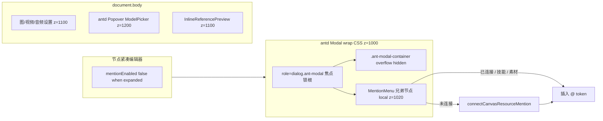
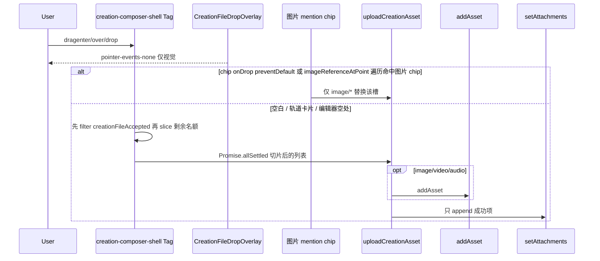

# 画布提示词放大编辑、@ 分组与创作页拖放

| 字段 | 内容 |
| --- | --- |
| 日期 | 2026-09-30 |
| 状态 | Draft |
| 产品 | 画布TV |
| 作者 | 画布TV |
| 现网 | https://canvas.j11.net ，仓库 `VERSION` = `v1.5.71` |
| 前置 | 产品口径已冻结（见 §Key Decisions）；本文只设计、不改 `web/` / `backend/` 应用代码 |
| 范围 | 前端 only。无 schema、不改 `handler/agent.go`、不带广场 ingest、不 bump `VERSION` |

---

## Overview

画布图片/视频节点的「放大编辑」弹层目前有三处产品缺口：提示词高度被 8 行封顶且不跟视口走；`@` 菜单因 z-index 被 antd `Modal` 挡住，空查询也只列出**已连接上游**，未连上的当前画布媒体无法一键引用；独立画布左侧素材托盘与 `@` 菜单的分组、媒体种类不一致（托盘只有图片，「素材库」口径也不等于个人资产库）。创作页输入区能从素材库点选参考，但没有整块输入区的本地文件拖放，文档/音视频只能绕进弹窗点「上传新素材」。

本期把三件事做成一条前端改动链：

1. **放大编辑**（图片 + 视频同一套）按视口与文案自动增高，并允许拖动手柄，上限是剩余视口而不是 8 行。
2. **独立画布托盘**与**节点 `@` 菜单**共用两组：**所有画布** = 个人素材库（含视频/音频）；**当前画布** = 本画布可引用节点（含视频/音频/文本）。选未连接的当前画布节点时先自动连线再插入 `@` token；素材库条目只插 mention、不新建节点。
3. **创作页**保留现有「参考内容」与素材库弹窗内的「上传新素材」，在整块 composer 上增加本地文件 dropzone，并在「参考内容」旁放一枚显式「上传」。

---

## Background & Motivation

### 现状（已对照代码）

#### A. 放大编辑不能 `@` 素材，高度被 8 行卡住

`CanvasNodePromptPanel`（`web/src/components/canvas/canvas-node-prompt-panel.tsx`）：

- `canExpandPrompt = mode === "image" || mode === "video"`（约 L166）。音频/文本没有放大入口，本期不补。
- `expandedPromptOpen` 走 antd `Modal`：`width={920}`，`styles.container.overflow = "hidden"`（约 L530–545）。紧凑编辑器在 Modal 打开时仍挂载（`renderPromptEditor(false)` 与 Modal 内 `renderPromptEditor(true)` 并存），两套 `CanvasResourceMentionTextarea`。
- 高度常量：`PROMPT_EDITOR_MAX_LINES = 8`。`promptEditorBounds`（约 L917–921）把放大编辑上限算成 `24 * 8 + 20 = 212px`，有参考架再加 `PROMPT_REFERENCE_SHELF_HEIGHT = 58`。`PromptResizeHandle` 与 `clampPromptHeight` 都吃这个 max。Modal 不读 `100vh` / `100dvh`。
- `includeAssetLibrary` 在提示面板 textarea 上**已经是 true**（约 L456）。缺口不在开关，而在菜单层叠与 `onAddReference` 过滤。

`CanvasResourceMentionTextarea`（`web/src/components/canvas/canvas-resource-mention-textarea.tsx`）：

- 菜单 `createPortal(..., document.body)`，`className="... z-[var(--z-tooltip)]"`（约 L733–737）。`--z-tooltip: 1000`（`web/src/styles/globals.css` L231）。AutoLink 条同样 `z-[var(--z-tooltip)]`（约 L267）。`InlineReferencePreview` 用 `--z-dialog-popover` = 1100（约 L621）。
- 仓库是 **antd `^6.5.1`**（`web/package.json`），不是 antd 5。`useZIndex('Modal')` 在未传 `zIndex` 时返回 **`[undefined, contextZIndex]`**：wrap **没有** inline z-index；`genModalMaskStyle` 把 mask/wrap 写成 CSS `token.zIndexPopupBase` = **1000**。`contextZIndex`（1000+100=1100）只喂给**嵌套 antd 子层**（`ZIndexContext`），不是 wrap 自己的层。菜单与 wrap 同为 1000 时，后挂到 `document.body` 的 wrap 盖住菜单，点 `@` 看起来像没开。
- 焦点锁根是 `.ant-modal`（`role="dialog"`）：`@rc-component/dialog` `Panel.js` 对 `internalRef`（dialog 节点）做 `useLockFocus`。`.ant-modal-wrap` 是它的**外层**，portal 进 wrap 仍在 `element.contains(activeElement)` 之外。
- 关闭钮 `.ant-modal-close` 的 CSS 是 `zIndexPopupBase+10` = **1010**（`antd/es/modal/style/index.js`）。`.ant-modal` 自身 `pointer-events: none`，`.ant-modal-container` 才是 `auto`。
- `mentionMenuPosition` 用 `anchor.closest(".ant-modal-container")` 当边界（约 L1003–1016）。
- 空 `@` 键盘 `candidates`：无 query 时只取 `canvasReferences`（有 `onSelectReference`）或 `activeCanvasReferences`（约 L78–83），**不含素材库**。有 query 才在 `availableReferences`（画布 + 素材库）里滤。Escape 只在 `mention && candidates.length` 时关菜单（contenteditable 约 L419、textarea 约 L535）；搜索框 L753 同样只有 `preventDefault`、**没有** `stopPropagation`。`@rc-component/portal` `useEscKeyDown` 在 **`window` 冒泡** 上听 keydown，且**不看** `defaultPrevented`；菜单 portal 进 dialog 后不在该 portal Esc 栈上，只 `preventDefault` 仍会关放大 Modal。
- 空 `@` 视觉菜单：`connectedReferences={activeCanvasReferences}`（约 L317–321），分组标题是「画布节点 / 技能库 / 素材库文件夹」（约 L780–804）。未连接节点即使被塞进 `references`、键盘 `candidates` 已包含它们，只要 `active === false` 就不会出现在「画布节点」。

`project.tsx` `onAddReference`（约 L2080–2093）：

```ts
if (reference.active || reference.assetId || reference.kind === "skill") return reference;
if (reference.kind !== "text" || !reference.nodeId || reference.nodeId === nodeId) return undefined;
// connectCanvasTextMention(...)
```

未连接的图/视频/音频走到第二行直接 `undefined`，token 插不进去。未连接文本靠 `connectCanvasTextMention`（`web/src/lib/canvas/canvas-text-mention.ts`）自动连线；`mentionReferences` 额外拼了全画布未连接文本（`project.tsx` L2077–2078），但**没有**同等拼未连接媒体。

键盘：`ArrowUp` / `ArrowDown` 循环 `candidates`；`Enter` / `Tab`（富文本）选中；`Escape` 关菜单。菜单内搜索框 Enter 取 `filteredReferences[0]`。Blur 延迟 120ms，若 `relatedTarget` 落在 `[data-canvas-resource-mention-menu]` 则不关。

#### B. 独立画布资源分类

独立画布 = `/canvas/:id` 且 `currentProject.projectId` 为空。`CanvasProject.projectId` 是短剧/领域项目 id，不是画布 id。

`CanvasAssetTray`（`web/src/components/canvas/canvas-asset-tray.tsx`）：

- Tab 文案：`素材库 ${assetImages.length}` / `当前画布 ${canvasImages.length}`（约 L210–211）。
- `showLibrary={!currentProject?.projectId}`（`project.tsx` L2906）。关联短剧画布只留「当前画布」，项目资产走侧栏 `CanvasWorkspaceAssetPanel`，**本期不改侧栏**。
- 数据：`imageAssets = assets.filter(kind === "image" && status !== "archived")`（`use-canvas-render-model.ts` L206）；`canvasImageNodes` 只收 `type === Image && metadata.content` 且非折叠批次/折叠背板子节点（同文件 L110–112）。
- 点击素材库：`onInsertAssetImage` → `createImageAssetNode`（只建图片节点）。点击当前画布：`onFocusCanvasImage`。拖拽：`CANVAS_IMAGE_ASSET_DND_TYPE = "application/x-infinite-canvas-image-asset"`，`handleDrop` 只认这个 type 再 `createImageAssetNode`（`use-canvas-upload.ts` L546–554）。

`@` 菜单素材库来自 `buildAssetMentionReferences`（`canvas-resource-references.ts` L270–290），本来就含 image/video/audio/text/entity，跳过 `model`。缺口是**视觉分组名**和**当前画布节点集合**，不是素材库 builder。

#### C. 创作页上传 / 拖放

上传链路已存在，不必新后端：

- `uploadCreationAsset` / `uploadLibraryAssets` / `handleLibrarySelect`（`web/src/pages/create/index.tsx` L412–464）。
- 接受矩阵：`creationUploadAccept` / `creationFileAccepted`（`creation-assets.ts` L31–43）。图片模式只收 `image/*`；视频模式 `image/*,video/*,audio/*`；文本模式另加常用文档扩展名。
- 文档上传返回 `{ attachment }`、**不** `addAsset`（L428–430）。媒体才入个人素材库。
- Composer（`creation-workspace.tsx`）「参考内容」打开 `AssetLibraryPickerModal`。弹窗页脚有「上传新素材」文件选择（`asset-library-picker-modal.tsx` L525–534），**无 dropzone**。Composer 外壳 `creation-composer-shell` 也无 dropzone。
- 拖到**已有图片 mention chip**：textarea `onDrop` 仅在 `reference.kind === "image"` 时 `preventDefault` + `onReferenceFilesDrop`，然后**仍转发** `props.onDrop`，**没有** `stopPropagation`（`canvas-resource-mention-textarea.tsx` L386–394）。参考轨道卡片（`CreationAttachmentThumbnail`）**没有**文件 `onDrop`，拖到卡片上今天不会替换，等同落到空白处（目前空白处无行为）。
- 画布有 `CanvasFileDropOverlay`：`pointer-events-none` 纯视觉，真正 `drop` 在画布容器。创作页没有对等物。
- 底栏 dock **禁止**再放「从本机上传附件」——`web/test/create-library-button.test.ts` 已锁：`aria-label="从本机上传附件"` 不得出现在 `<footer className="creation-chat-dock">`。同文件还锁 `index.tsx` 不得出现 `onUpload={() => fileInputRef.current?.click()}`（素材库上传必须走 `uploadLibraryAssets`）。
- 空首页滚动后的压缩条 `creation-floating-prompt`（`index.tsx` ~L989）是另一块 `<input>`，不是 `CreationComposer`。

### 痛点

| 用户动作 | 实际结果 |
| --- | --- |
| 图片/视频节点点放大编辑，输入 `@` | 菜单在 Modal 后面；即使看见，空列表也只有已连接节点 |
| 当前画布另有一张未连的图/视频，想 `@` | 插入失败（`onAddReference` 返回 `undefined`） |
| 独立画布打开素材托盘找视频 | 没有；当前画布 tab 也只有带 `content` 的图片节点 |
| 创作页把本地 mp4 / pdf 拖进输入框 | 无反应；必须打开素材库再点上传 |

---

## Goals & Non-Goals

### 目标

- 图片与视频节点的放大编辑：高度随**视口**和**文案**增长；用户可拖模块高度；夹紧到剩余视口，取消 8 行上限，不超出窗口。
- 放大编辑内 `@` 菜单叠在 Modal 之上，可键盘/点击，焦点不把弹层关掉。
- `@` 与独立画布托盘共用两组：**所有画布**、**当前画布**（含视频/音频）。选未连接的当前画布节点 → 自动连线 → 插入 `@` token。素材库条目只插 token、不新建画布节点。
- 创作页：保留「参考内容」+ 弹窗内「上传新素材」；整块 composer 可拖本地文件；「参考内容」旁增加「上传」；文本模式 dropzone 收文档作参考；图片模式拒绝视频/音频。
- 拖到已有图片 mention chip 仍是替换该图；拖到空白 composer / dropzone 是**新增**参考。

### 非目标

- 不改 `CanvasShare` 语义，不复用 `canvas_snapshots` / `CanvasSnapshot`。
- 不改关联短剧画布的项目资产侧栏（`CanvasWorkspaceAssetPanel`）；`showLibrary={!currentProject?.projectId}` 保持。
- 不把「所有画布」做成「其它画布节点聚合」——它就是个人素材库。
- 不改 Agent 面板 `@`（`includeAssetLibrary={false}` 维持；Agent 用 `buildCanvasAgentMentionReferences`）。
- 不为文本/音频节点补放大编辑。
- 不迁库、不改 `backend/internal/handler/agent.go`、不做广场 ingest、不 bump `VERSION`。
- CHANGELOG / UI 文案不出现 libtv / lumlum / liblib。
- 素材库弹窗本身不强制做 dropzone（composer 外壳已覆盖主路径）。
- 不自动把拖入的参考写成提示词里的 `@` token（与「参考内容」确认后只 `setAttachments` 对齐）。
- 不给空首页压缩条 `creation-floating-prompt` 做 dropzone / 上传（那是滚动后的占位输入，点放大才回到 `CreationComposer`）。
- 不给 `creationFileAccepted` 补「空 MIME 按扩展名猜视频」；空 MIME 维持现状（非 text 模式落到 `false`）。

---

## Key Decisions

1. **「所有画布」= 个人素材库，不是其它画布的节点。** 用户已选方案 A。文案要在托盘副标题和空态里写清「个人素材库」，避免被理解成跨画布检索。
2. **放大编辑高度：自动 + 手动，上限 = 剩余视口。** 紧凑编辑器仍 8 行。放大态取消 `PROMPT_EDITOR_MAX_LINES`。未拖过时 `height = clamp(max(content, 舒适下限), min, viewportMax)`；拖过之后以手动值为主，窗口 resize 只再夹紧，不把高度弹回。
3. **`@` 当前画布 = 本画布全部可引用资源节点**（`getNodeResourceKind(node)` 非空：图、视频、音频、文本、绘图、角色卡等），不只是已连接上游。自身节点仍排除。`isResourceNode` 是 `canvas-resource-references.ts` 的**文件内私有**函数，调用方用 `buildCanvasResourceReferences` / `getNodeResourceKind`，不要当公共 API。
4. **未连接媒体与文本走同一套自动连线。** 把 `connectCanvasTextMention` 泛化为 `connectCanvasResourceMention`；文本函数保留为薄封装，现有单测不红。
5. **技能不是第三 tab。** 空 `@` 菜单在「当前画布」与「所有画布」之间保留「技能库」section（与今天结构同级）。
6. **`@` 菜单 portal 进焦点锁根，trap 保持开启。** 锚点在放大 Modal 内时：`createPortal(menu, anchor.closest("[role='dialog'].ant-modal") || document.body)`，菜单作为 `.ant-modal-container` 的**兄弟**（不被 `overflow: hidden` 裁）。`--z-mention-menu: 1020` 只用于该 dialog 堆叠上下文，高于关闭钮 `zIndexPopupBase+10`（1010）。**禁止**把菜单/AutoLink 提到 body 上的 1150——那会盖住图/视频/音频设置（`--z-dialog-popover: 1100`）。紧凑编辑器（无 Modal）继续 `--z-tooltip: 1000`。菜单开着按 Esc：`preventDefault` **加** `stopPropagation` 再 `closeMention`（见 A.2）——portal Esc 在 window 冒泡且忽略 `defaultPrevented`。
7. **双编辑器：放大打开时紧凑实例 `mentionEnabled={false}`（关 portal）+ `inert`。** 只 `inert` 不会卸掉已经 `createPortal` 到 body 的菜单。
8. **创作页「上传」放在参考轨道里、紧挨「参考内容」右侧，不进 dock。** 满足既有 `create-library-button` 源码锁。Dropzone 命中整个 `creation-composer-shell`。
9. **图片 mention chip 替换优先于 dropzone 新增。** Overlay 必须 `pointer-events-none`（对齐 `CanvasFileDropOverlay`）；`drop` 在 shell 上用 `defaultPrevented` 或 **遍历整份** `elementsFromPoint`（复用 `imageReferenceAtPoint`，**不要**只看 `[0]`——`pointer-events: none` 仍会排在 hit-test 首位）。不要声称 chip 会 `stopPropagation`（今天没有）。拖到参考**轨道卡片** = 新增（今天卡片无文件 drop）。
10. **关联画布：托盘仍隐藏「所有画布」；节点 `@` 仍可列出个人素材库。** 托盘插入会在画布落节点，短剧画布继续走项目资产侧栏；`@` 素材库只写 token，不落节点，允许保留。

---

## Proposed Design



### A. 放大编辑高度与 `@` 层叠

#### A.1 高度公式

抽出纯函数到 `web/src/lib/canvas/prompt-editor-height.ts`（便于单测；面板只负责量 chrome）。

符号：

| 符号 | 值 / 算法 |
| --- | --- |
| `LINE` 紧凑 / 放大 | 20 / 24 |
| `PAD` 紧凑 / 放大 | 12 / 20 |
| `MIN_BODY` 紧凑 / 放大 | 72 / 76 |
| `SHELF` | 有非 skill 的 active 参考时 58，否则 0 |
| `COMFORT` | `min(280, round(0.40 * availableViewport))`，且 `>= MIN_BODY`。只用于**放大、尚未手动拖过**的默认高度，避免短提示词点开仍是 76px |
| 紧凑 `max` | `LINE * 8 + PAD + SHELF`（**保持 8 行**） |
| 放大 `max` | `max(MIN_BODY + SHELF, viewportH - chromeH)` |

`chromeH`（放大 Modal 占用、不含编辑器本体）用 ResizeObserver 实量 **header、footer、以及视频工具节点**（工具出现/消失会改 chrome；例如放大里自动连上第一张参考图后 `hasVideoPromptTools` 变为 true）。初值可用常量兜底：

```
MODAL_MARGIN_Y     = 32          // 距视口上下，避免贴边
MODAL_PAD_Y        = 24          // p-3 * 2
HEADER_H           ≈ 36
FOOTER_H           ≈ 44
RESIZE_HANDLE_H    ≈ 12
STACK_GAP          = 10 * N      // class gap-2.5；N = header、editor+handle、
                                 // 可选视频工具、footer 之间的缝：无工具 N=3，有工具 N=4
VIDEO_TOOLS_H      = 实量或 0    // 仅当 hasVideoPromptTools
                                 // = mode==="video" && !simpleMode && videoFrameOptions.length>0
                                 // 放大态此时常驻（不是手风琴）；否则 0，不是「永远有一块工具栏」
ANTD_CLOSE         计入 header 行
```

`availableViewport = window.innerHeight - chromeH`。

高度状态机（放大）：

```
contentH = onContentSizeChange 测到的 scrollHeight   // 已有 reportContentSize
desiredAuto = clamp(max(contentH + SHELF, COMFORT + SHELF), min, viewportMax)

if manualExpandedPromptHeight == null:
    height = desiredAuto
else:
    height = clamp(manualExpandedPromptHeight, min, viewportMax)
```

- 输入文案变长：未手动时跟着长到 `viewportMax`，超出后 textarea `overflow-y-auto`（已有）。
- 窗口变大：未手动时 `COMFORT` 与 `viewportMax` 变大，编辑器跟着长；已手动则只把越界的 manual 夹回来（与托盘 `clampTrayHeight` + resize listener 相同，见 `canvas-asset-tray.tsx` L143–147）。
- 切换节点：现有 `useEffect([node.id])` 已 `setManualExpandedPromptHeight(null)`，保持。
- 双击 resize handle：清 manual，回到 auto（新增，手柄已有键盘 Home/End）。

紧凑编辑器：公式不变，仍 8 行。`PromptResizeHandle` 继续存在。

Modal chrome：

- `width={920}` 不变。`centered` 不变。
- **`styles.container.overflow` 保持 `hidden`。** 菜单不是 container 的子孙（见 A.2），改 `visible` 只会弄圆角、帮不上菜单。
- 外壳改为 `max-height: calc(100dvh - 32px)`，内部 column：header / editor（`flex-1 min-h-0`）/ 可选视频工具 / footer。工具与 footer `shrink-0`，编辑器吃剩余。
- 放大态：当 `hasVideoPromptTools` 为真时工具**常驻**（不是紧凑态那块手风琴）；为假时不占位。
- 关闭按钮仍用 antd 默认 X；header 已有 `pr-8`。

图片与视频共用 `renderPromptEditor(true)`，公式不按 mode 分叉。`PromptResizeHandle` 现有 Home/End，**没有** `onDoubleClick`——双击清 manual 是新工作。

#### A.2 Z-index、portal、焦点

选定方案（trap **保持开启**，不设 `focusable={{ trap: false }}`）：

```
const lockRoot = anchor.closest("[role='dialog'].ant-modal");
createPortal(menu, lockRoot || document.body);
```

菜单挂成 `.ant-modal-container` 的兄弟。源码锁这个 selector（antd 6 仍有 `.ant-modal-wrap` / `.ant-modal-container`；wrap **不是**锁根）。

`.ant-modal { pointer-events: none }`，菜单必须显式 `pointer-events: auto`，否则点不到。

| 层 | 实际 z-index | 挂载 | 说明 |
| --- | --- | --- | --- |
| 紧凑节点面板 | `--z-modal-overlay` = 110 | 画布 | 不变 |
| 放大 Modal mask / wrap | CSS `zIndexPopupBase` = **1000** | body | 无 `zIndex` prop 时 `useZIndex` 第一项是 `undefined`，**没有** inline 1100 |
| 嵌套 antd 上下文 | `contextZIndex` = 1100 | Context | 只影响 Modal 子树里的 antd 组件 |
| 关闭钮 `.ant-modal-close` | `zIndexPopupBase+10` = **1010** | dialog 内 | 菜单必须高于它 |
| `@` 菜单 / AutoLink（放大） | **`--z-mention-menu: 1020`** | **dialog 锁根内** | 只打赢关闭钮；仍困在 wrap=1000 的堆叠上下文里 |
| `@` 菜单 / AutoLink（紧凑） | `--z-tooltip` = **1000** | `document.body` | **不要**改成 1020/1150，否则盖住紧凑设置 |
| 图 / 视频 / 音频设置 | `--z-dialog-popover` = **1100** | `document.body` | `CanvasImageSettingsPopover` / `CanvasVideoSettingsPopover` / `CanvasAudioSettingsPopover` 各自 `createPortal(..., document.body)`。必须保持在菜单之上 → 菜单不得提到 body 1150 |
| ModelPicker / Preset / 智能引用 | 无自定义 zIndex 的 antd `Popover` | 嵌套时 **1200**（父 1100+100） | 继续高于设置与菜单 |
| `InlineReferencePreview` | `--z-dialog-popover` = **1100** | `document.body` | 高于 wrap 1000，放大态双击 chip 仍能盖住 Modal。PR1 **不要**改它的 token |
| loader | `--z-loader` = 1200 | body | 不变 |

禁止的替代：portal 进 `.ant-modal-wrap`（在锁根外，搜索框 focus 会被 `syncFocus` 拽回，120ms blur 关菜单）；body 菜单 1150（盖住 1100 的图/视频/音频设置，紧凑态同样误伤）。

Blur 关闭：保留 120ms + `[data-canvas-resource-mention-menu]`。Modal `onCancel`：**先**让 textarea `closeMention`（见下 `mentionEnabled`），**再** `setExpandedPromptOpen(false)`。Esc：菜单开着只关菜单；菜单关着才让 antd 关 Modal。

键盘 Escape（textarea contenteditable 路径、textarea 路径、**以及**菜单搜索框 `onKeyDown` 三处都要）：

```
if (mention != null && event.key === "Escape") {  // 搜索框：菜单已开，等价 mention != null
  event.preventDefault();
  event.stopPropagation();   // 必须。@rc-component/portal useEscKeyDown 听 window 冒泡，不看 defaultPrevented
  closeMention();            // 搜索框走现有 onClose + anchor.focus()
  return;
}
```

不要 `&& candidates.length`。不要只 `preventDefault`：菜单 portal 进 dialog 后不在 rc-dialog 的 portal Esc 栈上，事件会冒泡到 `window`，Top-of-stack `onEsc` 仍 `onClose` 整个放大 Modal。PR1 源码锁 `stopPropagation`（紧挨锁根 selector）。

双编辑器：

```
<CanvasResourceMentionTextarea
  mentionEnabled={!expandedPromptOpen}  // 紧凑实例
  ...
/>
```

`mentionEnabled === false` 时：`useEffect` `setMention(null)` 且不渲染 `MentionMenu` / AutoLink portal。另给紧凑 editor 容器 `inert` + `aria-hidden`，挡住新交互。不要只靠 `inert`。放大实例 `destroyOnHidden` 已有。

#### A.3 `@` 数据源与自动连线

**当前画布（节点 `@`）**

`project.tsx` 传给 `CanvasNodePromptPanel` 的 `mentionReferences` 改为：

```
connected = mentionReferencesByNodeId.get(panelNode.id) || []   // 含 skill
canvasAll = buildCanvasResourceReferences(nodes, connections)   // 全画布 isResourceNode
          .filter(r => r.nodeId && r.nodeId !== panelNode.id)
          .filter(r => !connected.some(c => c.nodeId === r.nodeId && !c.assetId))
mentionReferences = [...connected, ...canvasAll]
```

不再只追加 `kind === "text"`。`buildCanvasResourceReferences` 已按内部 `isResourceNode`（=`getNodeResourceKind` 非空）收图/视频/音频/文本/绘图/角色等；空内容节点 kind 为 null，不会出现（`builtin-nodes.tsx`：Image 要 `content|storageKey`，Video 同，Audio 要 `content`，Text 要 `content|prompt`，Drawing 要 `drawingId`）。

`MentionMenu` **必须改空 query 的画布数据源**：今天 `connectedReferences={activeCanvasReferences}` 把未连接节点从视觉列表里滤掉。PR2 改为传入**完整** `canvasReferences`（有 `onSelectReference` 时与键盘 `candidates` 同源），再在菜单内分组。建议把 prop 从 `connectedReferences` 重命名为 `canvasReferences`，避免继续只喂 active。

空 query 分组：

1. **当前画布** — `canvasReferences.filter(kind !== "skill" && !assetId)`，已连接（`active`）在前，未连接在后。副文案未连接为「选择后自动连线」。
2. **技能库** — `kind === "skill"`（来自 `mentionReferencesByNodeId` 里拼的 `skillMentionReferences`）。
3. **所有画布** — 现有 `assetReferences` 按 `ASSET_CATEGORY_LABELS` 文件夹（角色/场景/道具/素材/其他）。无素材时整组不渲染。

有 query：扁平搜索 `label/title/kind/category/text`，结果不再进文件夹。键盘 `candidates`：

- 空 query：当前画布节点（已连接优先）+ 技能，**不含**素材库文件夹项（与今天「空 query 键盘不进素材库」一致，只是当前画布从「已连接」扩成「全可引用」）。
- 非空 query：`availableReferences` 全量过滤（当前画布 + 技能 + 所有画布）。

`includeAssetLibrary` 在提示面板保持 true。关联短剧画布同样 true（只插 token）。

**选择契约 `onAddReference`**

```
if (reference.assetId || reference.kind === "skill" || reference.active) return reference;
if (!reference.nodeId || reference.nodeId === targetId) return undefined;
try {
  const linked = connectCanvasResourceMention(nodes, connections, targetId, reference.nodeId, nanoid());
  commit nodes/connections;
  return linked.reference; // active, 编号已按连线重算
} catch (e) {
  message.warning(e.message);
  return undefined;            // insertReference 已对 undefined 不插 token
}
```

`connectCanvasResourceMention`（同文件 `canvas-text-mention.ts`）：

- 源节点：`buildCanvasResourceReferences(nodes, connections).find(r => r.nodeId === sourceId)`，**不限制 kind === "text"**。找不到则 throw。不要 import 私有的 `isResourceNode`。
- 文案（替换「文本」口径；`project.tsx` 的 fallback 同步改）：
  - `"无法引用该节点"`（原 `"无法引用该文本节点"`）
  - `"无法修改锁定节点的引用"`（已有，保持）
  - `"该引用会形成循环连线"`（已有，保持）
  - `"引用未建立"`（原 `"文本引用未建立"`）
  - `project.tsx` catch fallback：`"引用失败"`（原 `"文本引用失败"`）
- 其余：锁定、自引用、环检测、Config 汇流（有其它资源入边则连到 Config）与今天文本实现相同。
- `applyCanvasConnectionPromptSync` 照旧，保证编号与 prompt 里已有 `@图片N` 同步。
- `connectCanvasTextMention` 改为调用泛型并断言源为 text，或保留原函数、泛型复用其控制流。现有 `web/test/canvas-text-mention.test.ts` 必须继续绿（可继续断言旧路径，新增媒体用例）。

素材库条目：`assetId` 已有，token 为 `@[asset:id]`（`canvasResourceMentionToken`），**不** `createImageAssetNode` / `createAssetPayloadNode`。

### B. 托盘与 `@` 共用两组

独立画布托盘 tab：

| Tab id | 产品文案 | 数据 | 交互 |
| --- | --- | --- | --- |
| `library` | **所有画布** `{n}` | 个人库 `kind ∈ {image,video,audio}` 且 `status !== "archived"` | 点击：画布中心创建对应类型节点；拖：落点创建。**一律新建**，不替换已有节点 |
| `canvas` | **当前画布** `{n}` | 见下方谓词 | 点击聚焦（平移/选中/工具条），**不打开**创作面板 |

「当前画布」谓词（不要「只放宽 type、仍要求 `metadata.content`」——绘图经常没有 `content`，只有 `drawingId` / `drawingPreviewUrl`）：

```
isTrayCanvasMediaNode(node):
  排除 collapsedBatchChild / collapsed frame child（与今日 canvasImageNodes 相同）
  Image | Video  → metadata.content || metadata.storageKey
  Audio          → metadata.content
  Drawing        → metadata.drawingId || metadata.drawingPreviewUrl
```

副标题：「个人素材库与当前画布节点 · 拖入画布或定位已使用的素材」。搜索 placeholder：「搜索素材…」。空态：「没有匹配的素材」/「当前画布没有匹配素材」。底栏：所有画布「点击插入 · 拖拽定位」；当前画布「点击回到节点」。

关联短剧：`showLibrary === false`，只渲染当前画布 tab（现有 `useEffect` 会把 library tab 打回 canvas）。当前画布节点同样含视频/音频/绘图。

**聚焦：** 不要把托盘接到现有 `focusCanvasNode`（`use-canvas-viewport-controller.ts` L141：非 Drawing/Script 会 `setDialogNodeId(node.id)` 打开创作面板）。也不要继续用 `focusCanvasImageNode`（L131–132：`type === Image` 否则静默 return）。PR3 把 `focusCanvasImageNode` **泛化**为 `focusCanvasMediaNode`：接受 `Image | Video | Audio | Drawing`，行为与今日图片托盘一致——`transitionViewportTo` + `selectFocusedNode` + `setDialogNodeId(null)` + `setToolbarNodeId(node.id)`。`focusCanvasNode` 其它调用点不动。

**插入：** `localAssetToInsertPayload` 目前是 `asset-picker-modal.tsx` 里的非导出 `function`，PR3 必须 `export`（或紧挨它写一个导出包装）。不要走 `handleAssetsInsert` 做托盘点击：那条路径会 toast「已插入 N 项素材」、清选区/关 dialog、位置用 `assetInsertPositionRef || getCanvasCenter()`。

`createAssetPayloadNode`（`use-canvas-upload.ts` L612–671）**只返回** `CanvasNodeData`，不写图。真正上画布的是 `insertAssetPayloads` 里的 `setNodes((current) => [...current, ...created])`（L679）；`selectInsertedNode`（L103–107）只改选区/dialog，**不加节点**。今日托盘点击 `createImageAssetNode`（L254–255）自己 `setNodes` 再 select。照抄「create + select」会选中一个不在图上的 id。

PR3 在 `createAssetPayloadNode` 旁加薄封装 `insertLibraryAssetAt(payload, position)`，三步写死：

```
const node = await createAssetPayloadNode(payload, position);
setNodes((current) => [...current, node]);
selectInsertedNode(node.id, "close");
return node;
```

无 toast。托盘**点击**：`insertLibraryAssetAt(localAssetToInsertPayload(asset), getCanvasCenter())`。托盘**拖拽** / `handleDrop` 库 MIME（新旧两种）：同一 helper，`position = screenToCanvas(clientX, clientY)`。禁止只调 `createAssetPayloadNode`。

拖拽 MIME：新增 `application/x-infinite-canvas-asset`（值为 asset id），`handleDrop` 按 store 的 `kind` **始终创建**；**同时继续读**旧 `CANVAS_IMAGE_ASSET_DND_TYPE`。库素材 MIME **不**走 `replaceNodeMedia`（今天图片 asset 拖到节点上也是创建，不是替换）。本地 **File** 拖到同类型节点矩形仍替换——这是 `handleDrop` 现有文件分支，与库 MIME 无关。

`AssetTrayRow` 必须按 kind 预览，禁止把音频 `metadata.content`（媒体 URL）塞进 `CachedResourceImage`：

| kind | 预览 |
| --- | --- |
| image | `coverUrl` / `content` / `CachedResourceImage` |
| drawing | `drawingPreviewUrl` |
| video | `canvasNodeVideoPreviewUrl(node)` |
| audio | `Music2` 图标，无 `` |

标题：`node.title || prompt || kind 默认名`。

`@` 菜单两组标题与托盘**用同一文案**：「当前画布」「所有画布」。不要再写「画布节点」「素材库」。技能库保持「技能库」。

托盘不做技能、不做文本资产（视觉媒体空间）。`@` 当前画布含文本节点；`@` 所有画布仍用 `buildAssetMentionReferences`（含 text/entity，跳过 model）。

### C. 创作页 dropzone 与上传



#### 命中与视觉

对齐 `CanvasFileDropOverlay`：**overlay `pointer-events-none` + `aria-live="polite"`**，真正的 `dragenter` / `dragover` / `dragleave` / `drop` 绑在 `HoverBorderGradient` 的 **Tag** 上（`hover-border-gradient.tsx` L60–62 已把 `...props` 铺到 Tag；`containerClassName="creation-composer-shell"`）。不要把处理器只写在 overlay 上。

- 热区：该 Tag（写作区、参考轨道、dock 都在内部）。empty / thread 共用 `CreationComposer`，两套都要。
- Overlay 必须放在 Tag **内部**（Tag 有 `overflow-hidden`）。禁止 `position:fixed; inset:0` 全屏，以免盖住历史消息。
- 文案：「释放文件，添加为参考内容」。副文案随 mode：文本「图片、视频、音频和常用文档」；视频「图片、视频和音频」；图片「仅图片」。新建 `CreationFileDropOverlay`，不要复用画布「放入创作空间 / 创建节点」。
- `dragenter`/`dragleave` 用计数（对齐 `fileDragDepthRef`）。
- `disabled`：`interactionBusy` 时 `dropEffect = "none"`，overlay 文案改「生成中暂不能添加参考内容」。

Shell `drop` 判定（**不要**假设 chip `stopPropagation`）：

1. `event.defaultPrevented` → return（chip 已 `preventDefault` 并替换）。
2. 否则命中图片 chip → return（让 chip 路径处理；若 chip 没接到，也不要在 shell 里新增一份）。命中检测**复用**现有 `imageReferenceAtPoint`（`creation-workspace.tsx` L490–497）：

```
for (const element of document.elementsFromPoint(x, y)) {
  const chip = element.closest<HTMLElement>("[data-mention-reference-id]");
  // … kind === "image" && attachmentId → 命中
}
```

   **不要**用 `elementsFromPoint(...)[0]`。`pointer-events: none` 只跳过事件派发，**不**把 overlay 移出 hit-test；`absolute inset-0` overlay 通常仍是 index 0，`[0].closest("[data-mention-reference-id]")` 恒为 null，shell 会走分支 3 再 append 一份。
3. 否则 `addLocalCreationFiles`。拖到参考**轨道卡片**走分支 3（新增）。卡片不在本期加替换。Overlay 仍 `pointer-events-none` 且留在 Tag 内。

#### 接受矩阵（不新写一套，调用现有函数）

| mode | `creationFileAccepted` | 非法文件 toast |
| --- | --- | --- |
| `image` | 仅 `image/*` | 「图片创作仅支持参考图」 |
| `video` | image / video / audio | 「当前模式不支持该文件类型」 |
| `text` | 上列 + `text/*` + `textDocumentExtensions` | 同上 |

`maxReferences` 已有：视频看 `image_to_video` 与 `videoProfile.references.maxImages`；图片看 `imageProfile.references.maxImages`；文本常数 6（`index.tsx` L153）。`referencesSupported === false` 或已满：overlay 说明上限，文件不上传。

混排一次拖入：**先** `filter(creationFileAccepted)`，再 `slice(0, remainingSlots)`，**然后**才 `Promise.allSettled` 切片后的列表。不要先并行再截断——并行会超打 `maxReferences`。Toast：

- 成功 n：「已添加 n 个参考内容」（媒体同时入素材库，沿用「已上传到素材库」口径时可合并一句）。
- 类型拒绝 m：「m 个文件类型不支持」。
- 超上限 k：「已达到当前模型的参考内容上限（N 个），k 个未添加」。
- 上传失败：现有 `toast.error`。

顺序（每个成功文件）：`uploadCreationAsset` → 若返回 `asset` 则 `addAsset` → `setAttachments(prev => uniqueConcat.slice(0, maxReferences))`。文档无 `asset`。不改 prompt、不插 `@` token（用户可随后在 `@` 菜单里引用，因为 `buildCreationMentionReferences` 把 attachments 标为 `active`）。

替换仍只接受图片。

#### 「上传」相对「参考内容」

参考轨道现有 `creation-reference-add-slot` + 「参考内容」按钮（`creation-workspace.tsx` L566）。在**同一** `Reorder.Group` 里、该 slot **右侧**再加一枚 `creation-reference-add-button`：

- 文案：「上传」
- `aria-label`：「从本机上传参考内容」（**不要**用测试锁定的 `从本机上传附件`）
- hidden `<input type="file" multiple accept={creationUploadAccept(mode)}>` 与 ref 都**活在 `CreationComposer` 内部**，不要把 `fileInputRef` 提到 props（避免 `onClick={() => props.fileInputRef.current?.click()}` 这种字符串；`create-library-button.test.ts` 对 `index.tsx` 锁的是 `onUpload={() => fileInputRef.current?.click()}`，PR4 不得改素材库 `onUpload: uploadLibraryAssets`）
- disabled 条件与「参考内容」相同：`interactionBusy || !canAddMoreReferences`
- 处理函数与 dropzone 共用 `addLocalCreationFiles(files)`

素材库弹窗页脚「上传新素材」**保留**。它仍然只入库并自动选中、确认前不 `setAttachments`。Composer 的「上传」则直接变成参考。

Dock、`ModePicker` 一排不加上传。PR4 更新 `create-library-button.test.ts`：参考轨道允许「上传」；dock 仍禁旧 aria-label；`index.tsx` 仍不得出现 `onUpload={() => fileInputRef.current?.click()}`。

---

## 交互合同

### 空 `@`（画布节点提示词，含放大编辑）

- 输入单独 `@`：打开菜单。当前画布列出本画布可引用节点（已连接置顶）；其下技能库；其下所有画布分类文件夹。无当前画布节点时该 section 不出现，可以只有技能和/或所有画布。
- 键盘：↓ 从当前画布第一项开始（无则技能第一项）；↑ 反向；Enter/Tab 插入高亮项。空 query 不能把高亮移进文件夹按钮；点文件夹才进入分类列表（保持今天「返回 + 列表」）。
- 点击未连接节点：连线成功后插入对应 `@图片N` / `@视频N` / `@音频N` / `@文本N`（或角色/绘图标签），参考架出现该 chip。失败：warning toast，菜单可留着。
- 点击所有画布条目：只插 `@[asset:…]`，画布不新增节点。
- 搜索框与 textarea 的 `@query` 同步。Escape：**只要菜单开着**（`mention != null`；搜索框已开菜单同理）就 `preventDefault` + **`stopPropagation`** + `closeMention`，与 `candidates.length` 无关；焦点回编辑器。只 `preventDefault` 挡不住 `@rc-component/portal` 在 `window` 上的 Esc。
- 无任何候选且无文件夹：菜单仍开，滚动区「没有匹配的引用」（现有 empty）。空 query 键盘仍不把高亮移进文件夹（文件夹不在 `candidates` 里）。
- busy / 节点 `locked`：生成中仍允许 `@` 编辑（今天生成中只 disable 提交）；锁定节点 `onAddReference` 失败并 warning。

### 搜索 `@`

- query 非空：隐藏文件夹，扁平列表，匹配 label/title/kind/category/text。
- 键盘循环整表。无匹配显示 empty。

### 拖放（创作页）

见 §C。画布托盘：

- **库素材 MIME**（新旧两种）拖到画布：**始终创建**新节点（落点坐标），即使指针在已有同类型节点上。走 `insertLibraryAssetAt`（内部 `setNodes`），不要只调 `createAssetPayloadNode`。
- **本地 File** 拖到已有同类型节点矩形：仍 `replaceNodeMedia`（现有文件分支，与库 MIME 无关）。
- 当前画布 tab 点击：聚焦，不打开创作面板（`focusCanvasMediaNode`）。

### 溢出 / disabled

- 放大编辑到 `viewportMax` 后内部滚动。
- 托盘高度逻辑不改（已有视口夹紧）。
- 创作 `maxReferences`：按钮 disable + tooltip 沿用「已达到当前模型的参考内容上限（N 个）」；drop 被拒时同样这句话。

---

## API / Interface Changes

无新 HTTP。前端函数签名变化：

```ts
// web/src/lib/canvas/canvas-text-mention.ts
export function connectCanvasResourceMention(
  nodes: CanvasNodeData[],
  connections: CanvasConnection[],
  targetId: string,
  sourceId: string,
  connectionId: string,
): { nodes: CanvasNodeData[]; connections: CanvasConnection[]; reference: CanvasResourceReference };

export function connectCanvasTextMention(...): ReturnType<typeof connectCanvasResourceMention>;
// 保持签名；内部转调泛型，源必须是 text

// web/src/lib/canvas/prompt-editor-height.ts
export function promptEditorBounds(args: {
  expanded: boolean;
  hasReferences: boolean;
  viewportHeight?: number;
  chromeHeight?: number;
}): { min: number; max: number };

export function estimatePromptContentHeight(value: string, expanded: boolean): number;
export function clampPromptHeight(height: number, bounds: { min: number; max: number }): number;
export function autoExpandedEditorHeight(args: {
  contentHeight: number;
  hasReferences: boolean;
  viewportHeight: number;
  chromeHeight: number;
  manualHeight: number | null;
}): number;

// web/src/lib/canvas/canvas-mention-groups.ts
export type CanvasMentionGroupId = "current-canvas" | "skills" | "all-canvases";
export function groupCanvasMentionReferences(args: {
  canvasReferences: CanvasResourceReference[];
  assetReferences: CanvasResourceReference[];
  query: string;
}): { currentCanvas: CanvasResourceReference[]; skills: CanvasResourceReference[]; allCanvases: CanvasResourceReference[] };

// CanvasAssetTray props
assetItems: Array<ImageAsset | VideoAsset | AudioAsset>;
canvasNodes: CanvasNodeData[];
onInsertLibraryAsset: (asset: ImageAsset | VideoAsset | AudioAsset) => void;
onFocusCanvasMedia: (nodeId: string) => void;

// use-canvas-viewport-controller.ts
focusCanvasMediaNode(nodeId: string): void
// Image|Video|Audio|Drawing；setDialogNodeId(null)+setToolbarNodeId；勿接 focusCanvasNode

// asset-picker-modal.tsx
export function localAssetToInsertPayload(asset: InsertableAsset): InsertAssetPayload;

// use-canvas-upload.ts（PR3，紧挨 createAssetPayloadNode）
insertLibraryAssetAt(payload: InsertAssetPayload, position: Position): Promise<CanvasNodeData>;
// 三步：createAssetPayloadNode → setNodes(current => [...current, node]) → selectInsertedNode(id, "close")
// 无 toast。托盘点击与 handleDrop 库 MIME 共用。createAssetPayloadNode 本身不上图。

// CanvasResourceMentionTextarea 新增
mentionEnabled?: boolean; // default true；false 时 setMention(null) 且不渲染 portal
mentionGroupLabels?: { currentCanvas: string; allCanvases: string };

// CreationComposer props 新增
onAddLocalFiles: (files: File[]) => void;
uploadAccept: string;
```

`mentionGroupLabels` 默认「当前画布」「所有画布」，避免 Agent 误伤（Agent 不传 `includeAssetLibrary`，空菜单本来就没有素材库文件夹）。`MentionMenu` 的 `connectedReferences` 在 PR2 重命名为 `canvasReferences`，空 query 用完整画布列表（已连接在前），不要只传 `activeCanvasReferences`。

---

## Data Model Changes

无后端表、无 migration、无 `CanvasProject` 字段变更。

前端状态：

- `manualExpandedPromptHeight` 语义从「8 行内的 px」变为「视口夹紧后的 px」。
- 托盘 props 从 `ImageAsset[]` 放宽到三种媒体。
- DnD type 增加通用 asset id；旧 image type 兼容。
- 创作 composer 增加 `fileDragDepth` / `dropActive` 局部 state，不进 `use-creation-preferences-store`。

连线：自动引用写一条普通 `CanvasConnection`（`fromNodeId = 源资源`，`toNodeId = 目标或 Config`），与手动连线、文本 `@` 相同，走现有 `commit`/`applyCanvasConnectionPromptSync`，可撤销（`project.tsx` 里这组 `onAddReference` 目前直接 `setNodes/setConnections`，与文本 `@` 现状一致；若该路径已在历史栈外，**不要借本期改历史策略**）。

---

## Alternatives Considered

### 1. 放大编辑改用自建面板而不是 antd Modal

- 优点：彻底躲开 wrap 堆叠与 focus trap。
- 缺点：要重做居中、遮罩、Esc、与 `CanvasPresetPicker` / `ModelPicker` 的叠层；放大入口已经绑在这颗 Modal 上。
- 结论：保留 Modal。菜单 portal 进 `[role='dialog'].ant-modal`（锁根），trap 保持开启。不采用 body 1150，也不关 trap。

### 2. 「所有画布」聚合用户其它 `CanvasProject` 的节点

- 优点：字面意思更像「所有画布」。
- 缺点：用户已否决；要跨项目读节点、权限与性能都不是前端小改。
- 结论：个人素材库。用副标题消歧义。

### 3. 空 `@` 只列已连接，另做「插入并连接」按钮

- 优点：少自动改拓扑。
- 缺点：用户明确要选未连接节点就自动连；文本路径已经自动连，媒体应对齐。
- 结论：自动连。

### 4. 创作页只做 dropzone、不加「上传」按钮

- 优点：更少 UI。
- 缺点：触控/无文件拖拽环境没有入口；用户要求写明相对「参考内容」的上传按钮位置。
- 结论：轨道内并列「参考内容」「上传」，dock 不动。

### 5. 把紧凑编辑器的 8 行也改成视口高度

- 优点：公式统一。
- 缺点：节点面板会撑满屏幕，挡画布；需求只覆盖放大编辑。
- 结论：紧凑保持 8 行。

---

## Security & Privacy Considerations

- 创作/画布上传继续走现有 `uploadImage` / `uploadMediaFile`（用户作用域、storageKey）。Dropzone 不读目录、不跟新的第三方。
- `creationFileAccepted` 是 MIME + 扩展名白名单，不是内容扫描；与弹窗上传同一信任模型。可执行文件/HTML 不在文本文档列表里。
- 拖放 `dataTransfer.files` 只在用户手势下读取。不要解析 `text/html` 剪贴板进 dropzone。
- `@` 自动连线沿用环检测与 `locked`，避免把锁定节点当接收端。
- 个人素材库出现在「所有画布」时仍是当前登录用户的 `useAssetStore`，不拉其它用户资产。
- 关联短剧画布不通过托盘把个人库节点插进项目画布；`@` token 引用个人库文件时，生成链路已能解析 `assetId`（现网已支持素材库 mention）。若某模型不接受该 kind，走现有模型能力校验，不在本期新开权限口子。

威胁：恶意超大文件拖进 composer。沿用现有上传体积限制与失败 toast，不在 dropzone 另做绕过。

---

## Observability

无新后端指标。前端：

- 现有 `message.warning` / `toast.success|error` 覆盖连线失败、类型拒绝、上限、上传失败。
- 不打含文件名+用户 id 的遥测。若已有上传埋点（`create-upload` 作为 `uploadMediaFile` 的 source tag），dropzone 走同一 `uploadCreationAsset`，source 保持 `"create-upload"`。
- 调试：菜单 DOM 带 `data-canvas-resource-mention-menu`；dropzone overlay `aria-live="polite"`。

告警：无。回归靠单测 + 手动清单（§Rollout）。

---

## Rollout Plan

- 纯前端，无 feature flag。随用户说「发一版」时再 bump `VERSION` 与 CHANGELOG（**本文实施 PR 不改 VERSION**）。
- 建议按 §PR Plan 拆 4 个可独立回滚的 PR 合入 `main`，现网只更 web 镜像并重启 web（与既有「不跑迁移、`CANVAS_AUTO_MIGRATE=false`」一致）。
- 回滚：还原对应前端镜像。自动连线写入的 `CanvasConnection` 留在用户画布上，属合法数据，回滚后只是 `@` 菜单不再列出未连接节点，已连的线不必清。
- 灰度：无。放大编辑层叠若有问题：菜单再次被挡 = portal 没进锁根或 local z < 1010；图/视频/音频设置被菜单挡住 = 菜单被错误提到 body 且 z≥1100。antd `Popover`（ModelPicker）嵌套 1200 必须仍高于设置 1100。

验收清单：

1. 图片节点放大：短文案有舒适高度；长文案长到接近窗口后内部滚动；拖动手柄不能拖出窗口；缩小浏览器后再夹紧。
2. 视频节点放大：同上，视频工具仍在编辑器与 footer 之间，且计入上限。
3. 放大里输入 `@`：菜单可见，可点素材库文件夹，可点未连接的当前画布视频并看到连线 + token。Esc 只关菜单，不关 Modal（搜索框 Esc 同）。
4. 独立画布托盘：两组文案；能插入/拖入视频与音频；关联短剧画布托盘无「所有画布」。
5. 创作页：拖 png 进空白输入 → 参考架新增；拖 png 到已有图片 chip → 替换；图片模式拖 mp4 → 拒绝 toast；文本模式拖 pdf → 参考架「文件」；「上传」在「参考内容」右侧；dock 无上传。

---

## Open Questions

本期无未决项。产品口径已冻结，实施时不得把冻结项再当成问题上抛。

若实现时发现：关联短剧画布的节点 `@` 列出个人素材库会让生成误用非项目资产——那是生成侧既有能力，不在本期改；不要偷偷把 `includeAssetLibrary` 在关联画布设 false，除非产品再开口。

---

## References

- 计划文风对照：`E:\canvas\docs\plans\canvas-connection-marquee-delete.md`
- 提示面板：`E:\canvas\web\src\components\canvas\canvas-node-prompt-panel.tsx`
- `@` 编辑器：`E:\canvas\web\src\components\canvas\canvas-resource-mention-textarea.tsx`
- 引用模型：`E:\canvas\web\src\lib\canvas\canvas-resource-references.ts`
- 文本自动连线：`E:\canvas\web\src\lib\canvas\canvas-text-mention.ts`
- 画布页接线：`E:\canvas\web\src\pages\canvas\project.tsx`（`onAddReference` L2080、托盘 L2903）
- 托盘：`E:\canvas\web\src\components\canvas\canvas-asset-tray.tsx`
- 渲染派生：`E:\canvas\web\src\pages\canvas\use-canvas-render-model.ts`
- 上传/拖放：`E:\canvas\web\src\pages\canvas\use-canvas-upload.ts`
- 画布落点 payload：`E:\canvas\web\src\components\canvas\asset-picker-modal.tsx` `localAssetToInsertPayload`（PR3 导出）
- 视口聚焦：`E:\canvas\web\src\pages\canvas\use-canvas-viewport-controller.ts`（`focusCanvasImageNode` L131 / `focusCanvasNode` L141）
- 关联画布侧栏（不改）：`E:\canvas\web\src\components\canvas\canvas-workspace-asset-panel.tsx`
- 创作页：`E:\canvas\web\src\pages\create\index.tsx`、`creation-workspace.tsx`、`creation-assets.ts`、`creation-references.ts`
- composer 外壳：`E:\canvas\web\src\components\ui\aceternity\hover-border-gradient.tsx`（Tag `overflow-hidden`，props 铺到 Tag）
- 素材库弹窗上传：`E:\canvas\web\src\components\assets\asset-library-picker-modal.tsx`
- z-index token：`E:\canvas\web\src\styles\globals.css` L217–234
- 锁 dock 上传的测试：`E:\canvas\web\test\create-library-button.test.ts`
- 创作页 chip hit-test：`creation-workspace.tsx` `imageReferenceAtPoint` L490–497（遍历 `elementsFromPoint`，勿 `[0]`）
- portal Esc：`@rc-component/portal` `useEscKeyDown.js`（window 冒泡，忽略 `defaultPrevented`）
- 文本 `@` 单测：`E:\canvas\web\test\canvas-text-mention.test.ts`
- 接受矩阵单测：`E:\canvas\web\test\creation-references.test.ts`
- antd 6.5 Modal：`node_modules/antd/es/_util/hooks/useZIndex.js`、`antd/es/modal/style/index.js`（wrap=1000，close=+10）；锁根 `@rc-component/dialog` `Panel.js` `useLockFocus`

---

## 实现边界（按文件）

### 必改

| 文件 | 改动 |
| --- | --- |
| `web/src/styles/globals.css` | `--z-mention-menu: 1020`（仅 dialog 内）；创作 dropzone class；**不**把 container overflow 改 visible |
| `web/src/lib/canvas/prompt-editor-height.ts` | **新建**高度纯函数 |
| `web/src/lib/canvas/canvas-mention-groups.ts` | **新建**分组纯函数 |
| `web/src/lib/canvas/canvas-text-mention.ts` | `connectCanvasResourceMention` + 中性错误文案 |
| `web/src/components/canvas/canvas-node-prompt-panel.tsx` | 放大高度、chrome 实量（含工具节点）、`mentionEnabled`/`inert`、Modal `onCancel` 先关菜单 |
| `web/src/components/canvas/canvas-resource-mention-textarea.tsx` | 锁根 portal、Escape（`preventDefault`+`stopPropagation`，三处：ce / textarea / 搜索框）、AutoLink 同 portal、`mentionEnabled`；PR2 再改分组 |
| `web/src/pages/canvas/project.tsx` | `mentionReferences` 含未连接媒体；`onAddReference` 泛化；托盘 props；fallback「引用失败」 |
| `web/src/pages/canvas/use-canvas-render-model.ts` | `mediaAssets`；`canvasMediaNodes` 用 §B 谓词（含 Drawing） |
| `web/src/pages/canvas/use-canvas-viewport-controller.ts` | `focusCanvasMediaNode`（勿复用 `focusCanvasNode`） |
| `web/src/pages/canvas/use-canvas-upload.ts` | 通用 asset DnD **只创建**；`insertLibraryAssetAt`（create + **setNodes** + select，无 toast）；点击/拖拽/`handleDrop` 库 MIME 都走它 |
| `web/src/components/canvas/asset-picker-modal.tsx` | **导出** `localAssetToInsertPayload` |
| `web/src/components/canvas/canvas-asset-tray.tsx` | 文案、媒体种类、音频图标、回调 |
| `web/src/pages/create/creation-workspace.tsx` | shell 事件 + `pointer-events-none` overlay、上传按钮、`onAddLocalFiles` |
| `web/src/pages/create/index.tsx` | `addLocalCreationFiles`（先 filter+slice 再 allSettled）；不改 `uploadLibraryAssets` |
| `web/src/pages/create/creation-assets.ts` | 仅当需要导出过滤时动；**不**加空 MIME 扩展名回退 |

### 建议测试文件

| 文件 | 内容 | PR |
| --- | --- | --- |
| `web/test/prompt-editor-height.test.ts` | **新建** min/max/comfort/manual/viewport 夹紧 | PR1 |
| `web/test/canvas-resource-mention-editor.test.ts` | 源码锁：`--z-mention-menu`、`[role='dialog'].ant-modal` portal、Escape 路径含 `stopPropagation`（紧挨锁根 selector）、`mentionEnabled`、紧凑仍 `--z-tooltip`、AutoLink 与菜单同 portal。**不要**在 PR1 锁「当前画布」「所有画布」文案 | PR1 |
| `web/test/canvas-mention-groups.test.ts` | **新建** 空 query 分组、搜索扁平、技能独立、素材库不进空键盘候选、空 query 视觉用完整 canvas 列表 | PR2 |
| `web/test/canvas-text-mention.test.ts` | 增补 image/video 自动连、环、锁定、新错误文案；旧文本用例保持 | PR2 |
| `web/test/canvas-resource-mention-editor.test.ts` | PR2 追加：分组文案「当前画布」「所有画布」、Escape 不依赖 `candidates.length` | PR2 |
| `web/test/creation-references.test.ts` | 增 `creationFileAccepted("image", { name: "clip.mp4", type: "video/mp4" }) === false` | PR4 |
| `web/test/create-library-button.test.ts` | 参考轨道允许「上传」；dock 仍禁旧 aria-label；`index.tsx` 仍不得 `onUpload={() => fileInputRef.current?.click()}` | PR4 |

不必上 e2e，除非仓库里已有便宜的 playwright 画布用例可顺手加一条 `@` 可见性（当前测试目录以 bun 单测/源码锁为主）。

### 明确不改

- `backend/internal/handler/agent.go`
- 任何 `backend/` migration / schema
- `VERSION`
- 广场 ingest、默认首页
- `canvas-cloud-agent-panel.tsx` 的 `includeAssetLibrary={false}`
- `CanvasWorkspaceAssetPanel` 项目资产侧栏

---

## Risks

| 严重度 | 风险 | 缓解 |
| --- | --- | --- |
| 高 | Modal focus trap 把搜索框焦点拽回，120ms blur 关菜单 | portal 进 `[role='dialog'].ant-modal`（不是 wrap）；菜单 `pointer-events: auto`；单测锁 selector |
| 高 | 放大前已打开的紧凑菜单 portal 仍留在 body | `mentionEnabled={false}` 清 `mention` 且不渲染菜单；`onCancel` 先关菜单；`inert` 只是辅 |
| 高 | 菜单提到 body 1150 盖住图/视频/音频设置（1100） | 放大菜单留在 dialog 内 1020；紧凑继续 `--z-tooltip` 1000；设置保持 `--z-dialog-popover` 1100 |
| 高 | 放大里 Esc 关菜单却把 Modal 一并关掉 | textarea + 搜索框：`preventDefault` **和** `stopPropagation`；PR1 源码锁 `stopPropagation` |
| 中 | overlay 有 pointer-events 时 chip 永远收不到 drop | overlay `pointer-events-none`；drop 在 shell；`defaultPrevented` / **遍历** `elementsFromPoint`（`imageReferenceAtPoint`，勿 `[0]`） |
| 中 | `elementsFromPoint()[0]` 永远是 overlay，chip 备份判定失败 | 复用 `imageReferenceAtPoint` 走完整列表 |
| 中 | 自动连线改变 `@图片N` 编号 | 已有 `applyCanvasConnectionPromptSync`；插入用返回的新 reference |
| 中 | 并行 upload 超 `maxReferences` | filter + slice **之后**再 `allSettled`；只 append 成功项 |
| 中 | 托盘点击接到 `focusCanvasNode` 会弹出创作面板 | 用 `focusCanvasMediaNode`，强制 `setDialogNodeId(null)` |
| 中 | 托盘点击走 `handleAssetsInsert` 改变选区/toast | 走 `insertLibraryAssetAt`，无 toast |
| 中 | 只调 `createAssetPayloadNode` 节点不上图 | helper 内必须 `setNodes((current) => [...current, node])` 再 `selectInsertedNode` |
| 中 | 音频 URL 当图片预览 | `AssetTrayRow` 按 kind 分支，音频只用 `Music2` |
| 低 | 「所有画布」被理解成跨画布 | 副标题写「个人素材库」 |
| 低 | 关联画布 `@` 个人库与侧栏口径不一致 | Key Decision 10 |

---

## PR Plan

实施时按序开 PR。每个 PR 独立可跑 `web` 单测。不改 VERSION。

### PR1 — 放大编辑高度与菜单层叠

- **标题：** `fix(canvas): 放大编辑随视口增高，@ 菜单叠在 Modal 上`
- **文件：** `globals.css`（`--z-mention-menu: 1020`）；`prompt-editor-height.ts`（新）；`canvas-node-prompt-panel.tsx`（高度、chrome observer、`mentionEnabled`/`inert`、`onCancel`）；`canvas-resource-mention-textarea.tsx`（锁根 portal、Escape `preventDefault`+`stopPropagation`（ce / textarea / 搜索框）、AutoLink 同 portal、`mentionEnabled`；**不改**分组文案）；`web/test/prompt-editor-height.test.ts`；`web/test/canvas-resource-mention-editor.test.ts`（token / lock-root / Escape `stopPropagation` / `mentionEnabled` / 紧凑仍 `--z-tooltip`）
- **依赖：** 无
- **说明：** 紧凑 8 行不变。放大取消 8 行。菜单 portal 到 `[role='dialog'].ant-modal`，container overflow 保持 hidden。`InlineReferencePreview` 仍 1100 body。不改 `onAddReference`。Escape 三处都要 `stopPropagation`（源码锁）。发完即可验证「放大里能看见 @ 菜单且能点搜索框；Esc 只关菜单不关 Modal」（列表内容仍是旧的已连接+素材文件夹）。

### PR2 — `@` 当前画布全节点 + 自动连线 + 两组文案

- **标题：** `feat(canvas): @ 当前画布可引用未连接媒体并自动连线`
- **文件：** `canvas-text-mention.ts`；`canvas-mention-groups.ts`（新）；`canvas-resource-mention-textarea.tsx`（`connectedReferences`→`canvasReferences`、分组 UI / candidates）；`project.tsx`（mentionReferences、onAddReference、错误 fallback）；`web/test/canvas-text-mention.test.ts`；`web/test/canvas-mention-groups.test.ts`；`canvas-resource-mention-editor.test.ts` 追加分组文案锁
- **依赖：** PR1（否则分组做了用户在放大里仍看不见）
- **说明：** `connectCanvasResourceMention` + 中性错误文案；空 `@` 标题「当前画布 / 技能库 / 所有画布」；视觉空列表用完整 canvas 列表（已连接在前）。素材库仍只插 token。Agent 面板不改。

### PR3 — 独立画布托盘媒体与文案

- **标题：** `feat(canvas): 素材托盘改为所有画布/当前画布并支持视频音频`
- **文件：** `canvas-asset-tray.tsx`；`use-canvas-render-model.ts`（§B 谓词）；`use-canvas-viewport-controller.ts`（`focusCanvasMediaNode`）；`use-canvas-upload.ts`（`insertLibraryAssetAt`：create + setNodes + select；创建-only MIME）；`asset-picker-modal.tsx`（导出 `localAssetToInsertPayload`）；`project.tsx` 托盘接线
- **依赖：** 无硬依赖；建议晚于 PR2，避免托盘与 `@` 文案窗口期不一致。可与 PR2 并行，但合并顺序 2→3。
- **说明：** `showLibrary` 规则不动。点击/拖拽/`handleDrop` 库 MIME 都走 `insertLibraryAssetAt`（中心或落点、无 toast、关 dialog、**必须 setNodes**）。当前画布点击不打开创作面板。音频行不走 ``。库 MIME 不替换已有节点。

### PR4 — 创作页 composer dropzone 与上传按钮

- **标题：** `feat(create): 输入区支持拖放本地参考并在参考内容旁上传`
- **文件：** `creation-workspace.tsx`；`index.tsx`（`addLocalCreationFiles`：filter+slice 再 allSettled）；新建 `creation-file-drop-overlay.tsx`（或写在 workspace 内，`pointer-events-none`）；`globals.css` 创作 overlay；`create-library-button.test.ts`；`creation-references.test.ts`（补 image 拒 mp4）
- **依赖：** 无。可与 PR1–3 并行。
- **说明：** drop 在 shell Tag 上。chip 替换靠 `defaultPrevented` / **遍历** `elementsFromPoint`（复用 `imageReferenceAtPoint`，勿 `[0]`）。轨道卡片 = 新增。保留弹窗「上传新素材」。Dock 不加按钮。不改 `creationFileAccepted` 的空 MIME 行为。

合并后由产品说「发一版」再单独 PR：`VERSION` + CHANGELOG（中文、无第三方站名）+ web 镜像。

---

## Revision Summary

- 2026-09-30：初稿。对照 `canvas-node-prompt-panel.tsx`、`canvas-resource-mention-textarea.tsx`、`project.tsx`、`canvas-asset-tray.tsx`、`creation-workspace.tsx`、`creation-assets.ts`、antd `useZIndex` 冻结交互与文件边界。
- 2026-09-30（评审修订，11 项全部落地）：
  1. A.2 按 antd 6.5：锁根 `[role='dialog'].ant-modal`、trap 开、菜单兄弟于 `.ant-modal-container`、`--z-mention-menu: 1020`；wrap CSS=1000；设置/InlineReferencePreview=1100；紧凑 `@` 仍 1000。
  2. 托盘聚焦改 `focusCanvasMediaNode`（关 dialog、开 toolbar），勿接 `focusCanvasNode`。
  3. dropzone overlay `pointer-events-none`，事件在 shell Tag；chip 不声称 `stopPropagation`；轨道卡片=新增。
  4. 「当前画布」显式谓词（Image/Video `content|storageKey`，Audio `content`，Drawing `drawingId|drawingPreviewUrl`）。
  5. 连线错误文案去「文本」；`isResourceNode` 标明私有；空 query 视觉源改为完整 `canvasReferences`。
  6. PR1 测试不锁分组文案；PR2 才锁「当前画布/所有画布」；PR1 含 AutoLink portal。
  7. 导出 `localAssetToInsertPayload`；点击无 toast + 关 dialog；库 MIME 只创建。
  8. `mentionEnabled={!expandedPromptOpen}` + `onCancel` 先关菜单。
  9. chrome `N=3|4`，观察 tools+footer；container overflow 保持 hidden。
  10. filter+slice 后再 `allSettled`；补 image 拒 mp4 单测；空 MIME 回退标为非目标。
  11. Escape 只要 `mention != null` 就关。
- 2026-09-30（评审 round 2，3 项）：
  1. Escape：`preventDefault` + `stopPropagation` + `closeMention`（textarea 两路径 + 搜索框）；PR1 源码锁 `stopPropagation`。`@rc-component/portal` window 冒泡不看 `defaultPrevented`。
  2. 托盘插入：`insertLibraryAssetAt` = `createAssetPayloadNode` + `setNodes` + `selectInsertedNode`；点击与 `handleDrop` 库 MIME 共用。
  3. `elementsFromPoint` 复用 `imageReferenceAtPoint` 遍历整表，禁止 `[0]`。
