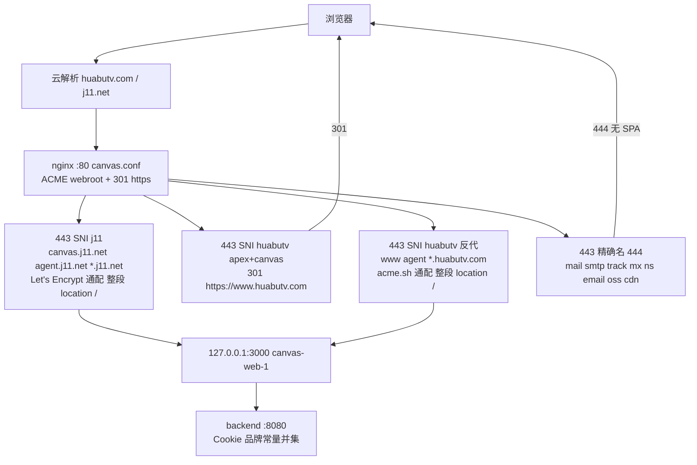
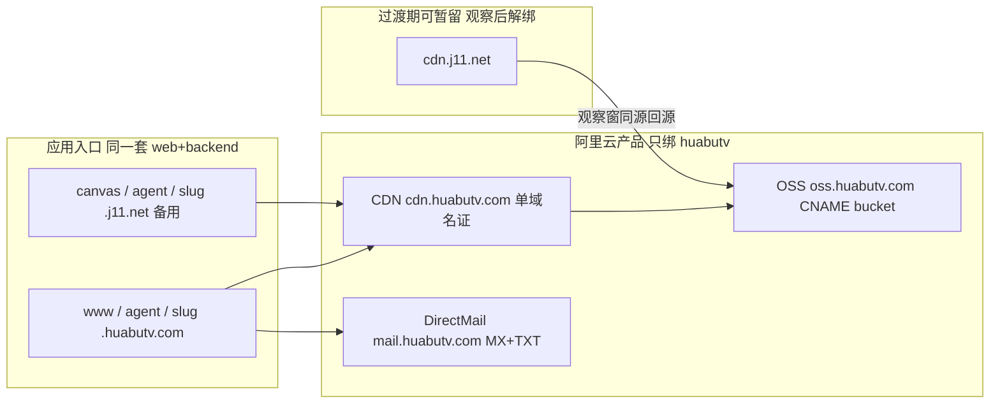

# 画布TV 主品牌域名切换：j11.net → huabutv.com

| 字段 | 内容 |
| --- | --- |
| 日期 | 2026-09-30 |
| 状态 | 已拍板（Approved） |
| 产品 | 画布TV |
| 作者 | 画布TV |
| 拍板 | 2026-09-30 用户决议：`canvas.huabutv.com` 与 apex 均 HTTPS 301 → www；产品 UI / 主播后台只展示 huabutv，j11 仅运维文档 |
| 现网 | https://canvas.j11.net ；仓库 `VERSION` = `v1.5.72`（产品口径）。现网镜像 tag 是 `open-ai-canvas-web:server` / `open-ai-canvas-backend:server`（**不是** `v1.5.71` 镜像名）。compose 另有 `/opt/canvas/docker-compose.images.yml` |
| 前置 | 只设计、不改 `web/` / `backend/` 应用代码、不 bump `VERSION`、不提交、不改现网 |
| 范围 | 基础设施（DNS / 证书 / nginx / CDN / OSS / DirectMail）+ 代码默认值 / Cookie / CORS / 允许名单 / 文案。无 schema。不改 `handler/agent.go`。不带广场 ingest。不自动把公开首页从欢迎页改成满创。 |
| 现网机 | 青岛 ECS `139.129.22.166`，ssh Host `xiaohe`，compose `/opt/canvas` |
| 运维身份 | RAM 子账号 `canvas@1194663601498266.onaliyun.com`（有 ECS / OSS / DNS / 证书，**没有安全组权限**）；SSH 密钥 `canvas.pem` |
| 硬顺序 | **PR-A（品牌常量双父域 Cookie）→ nginx 阶段 2 → 观察到 `Set-Cookie; Domain=.huabutv.com` 才把人放到 www → 阶段 4 env → PR-B → 阶段 5 `CDNBaseURL`。** 未备案则禁止切国内 CDN 自定义域。 |

---

## Overview

画布TV 今天的公网入口、Cookie 父域、CORS、主播子域、OG、OSS 图片处理允许名单和文档全部写死在 `j11.net` 上。`huabutv.com` / `www.huabutv.com` 的 A 记录已经指到同一台青岛 ECS，但 nginx 的 `server_name` 和证书仍只有 `j11.net` 通配，浏览器打开 `https://www.huabutv.com` 会 SNI 证书不匹配。

本期把 **`www.huabutv.com` 升为主品牌 canonical**，`huabutv.com` apex 301 到 www；代理后台 `agent.huabutv.com`、主播落地 `{slug}.huabutv.com`；CDN / OSS / 发信分别迁到 `cdn.huabutv.com` / `oss.huabutv.com` / `mail.huabutv.com`。原来的 `canvas.j11.net` / `agent.j11.net` / `{slug}.j11.net` **继续反代到同一套 web，作为备用入口，不 301 到 huabutv**，但 **不再** 作为 CDN、OSS 自定义域或发信域。

代码侧把默认父域从 `j11.net` 改为 `huabutv.com`，默认画布 host 改为 `www.huabutv.com`。Cookie / 主播跳转的「已知父域」是品牌常量并集 `{huabutv.com, j11.net}`，**不随** `CANVAS_PUBLIC_PARENT_DOMAIN` 收缩——否则 PR-A 上线、现网 env 仍是 j11 时，www 只会拿到 host-only cookie。存储、邮件、支付 `publicBaseUrl`、Linux.do `redirectUrl` 仍走管理后台 JSON，无 migration，`CANVAS_AUTO_MIGRATE` 保持 false。

**在 `Set-Cookie; Domain=.huabutv.com` 被 curl 观察到之前，不要把人类流量导向 www。** 阶段 2 只开 TLS/反代，不等于可以宣传主站已切。

---

## Background & Motivation

### 现状（已对照代码与现网）

#### DNS（xiaohe `getent hosts`）

| 主机 | 解析 | 含义 |
| --- | --- | --- |
| `canvas.j11.net` | `139.129.22.166` | 现网主入口 |
| `www.huabutv.com` | `139.129.22.166` | 已指向本机，nginx 未纳入 |
| `huabutv.com` | `139.129.22.166` | 同上；已在阿里云云解析 |
| `cdn.j11.net` | 阿里云 CDN（`*.w.kunlunaq.com`；IPv4 `140.249.108.x` **与** IPv6） | 对象公网分发 |
| `oss.j11.net` | `139.129.22.166`（**A 到 ECS，不是 bucket CNAME**） | 历史包袱，见下 |
| `agent.j11.net` | `139.129.22.166` | 代理后台 |

#### `oss.j11.net` 为什么不能当「OSS 自定义域名」复制到 huabutv

阿里云 OSS 自定义域名的正确形态是：

1. DNS：`oss.example.com` **CNAME** 到 `{bucket}.oss-cn-qingdao.aliyuncs.com`（或控制台给出的 OSS 源站域名）；
2. OSS 控制台绑定该自定义域名，并上传证书。

现网 `oss.j11.net` 是 **A 记录到 ECS**。结果是 `Host: oss.j11.net` 落到 `/etc/nginx/conf.d/canvas.conf` 的 `*.j11.net`，被反代进画布 SPA，**并不提供 bucket 对象**。代码里 `plazaOwnedMediaURL` / `canProcessOssUrl` 把 `oss.j11.net` 当成自有媒体，是允许名单上的历史假设，不是真正的 OSS 自定义域。

huabutv **禁止**再做「A 到 `139.129.22.166`」。`oss.huabutv.com` 必须 CNAME 到青岛 bucket；公网读走 `cdn.huabutv.com`。

#### 现网反代

`/etc/nginx/conf.d/canvas.conf`（**不是**宝塔 `vhost/nginx/canvas.conf`）：

- `:80 default_server` + `:443` / `[::]:443 ssl http2`，`server_name canvas.j11.net agent.j11.net *.j11.net`
- 80 → 301 https；ACME webroot `/var/www/acme`
- 443 → `proxy_pass http://127.0.0.1:3000`（`canvas-web-1` 只绑 `127.0.0.1:3000`）
- `location /` **不是**三个转发头。现网还有 `Upgrade` / `Connection`、`proxy_buffering off`、`gzip off`、`proxy_read_timeout 3600s`、`proxy_pass_header X-Accel-Buffering`。新 huabutv server 必须 **整段复制**，否则文本任务 SSE / WebSocket 会断（AGENTS.md：不要另发明一套超时/缓冲策略）
- 证书 `/etc/nginx/certs/canvas.j11.net.fullchain.pem`：Let's Encrypt（CN `YR2`），SAN `*.j11.net` + `j11.net`，2026-09-23 → 2026-12-22（90 天）
- 签发：`acme.sh --list` 为 `j11.net` + `*.j11.net`，`Le_Webroot='dns_ali'`，cron `acme.sh --cron` 每日四次。**不是**阿里云免费 DV
- HSTS `max-age=31536000; includeSubDomains`（只对 **j11.net 可注册域** 生效，不会「带上」huabutv.com；但一旦写到 `www.huabutv.com` 且带 `includeSubDomains`，浏览器会把全部 `*.huabutv.com` 钉死 HTTPS 一年，摘 server **教不回去**）

因此今天：

- `http://www.huabutv.com` 命中 `:80 default_server`，301 到 https 后 SNI 证书是 j11，浏览器报错；
- 同机 `manju.j11.net` / `auth.j11.net` / `mj.j11.net` / `version.j11.net` 等宝塔站点有自己的 `server_name`，**不得**改那些 vhost。

#### 现网 compose / env

`/opt/canvas/docker-compose.override.yml` backend：

```yaml
CANVAS_COOKIE_DOMAIN: ${CANVAS_COOKIE_DOMAIN:-.j11.net}
CANVAS_PUBLIC_PARENT_DOMAIN: ${CANVAS_PUBLIC_PARENT_DOMAIN:-j11.net}
CANVAS_PUBLIC_AGENT_HOST: ${CANVAS_PUBLIC_AGENT_HOST:-agent.j11.net}
CANVAS_PUBLIC_CANVAS_HOST: ${CANVAS_PUBLIC_CANVAS_HOST:-canvas.j11.net}
```

`/opt/canvas/.env`（与 `canvas-backend-1` 容器 env 一致）：

```
CANVAS_CORS_ORIGINS=https://canvas.j11.net
CANVAS_COOKIE_DOMAIN=.j11.net
CANVAS_PUBLIC_PARENT_DOMAIN=j11.net
CANVAS_PUBLIC_AGENT_HOST=agent.j11.net
CANVAS_PUBLIC_CANVAS_HOST=canvas.j11.net
```

另有 `/opt/canvas/docker-compose.images.yml`（这棵 git 树没有）。现网 `CANVAS_AUTO_MIGRATE=false`，`CurrentSchemaVersion = 47`。

Compose 的 `${VAR:-default}` 在 **unset 或空字符串** 时都会套 default。因此只把 `.env` 里 `CANVAS_COOKIE_DOMAIN=` 留空 **不够**，override 仍会写回 `.j11.net`。阶段 4 必须改 override 模板本身。这是防御纵深，**不是** Cookie 修复的唯一手段——PR-A 的品牌常量并集才是「env 仍为 j11 时 www 能种 `.huabutv.com`」的保证。

#### Host 模型（代码）

`backend/internal/app/streamer.go`：

- `defaultPublicParentDomain = "j11.net"`
- `PublicCanvasHost()` → env 或 `canvas.` + parent（**没有** www 公式）
- `PublicAgentHost()` → env 或 `agent.` + parent
- `StreamerLandingHost(slug)` → `slug.` + parent（**不看请求 Host**）
- `reservedStreamerSlugs`：www / app / api / agent / admin / static / cdn / mail / canvas（**没有 oss / smtp**）
- `ResolveStreamerByHost` 只取最左 label，**不校验父域**，所以 `zhangsan.huabutv.com` 与 `zhangsan.j11.net` 已能解析到同一主播（测试 `streamer_host_test.go` 两边都覆盖了）
- `PublicSiteSkin` / `StreamerConsoleMe` 把 `ParentDomain` / `AgentHost` / `CanvasHost` 发给前端，但 **一律用 env/默认主域**，忽略请求 Host

`web/src/lib/public-hosts.ts`：

- `DEFAULT_PARENT_DOMAIN = "j11.net"`
- `publicCanvasHost()` 默认 `canvas.${parent}`
- `isCanvasHost`：最左 label 是 `canvas` **或** `www`，**或** host === parent（apex 已当画布）
- `isAgentHost`：只看最左 label `agent`（`agent.huabutv.com` 与 `agent.j11.net` 都能识别）
- `isStreamerMarketingHost`：`host.endsWith('.' + publicParentDomain())` —— 默认父域改成 huabutv 后，**`a.j11.net` 会不再被当成主播页**，除非做双父域
- `canvasWorkspaceURL()` / `agentConsoleURL()` 在非 canvas/agent 时用 **无父域参数的** `publicCanvasHost()` / `publicAgentHost()`，SSR fallback 写死 j11
- `PublicSiteSkin.parentDomain` 类型已在 `web/src/services/api/streamer.ts`，**前端没有消费**

登录后跳转不只 `login.tsx`：`register.tsx`、`root-home.tsx`、`guest-home.tsx` 都在 `isStreamerMarketingHost()` 时 `window.location.replace(canvasWorkspaceURL())`。实现应把合同收在 `public-hosts.ts`（调用方不必改），否则备用域主播页会跳到 www 并丢掉 `.j11.net` cookie。

#### Cookie

`backend/internal/handler/auth.go` `sessionCookieDomain`：

1. `CANVAS_COOKIE_DOMAIN` **非空则一律使用**（现网 `.j11.net`）；
2. 否则 Host 落在 `PublicParentDomain()` 上才写 `.`+parent；
3. 否则 host-only。

`setSessionCookie` 会先 **过期 host-only** 同名 cookie，再写 parent Domain。因此 www 响应若带 `Domain=.j11.net`，浏览器丢弃该 Set-Cookie，同时又清掉了 host-only——表现是「API 200，仍然未登录」，而不是「至少 www 自己能登录」。

现网 **同时** 有 `CANVAS_COOKIE_DOMAIN=.j11.net` 和 `CANVAS_PUBLIC_PARENT_DOMAIN=j11.net`。若「已知父域」做成 `PublicParentDomain()` + backup，而两者都是 j11，则 `matchingKnownParent("www.huabutv.com")` 为空，env 又不匹配 Host，结果仍是 host-only。这是 PR-A 原草案的核心漏洞。

#### CORS

`backend/cmd/server/main.go` `parseCORSPolicy` / `allowedOriginWithPolicy` / `corsOriginMatchesConfiguredSubdomain`：

- 配置一个 origin 会放行其 **registrable parent 上的一级子域**（`corsRegistrableParent`：`www.huabutv.com` → `huabutv.com`）；
- 测试 `TestAllowedOriginAllowsOneLevelSubdomainOfConfiguredHost`：名单 `https://app.huabutv.example` 放行 `https://zhangsan.huabutv.example`；
- **因此名单只有 `https://www.huabutv.com` 时，`https://foo.huabutv.com` / `https://agent.huabutv.com` 其实会被放行**；
- **apex `https://huabutv.com` 不会被 www 带出来**（apex 的 parent 是 `com`），必须显式列入；
- 名单里有 apex 时，第一段 `scheme://parent` 也会放行全部一级子域；
- 同 Host 的 Origin（`X-Forwarded-Host`）直接放行。现网 SPA 走相对路径 `/api`，同 Host 凭证请求不依赖 CORS。**「同 Origin API 可用」不等于登录可用。**

现网只配 `https://canvas.j11.net`，一级子域规则覆盖 `agent.j11.net` / `{slug}.j11.net`。huabutv 不在名单里。

#### OSS / CDN 允许名单与画布播放路径

运行时 **带 storageKey 的播放** 不读死 CDN host：

- 前端 `resolveImageUrl` / `resolveMediaUrl`（`web/src/services/image-storage.ts`、`file-storage.ts`）优先 `resourceFileUrl(id)` → `/api/resources/:id/file`
- `PrepareResourceDelivery`（`resource.go` ~138–141）在 `CDNBaseURL != ""` 时 `ossCDNObjectURL(setting.CDNBaseURL, objectKey)` 302 到 **当前** 后台值

因此阶段 5 改 `CDNBaseURL` 之后，画布节点走 storageKey 的预览 **不必** 等展示层 host 改写，也 **不要** 为此推迟阶段 5。

硬编码 j11、改后台也救不了的是 **处理参数** 和 **从未走 resource 接口的绝对 URL**：

- `web/src/lib/oss-image.ts` `canProcessOssUrl`：精确/后缀匹配 `cdn.j11.net`、`j11.net`，以及 `aliyuncs.com` / `oss-cn-` / **`liblib.art` / `liblib.cloud`**（CHANGELOG/UI 不得出现这些名字，但允许名单必须保留）
- `safeHost` base `https://canvas.j11.net`：相对路径会被当成 j11，再被 `endsWith("j11.net")` 当成可 process——改 fallback 之前必须先把允许名单改成 **精确媒体 host**，禁止 `*.huabutv.com`
- `backend/internal/app/appearance_media.go` `aliyunStyleCDN`：判断的是 **`CDNBaseURL` 的 host**，不是对象 URL。`CDNBaseURL=https://cdn.huabutv.com` 之后，在 PR-B 之前这里会停掉 process
- `ossProcessedImage` 用于满创/门户/广场/创作页缩略图（`manchuang-home.tsx`、`portal-home.tsx`、`plaza/work.tsx`、`creation-workspace.tsx`、`media-thumb.ts`），**不是**画布节点 resolver
- 解绑 `cdn.j11.net` 之后，appearance hero、广场封面、canvas `metadata.content` 回退、以及任何 `src={publicUrl}` 且从未进 `ossProcessedImage` 的绝对 URL **会裂图**。只改 `oss-image.ts` 不等于全局改写

广场 `plaza_ingest_media.go` 的 `plazaOwnedMediaURL` 同样硬编码 `cdn.j11.net` / `oss.j11.net`。该文件与 `cmd/server/plaza_ingest.go` 按仓库约定视为 dirty / 独立线，**本期 PR Plan 不包含 ingest**。切域后、ingest 允许名单未改之前 **禁止跑 ingest**：新 `cdn.huabutv.com` URL 会被当成外部资源再抓一份。

#### 邮件

管理后台 SMTP（`web/src/pages/admin/components/email-settings-panel.tsx`），不是 Cloudflare Email Routing。占位符仍是 `smtp.mx.cloudflare.net`。`fromEmail` 存在系统设置 JSON。切换 = DirectMail 验证 huabutv 侧域名 + 改后台 SMTP，代码协议不变。

DirectMail 在 `mail.huabutv.com` 上要 MX + TXT。**MX/TXT 不会压过通配 A**：`*.huabutv.com` A → ECS 时，`mail.huabutv.com` 的 HTTPS 仍打到本机。`mail` 上也不能再放 CNAME（与 MX 互斥）。nginx 必须给保留基础设施名单独 444，不能指望「不要写进 server_name」。

#### 支付

`backend/internal/app/payment.go`：`NotifyURL` **和** `ReturnURL` 都 = 渠道配置里的 `publicBaseUrl` + `/api/payments/notify|return/...`，跟请求 Host 无绑定。本期 **不** 做 Return 按 Host 自适应（那是额外代码）。

- Notify 打到旧 host 是保留 j11 反代的理由（在途入账）。
- Return 切到 www 后，从 `canvas.j11.net` 打开钱包的用户会被送到 www，**备用域 cookie 带不过去**，看起来已付但未登录。阶段 5 必须把这条 UX 排进顺序，而不是只回归「旧 notify」。

#### Linux.do OAuth

`backend/internal/auth/linuxdo.go`：`linuxdo_oauth` JSON 里 **只有一个** `redirectUrl`，原样作为 `redirect_uri`。管理后台 `access-settings-panel.tsx` 要求与 Linux.do 应用登记值 **完全一致**。现网几乎肯定是 `https://canvas.j11.net/oauth/linuxdo/callback`。canonical 切到 www 后，不改这一项则 www 登录 Linux.do 失败；只改应用侧、不改站内，则旧 host 失败。Linux.do 控制台可以登记 **多个** 回调；站内只能保存一个，www 成为主入口后站内必须是 canonical 回调。这与 SMTP/`CDNBaseURL` 同类，不是 `handler/agent.go`。

#### 文案 / OG / 测试

- `web/src/pages/admin/components/streamers-panel.tsx` L127 / L250 / L285 写死 `{slug}.j11.net`
- `web/index.html` `og:url` / `og:image` / `twitter:image` 硬编码 `https://canvas.j11.net`（query `v=1.5.52`）
- `web/test/appearance-bootstrap.test.ts` 锁的是 `v=1.5.50`（已与 html 脱节，改 OG 时一起对齐）
- `web/test/public-home.test.ts` 锁 `agent.j11.net` / `canvas.j11.net`，**没有** hostname mock
- `backend/internal/app/streamer_host_test.go` `TestPublicHostsDefaultToJ11`（PR-A 必须改名/改期望）
- `README.md`、`docs/画布TV-主播代理-域名与CORS.md` 整篇 j11
- CHANGELOG / UI **不得**出现 libtv / lumlum / liblib（允许名单代码里的第三方媒体 host 可以留，只是不写进 changelog）

#### 公开首页

`web/src/pages/public-home/root-home.tsx` 的 `/` **已经**渲染 `ManchuangHomePage`（agent / 已登录主播页除外）。`normalizePublicAppearance` 的 `publicHomepage: "welcome"` 只是 **store 默认值**，不是 `/` 实际画出的皮肤。本期不得借切域去改 `publicHomepage` 默认或把欢迎页逻辑改成「强制满创」；现网 appearance 若已是 manchuang 则保持。

### 痛点

| 用户动作 | 实际结果 |
| --- | --- |
| 打开 `https://www.huabutv.com` | SNI 证书是 j11，浏览器拦截 |
| nginx 先于 Cookie 修复就把 www 当可登录 | Set-Cookie `Domain=.j11.net` 被丢弃 + host-only 被过期 → API 200 仍未登录 |
| 希望主播页 `{slug}.huabutv.com` | DNS 可通配到本机，但无通配证书、无 cookie 父域、后台表格仍写 j11 |
| 把 CDN 改成 `cdn.huabutv.com` | storageKey 播放跟 `CDNBaseURL`；缩略图允许名单不认；历史绝对 URL 仍是 `cdn.j11.net` |
| 只改 `CANVAS_COOKIE_DOMAIN=.huabutv.com` | 备用域 `canvas.j11.net` 种不下 cookie |
| 已知父域 = `PublicParentDomain()` + backup | 现网两值都是 j11 时，www 仍是 host-only |
| `mail.huabutv.com` 配 MX 后以为不会进 nginx | 通配 A 仍解析到 ECS，`*.huabutv.com` server 会出 SPA |

---

## Goals & Non-Goals

### 目标

- 主品牌 canonical = `https://www.huabutv.com`；apex `https://huabutv.com` HTTPS 301 → www。
- 工作区 / 登录后画布：`www.huabutv.com`。apex 与 `canvas.huabutv.com` **均 HTTPS 301 → www**（已拍板，不是 alias，也不留未解析）。
- 代理后台：`agent.huabutv.com`。
- 主播落地：`{slug}.huabutv.com`，`*.huabutv.com` 证书（**acme.sh dns_ali**，与现网 j11 同路径）+ 通配 A。
- 备用：`canvas.j11.net` / `agent.j11.net` / `{slug}.j11.net` 继续反代同一套 web，**不**强制 301 到 huabutv；备用域独立 Cookie。**产品 UI、页脚、导航、主播后台只展示 `{slug}.huabutv.com` 与 www 画布 host，不出现 j11 URL。**
- CDN `cdn.huabutv.com`、OSS 自定义域 `oss.huabutv.com`、发信 `mail.huabutv.com`；从 CDN / OSS / DirectMail **解绑** j11 对应绑定（解绑晚于新域验证与观察窗）。
- 代码默认父域 `huabutv.com`，默认画布 host `www.huabutv.com`；Cookie/跳转已知父域是品牌常量 `{huabutv.com, j11.net}`。
- CORS 至少包含 apex + www + 备用 `https://canvas.j11.net`。
- 无 schema、无 `CANVAS_AUTO_MIGRATE=true`。

### 非目标

- 不改 `backend/internal/handler/agent.go`。
- 不把广场 ingest（`plaza_ingest.go` / `plaza_ingest_media.go` 等 dirty 文件）放进 PR；不在本期做 ingest 流程。**切域后、ingest 合入并更新 `plazaOwnedMediaURL` 之前禁止跑 ingest**（新 CDN URL 会被当外部资源重复抓取）。
- 不自动把默认公开首页从「影策欢迎页」改成满创（`/` 今天已经是满创组件；不要动 `publicHomepage` store 默认）。
- **不 mutate 画布 JSON / 广场 / 素材表里的绝对 URL**（无 migration）。历史绝对 URL 靠过渡期保留旧 CDN + 指定调用点的展示改写。
- 不跨父域共享 session，不做 IdP / SSO 桥；支付 Return / Linux.do `redirectUrl` **不**改成按 Host 自适应。
- 不改同机宝塔站点 nginx，不改安全组。
- 不把 `aliy.md` 或任何 AccessKey 写入本文或代码。
- 不 bump `VERSION`、不发版（本文只设计）。
- CHANGELOG / UI 不出现 libtv / lumlum / liblib。
- 不为 `cdn` / `oss` / `mail` 等基础设施名在 ECS 上 `proxy_pass` 到 :3000。
- 产品界面（含主播后台表格/表单 extra/落地页文案）**不展示** `j11.net` URL；j11 只出现在运维文档与代码双父域实现里。

---

## Key Decisions

1. **Canonical = `https://www.huabutv.com`（2026-09-30 已拍板）。** apex `https://huabutv.com` 在 HTTPS（以及 HTTP）**301** 到 `https://www.huabutv.com$request_uri`。apex **不是**可访问并列官网。**阶段 2 的 HSTS 只写 `max-age=31536000`，禁止 `includeSubDomains`，禁止 preload。** 等 `curl -IIv https://cdn.huabutv.com/` 与 `https://oss.huabutv.com/` 都出示匹配证书后，再在 huabutv 反代 server 加上 `includeSubDomains`。理由：浏览器一旦在 www 上学到 includeSubDomains，CDN/OSS/mail 缺证会硬失败，回滚摘 443 也清不掉 HSTS。

2. **`CANVAS_PUBLIC_CANVAS_HOST=www.huabutv.com`，代码默认公式从 `canvas.`+parent 改为 `www.`+parent。** 现网 override / `.env` 在阶段 4 同步。备用域历史入口仍是 `canvas.j11.net`（**不**发明 `www.j11.net`）。

3. **`canvas.huabutv.com` HTTPS 301 到 `https://www.huabutv.com$request_uri`（2026-09-30 已拍板）。** 不是并列 alias，也不留未解析（通配 A 会落到 ECS，必须用精确 `server_name` 做 301）。`canvas` 仍是保留字，不能当主播 slug。

4. **代理后台 `agent.huabutv.com`，主播 `{slug}.huabutv.com`。** 通配证书 SAN = `huabutv.com` + `*.huabutv.com`。保留字增加 `oss`、`smtp`、`track`、`mx`、`ns`、`email`（`cdn` / `mail` 已有）。这些名字另做更精确的 443 server，`return 444`，**不** `proxy_pass`。

5. **备用域继续服务、不 301；产品 UI 不展示。** `canvas.j11.net` / `agent.j11.net` / `{slug}.j11.net` 仍反代同一套 web，j11 证书继续给备用域。同机其它 j11 站点不动。备用域 **不再** 绑定 CDN / OSS 自定义域 / DirectMail 发信。**产品导航、页脚、主播后台只展示 `{slug}.huabutv.com` 与 www 画布 host，不出现 j11 URL。** 运维文档（PR-C、`docs/画布TV-主播代理-域名与CORS.md`、本文 Rollout）仍可写 `canvas.j11.net` 为备用入口。

6. **Cookie 已知父域 = 品牌常量并集 `{huabutv.com, j11.net}`，与 `PublicParentDomain()` 解耦。** 再并入 env 主域 / `CANVAS_PUBLIC_BACKUP_PARENT_DOMAIN` 作为额外项（不能用空 backup env 在本期关掉 j11）。`CANVAS_COOKIE_DOMAIN` 仅当 **Host 匹配该 Domain** 时覆盖；匹配已知父域时 **先** 写 `.`+该父域，因此「Host=www.huabutv.com 且现网 env 仍是 `CANVAS_PUBLIC_PARENT_DOMAIN=j11.net` + `CANVAS_COOKIE_DOMAIN=.j11.net`」必须得到 `Domain=.huabutv.com`。两套登录态不共享。主播跳转必须留在同一父域。**在该 Set-Cookie 被现网 curl 观察到之前，禁止把 www 当可登录主站宣传。**

7. **CORS 现网至少：** `https://www.huabutv.com,https://huabutv.com,https://canvas.j11.net`。apex 必须显式列入。禁止 `*`。

8. **CDN = `cdn.huabutv.com` → 阿里云 CDN，源站 OSS bucket（或绑定完成后的 `oss.huabutv.com`），不要回源 ECS。** 管理后台 `CDNBaseURL=https://cdn.huabutv.com`。CDN/OSS 用阿里云 **单域名** 证书（免费 DV 只支持单域名，正好给这两个 host）；ECS 通配符走 acme.sh，不把通配证当免费 DV。从 CDN / OSS **解绑** `cdn.j11.net` 必须在观察窗之后。**未完成 ICP 备案则不得把国内 CDN 自定义域切到生产流量（阶段 5 硬停止）。**

9. **OSS = `oss.huabutv.com` CNAME 到 `{bucket}.oss-cn-qingdao.aliyuncs.com`，在 OSS 控制台绑定。禁止 A 到 `139.129.22.166`。**

10. **发信域 = `mail.huabutv.com`，From = `noreply@mail.huabutv.com`，FromName = 画布TV。** SPF / DKIM / MX / DMARC 打在 `mail` 子域。跟踪用控制台给出的 **独立** 主机（常见 `dmtrace` CNAME），**不要**在 `mail` 上再套 CNAME。MX **不能**阻止通配 A，所以 mail 的 HTTPS 靠 nginx 444，不靠 DNS。

11. **解绑顺序：新域验证通过 → PR-B 允许名单在线 → 改 `CDNBaseURL` / SMTP / 支付 `publicBaseUrl` / Linux.do 站内 `redirectUrl` → 观察 → 再解绑 j11 的 CDN / OSS / 邮箱。** 支付 `publicBaseUrl` 只在 www 已成为对外入口、且能接受「备用域钱包 Return 进 www 会话岛」之后再改（或一直留 j11 Return 直到备用流量可忽略）。Linux.do 控制台可同时登记 j11 与 www 回调；站内只存 canonical。

12. **媒体允许名单用精确 host，不做 `*.huabutv.com`。** 精确：`cdn.huabutv.com`、`oss.huabutv.com`、`cdn.j11.net`、`oss.j11.net`，以及现有 `aliyuncs.com` / `oss-cn-` / 第三方对象 host（代码保留，CHANGELOG 不点名）。展示改写 **只** 发生在点名的函数里（见 Proposed Design），**禁止**改画布 JSON。`/api/resources/:id/file` 已跟 `CDNBaseURL`，不要为画布播放拖延阶段 5。

13. **前端跳转合同在 `public-hosts.ts`，不靠改 login.tsx。** `KNOWN_PARENT_DOMAINS = ["huabutv.com","j11.net"]`；`canvasWorkspaceURL(host)` / `agentConsoleURL(host)` **必须**走 `parentDomainOfHost` + `canvasHostForParent` / `agentHostForParent`，禁止无父域地调用 `publicCanvasHost()`。hostname 推断不能等 site-skin。测试用传入 host 的 mock，不断 window。

14. **无 schema、无自动 migrate。** `CANVAS_AUTO_MIGRATE` 保持 false。

15. **ECS 通配证书走现网同一条 acme.sh 路径，不用阿里云免费 DV。** `acme.sh --issue -d huabutv.com -d '*.huabutv.com' --dns dns_ali`，安装到 `/etc/nginx/certs/huabutv.com.fullchain.pem` + key，沿用现有 `acme.sh --cron`。`dns_ali` 要求 `huabutv.com` 与今天签发 j11 证的是 **同一云解析账号**（文档声称如此，控制台未在本次评审里核对）。禁止把 AccessKey 写进文档。j11 证继续给备用域。443 分 server 做 SNI，不混用一张证。

16. **发版：后续实现必须 web+backend 同发。** 现网镜像名是 `:server`，同发 = 同一 tag 的 web+backend，不要只更其中一个。本次只出文档。

17. **代码默认值是画布TV 产品默认，不是通用自托管默认。** 本仓已经把 `j11.net` 烤进源码；改成 `huabutv.com` / `www.` 公式与此一致。其它部署必须显式设置 `CANVAS_PUBLIC_PARENT_DOMAIN` / `CANVAS_PUBLIC_CANVAS_HOST` / `CANVAS_PUBLIC_AGENT_HOST`。拒绝「源码仍 `canvas.`+parent、只在这台机用 env 设 www」——env 会忘，测试会锁错默认。

18. **nginx 新 443 server 整段复制现网 `location /` 与 listen 行。** 含 `[::]:443 ssl http2`、Upgrade/Connection、`proxy_buffering off`、`gzip off`、`proxy_read_timeout 3600s`、`proxy_pass_header X-Accel-Buffering`。禁止只抄 Host / X-Forwarded-*。`:80` 仍保留 ACME webroot（通配符走 dns_ali，单域名证若用 HTTP-01 仍需要）。

---

## Proposed Design

### 主机地图

| 主机 | 角色 | DNS | TLS 终止 | 应用行为 |
| --- | --- | --- | --- | --- |
| `www.huabutv.com` | canonical 官网 / 工作区 | A → ECS | nginx huabutv 通配证 | `isCanvasHost` |
| `huabutv.com` | apex | A → ECS | nginx | **HTTPS 301 → www**（已拍板） |
| `canvas.huabutv.com` | 保留字，防三套官网 | 通配 A | nginx 精确 server | **HTTPS 301 → www**（已拍板） |
| `agent.huabutv.com` | 代理后台 | 通配或显式 A | nginx | `isAgentHost` |
| `{slug}.huabutv.com` | 主播落地 | `*.huabutv.com` A | nginx 通配 | `ResolveStreamerByHost` |
| `cdn.huabutv.com` | 对象 CDN | **CNAME → CDN** | CDN **单域名**证 | 不进 SPA；ECS 上 444 兜底 |
| `oss.huabutv.com` | bucket 自定义域 | **CNAME → OSS** | OSS **单域名**证 | 同上 |
| `mail.huabutv.com` | DirectMail | **MX + TXT**（无 CNAME） | 通配 A 仍到 ECS | nginx **精确名 444** |
| `smtp` / `track` / `mx` / `ns` / `email` | 保留基础设施 | 可能只有通配 A | nginx 444 | 不进 SPA |
| `canvas.j11.net` | 备用工作区 | 维持 | j11 证 | label `canvas` |
| `agent.j11.net` | 备用代理后台 | 维持 | j11 证 | `isAgentHost` |
| `{slug}.j11.net` | 备用主播页 | 维持 | j11 证 | 同一 slug |

通配 `*.huabutv.com` A 到 ECS 时，更具体的 **CNAME**（cdn / oss / dmtrace）优先。**MX/TXT 不抑制通配 A。** 忘记写 CNAME 或 mail 这类无 CNAME 的名字会落到 ECS——这是事故，用 444 server 收住，不是功能。

### 流量：用户 Host → nginx → web → backend



nginx 要点（现网手改，**不是 git PR**）：

- 只改 `/etc/nginx/conf.d/canvas.conf`。不要改宝塔 `vhost/nginx/*`。
- 保留 `:80 default_server`。`server_name` 增加 huabutv 名字。`/.well-known/acme-challenge/` 仍 `/var/www/acme`。HTTP `301 https://$host$request_uri`，canonical 在 443 做。
- 443 **四个** server（精确名优先于通配）：
  1. 原 j11 反代（证书与 `location /` 不动）
  2. huabutv 反代：`www.huabutv.com agent.huabutv.com *.huabutv.com`
  3. 301：`huabutv.com canvas.huabutv.com`
  4. 基础设施 444：`mail.huabutv.com smtp.huabutv.com track.huabutv.com mx.huabutv.com ns.huabutv.com email.huabutv.com oss.huabutv.com cdn.huabutv.com` → `return 444;`（有证书即可，**禁止** `proxy_pass`）
- 新 443 server 的 listen 复制现网：`listen 443 ssl http2;` 与 `listen [::]:443 ssl http2;`（huabutv 无 AAAA 也不要让配置漂移）。
- **把现网 j11 443 的整个 `location /` 原样贴进 huabutv 反代 server**，不要手写精简版。
- 阶段 2 HSTS：`add_header Strict-Transport-Security "max-age=31536000" always;` —— 无 `includeSubDomains`。CDN/OSS HTTPS 验收后再加。
- `nginx -t` 后再 reload。RAM 没有安全组权限：80/443 必须已经是通的。

### CDN / OSS / 邮件与两套父域



**新**对象 URL 一律 `https://cdn.huabutv.com/{key}`（阶段 5 起）。storageKey 播放经 `/api/resources/:id/file` 已指向该值。旧绝对 URL 在观察窗内可继续打 `cdn.j11.net`；指定函数可改写到新 host。

### 双父域 Host 解析

#### Go

```go
var brandParentDomains = []string{"huabutv.com", "j11.net"}

func knownParentDomains() []string {
    // 品牌常量始终在；再并 PublicParentDomain() 与 CANVAS_PUBLIC_BACKUP_PARENT_DOMAIN（额外，可空）。
    // 空 backup env 不得从并集里拿掉 j11.net。
}

func matchingKnownParent(host string) string {
    // host == parent 或 HasSuffix "."+parent，按 knownParentDomains() 匹配
}

func ParentDomainForHost(host string) string {
    if p := matchingKnownParent(host); p != "" {
        return p
    }
    return PublicParentDomain() // 生成对外主品牌链接时的回落
}

func CanvasHostForParent(parent string) string {
    switch parent {
    case "j11.net":
        return "canvas.j11.net"
    default:
        if parent == PublicParentDomain() {
            return PublicCanvasHost() // env 或 www.+parent
        }
        return "www." + parent
    }
}

func AgentHostForParent(parent string) string {
    if parent == "j11.net" {
        return "agent.j11.net"
    }
    if parent == PublicParentDomain() {
        return PublicAgentHost()
    }
    return "agent." + parent
}

func PublicCanvasHost() string {
    if host := envHost("CANVAS_PUBLIC_CANVAS_HOST"); host != "" {
        return host
    }
    return "www." + PublicParentDomain()
}
```

`PublicSiteSkin` / `StreamerConsoleMe` 用请求 Host 的父域填 URL。前端 **可以**读这些字段，但登录跳转 **禁止**等 site-skin。

#### TypeScript 合同（`web/src/lib/public-hosts.ts`，PR-A 必须落地）

```ts
export const KNOWN_PARENT_DOMAINS = ["huabutv.com", "j11.net"] as const;
export const DEFAULT_PARENT_DOMAIN = "huabutv.com";

export function parentDomainOfHost(host: string): string | "" { /* suffix 匹配 KNOWN_PARENT_DOMAINS，再试 publicParentDomain() */ }

export function canvasHostForParent(parent: string): string {
    if (parent === "j11.net") return "canvas.j11.net";
    return publicCanvasHost(undefined, parent || DEFAULT_PARENT_DOMAIN); // www.${parent}
}

export function agentHostForParent(parent: string): string {
    if (parent === "j11.net") return "agent.j11.net";
    return publicAgentHost(undefined, parent || DEFAULT_PARENT_DOMAIN);
}

export function isStreamerMarketingHost(host = currentHostname()) {
    if (!host || isAgentHost(host) || isCanvasHost(host)) return false;
    if (RESERVED_LABELS.has(leftmostHostLabel(host))) return false;
    return Boolean(parentDomainOfHost(host));
}

export function canvasWorkspaceURL(host = currentHostname()) {
    if (!host) return "https://www.huabutv.com/"; // SSR / 无 window
    if (isCanvasHost(host) || isLoopback(host)) return "/";
    return `${publicOrigin(canvasHostForParent(parentDomainOfHost(host)))}/`;
}

export function agentConsoleURL(host = currentHostname()) {
    if (!host) return "https://agent.huabutv.com/";
    if (isAgentHost(host)) return "/agent";
    return `${publicOrigin(agentHostForParent(parentDomainOfHost(host)))}/`;
}
```

**禁止** `canvasWorkspaceURL` 在已识别备用父域时调用无父域的 `publicCanvasHost()`（那会生成 www，丢掉 j11 cookie）。`login.tsx` / `register.tsx` / `root-home.tsx` / `guest-home.tsx` 继续只调这两个函数，PR-A 文件列表不必改它们。

`isCanvasHost`：label `canvas`|`www`，或 host 等于任一已知父域 apex。

`streamers-panel.tsx`（PR-B）**只**渲染 `{slug}.huabutv.com`（表格「域名」列、表单 extra「保存后落地页为 {slug}.huabutv.com」、皮肤说明 `https://{slug}.huabutv.com/`）。**禁止**再写 `.j11.net`，也禁止「备用 `{slug}.j11.net` 仍可用」之类产品文案。默认父域改成 `huabutv.com` 后用 `publicParentDomain()` 即可；不要为展示而读 backup parent。

#### 前端测试合同（`web/test/public-home.test.ts` 或新 `public-hosts.test.ts`）

传入 host，不 mock `window`：

| 调用 | 期望 |
| --- | --- |
| `publicCanvasHost()` | `www.huabutv.com` |
| `publicAgentHost()` | `agent.huabutv.com` |
| `canvasHostForParent("j11.net")` | `canvas.j11.net` |
| `canvasHostForParent("huabutv.com")` | `www.huabutv.com` |
| `isStreamerMarketingHost("a.j11.net")` | `true` |
| `isStreamerMarketingHost("a.huabutv.com")` | `true` |
| `isStreamerMarketingHost("agent.j11.net")` | `false` |
| `isStreamerMarketingHost("www.huabutv.com")` | `false` |
| `canvasWorkspaceURL("a.j11.net")` | `https://canvas.j11.net/` |
| `canvasWorkspaceURL("a.huabutv.com")` | `https://www.huabutv.com/` |
| `agentConsoleURL("a.j11.net")` | `https://agent.j11.net/` |
| `canvasWorkspaceURL("www.huabutv.com")` | `/` |
| `canvasWorkspaceURL("canvas.j11.net")` | `/` |

后端将 `TestPublicHostsDefaultToJ11` 改名为反映 huabutv 默认，并保留「env 仍指向 j11 时 Public* 跟 env」的用例。

### Cookie

```go
func sessionCookieDomain(c *gin.Context) string {
    host := normalizeRequestHost(c)
    if parent := matchingKnownParent(host); parent != "" {
        return "." + parent
    }
    if env := strings.TrimSpace(os.Getenv("CANVAS_COOKIE_DOMAIN")); env != "" {
        parent := strings.TrimPrefix(strings.ToLower(env), ".")
        if host == parent || strings.HasSuffix(host, "."+parent) {
            if strings.HasPrefix(env, ".") {
                return env
            }
            return "." + parent
        }
    }
    return ""
}
```

`setSessionCookie` 现有「先过期 host-only 再写 Domain」保留。不要从 huabutv 响应里过期 `.j11.net` cookie。

`session_cookie_test.go` 矩阵（**含现网混合 env，缺这一行视为 PR-A 未完成**）：

| 请求 Host | `CANVAS_PUBLIC_PARENT_DOMAIN` | `CANVAS_COOKIE_DOMAIN` | 期望 Domain |
| --- | --- | --- | --- |
| `www.huabutv.com` | 空 / 默认 | 空 | `.huabutv.com` |
| `www.huabutv.com` | `j11.net` | `.j11.net` | **`.huabutv.com`** |
| `a.huabutv.com` | `j11.net` | `.j11.net` | `.huabutv.com` |
| `canvas.j11.net` | `j11.net` | `.j11.net` | `.j11.net` |
| `canvas.j11.net` | `huabutv.com` | 空 | `.j11.net` |
| `www.huabutv.com` | `huabutv.com` | `.j11.net` | `.huabutv.com`（env 不匹配 Host，忽略） |
| `localhost` | 空 | 空 | host-only |

### CORS

现网阶段 4 `.env`：

```
CANVAS_CORS_ORIGINS=https://www.huabutv.com,https://huabutv.com,https://canvas.j11.net
```

`main_test.go` 用 **这一条真实名单** 断言：放行 `https://zhangsan.huabutv.com`、`https://agent.huabutv.com`、`https://a.j11.net`、`https://www.huabutv.com`、`https://huabutv.com`；拒绝无关域与 `https://evil.zhangsan.huabutv.com`。

### OSS / CDN 允许名单与展示改写

精确允许名单（前端 `canProcessOssUrl` 与后端 `aliyunStyleCDN` 对齐语义；后者只看 `CDNBaseURL` host）：

```ts
const OSS_PROCESS_HOSTS = new Set([
    "cdn.huabutv.com",
    "oss.huabutv.com",
    "cdn.j11.net",
    "oss.j11.net",
]);

export function canProcessOssUrl(url: string) {
    const source = rewriteLegacyCdnHost(String(url || "").trim());
    if (!source || source.startsWith("data:") || source.startsWith("blob:") || source.startsWith("/api/")) return false;
    const host = safeHost(source);
    if (OSS_PROCESS_HOSTS.has(host)) return true;
    return /aliyuncs\.com$|\.aliyuncs\.com$|oss-cn-/i.test(host)
        || /liblib\.art$|liblib\.cloud$/i.test(host); // 保留现网行为；CHANGELOG/UI 不出现这些名字
}

const LEGACY_CDN_HOSTS = new Set(["cdn.j11.net", "oss.j11.net"]);

export function rewriteLegacyCdnHost(url: string) {
    try {
        const u = new URL(url); // 只处理绝对 URL，避免相对路径套 www 后误伤
        if (LEGACY_CDN_HOSTS.has(u.hostname)) {
            u.hostname = "cdn.huabutv.com";
            return u.toString();
        }
        return url;
    } catch {
        return url;
    }
}
```

**调用点（PR-B 必须点名，缺一不算完成）：**

| 函数 | 改写？ | 理由 |
| --- | --- | --- |
| `rewriteLegacyCdnHost` | 实现 | 唯一替换逻辑 |
| `ossProcessedImage` | 入口先 rewrite 再 process | 满创/广场/创作缩略图 |
| `ossVideoSnapshot` | 同上 | `media-thumb.ts` 视频首帧 |
| `canProcessOssUrl` | 对 rewrite 后的 host 判断 | 避免旧 host 解绑后 process 加在死域上 |
| `mediaThumbUrl` | 不直接改 | 已走上面三个 |
| `manchuang-home.tsx` `versionedHeroMediaUrl` | fallback base 改 `https://www.huabutv.com`；绝对旧 CDN 走 `ossProcessedImage` 或显式 rewrite | 相对路径不要进 process |
| appearance 前端若直接 `src={logoUrl/hero}` 且可能是绝对 CDN | 包一层 rewrite / `ossProcessedImage` | grep `cdn.j11.net` 与裸 `publicUrl` |
| `resolveImageUrl` / `resolveMediaUrl` | **不改写** | 走 `/api/resources/:id/file` |
| `PrepareResourceDelivery` / `ossCDNObjectURL` | **不改写历史 URL** | 已用当前 `CDNBaseURL` |
| 画布 JSON / `metadata.content` 持久化 | **禁止 mutate** | 无 migration |

PR-B 完成后在 `web/src` 对 `cdn.j11.net` 再 grep 一次：剩下的要么是测试夹具，要么补调用点，要么接受「解绑后该路径裂图」并写进阶段 6 风险。

`safeHost` fallback 改为 `https://www.huabutv.com` **仅在**允许名单已是精确 host 之后，避免相对路径被当成可 process。

后端 `aliyunStyleCDN`：精确匹配 `cdn.huabutv.com` / `oss.huabutv.com` / `cdn.j11.net` / `oss.j11.net`，加上 `aliyuncs.com` / `oss-cn-`。**不要** `HasSuffix("huabutv.com")`。PR-B 必须先于阶段 5 `CDNBaseURL` 切换，否则外观图 process 会停。

**失败模式：**

| 阶段 | 旧绝对 `cdn.j11.net/key` | storageKey `/api/resources/.../file` | 缩略图 rewrite |
| --- | --- | --- | --- |
| PR-B 前、旧 CDN 仍绑 | 200，可能无 process | 跟当时 `CDNBaseURL` | 无改写 |
| PR-B + 阶段 5，旧 CDN 仍绑 | 200；rewrite 后走新 CDN | 新 `CDNBaseURL` | 200（同 key） |
| 旧 CDN 已解绑、无改写调用点 | **裂图** | 仍 200 | 视调用点 |
| 改写后 key 不在新 CDN | — | 200 | 404 → 回滚解绑，不改库 |

### 邮件（DirectMail + 现有 SMTP）

发信域 `mail.huabutv.com`。**以控制台清单为准**，常见形态：

| 类型 | 主机记录 | 值（示例，以控制台为准） |
| --- | --- | --- |
| TXT | `aliyundm.mail` | 所有权 token |
| TXT | `mail` | `v=spf1 include:spf1.dm.aliyun.com -all` |
| MX | `mail` | `mx01.dm.aliyun.com` |
| TXT/CNAME | DKIM 主机（在 mail 之下） | 控制台 |
| TXT | `_dmarc.mail` | `v=DMARC1;p=none;...` |
| CNAME | `dmtrace`（**不是** `mail`） | `tracedm.aliyuncs.com` |

然后后台 SMTP：`fromEmail=noreply@mail.huabutv.com`，发测试信。Cloudflare 一键填入可留。解绑 j11 发信时只删邮件相关记录，避开无关站点。

### 支付 / Linux.do / 微信 / 备案（运维，无代码）

- **ICP 硬停止：** 大陆阿里云 CDN 自定义域需要备案挂到这台 ECS。`huabutv.com` 备案状态本次未核对。**未备案则阶段 5 不得把国内 CDN 自定义域切到生产**（可先用 OSS 默认域名或仅绑定证但不切 `CDNBaseURL`）。
- 支付 `publicBaseUrl`：www 成为对外入口后再改为 `https://www.huabutv.com`。在此之前留 j11，避免备用域钱包 Return 进会话岛。改完后备用域下单的 Return 会到 www（用户需重新登录，钱可能已入账）——阶段 7 必须测「在 `canvas.j11.net` 打开钱包走完 Return」。本期不做 Return 按 Host 编码。
- Notify 旧 URL 继续依赖 j11 反代，直到在途单结束。
- Linux.do：读后台当前 `redirectUrl`。控制台 **同时** 登记 `https://www.huabutv.com/oauth/linuxdo/callback` 与现有 j11 URI。站内字段在 www 成为主入口时改成 www 那一条（代码只有一个 `redirect_uri`）。
- 汇付 / 微信 JS 安全域名 / 授权目录加 www；观察窗内保留 j11。状态未在控制台核对。

---

## API / Interface Changes

对外 HTTP 路径不变。

| 接口 / 环境变量 | 今天 | 之后 |
| --- | --- | --- |
| `GET /api/public/site-skin` 的 host 字段 | 总是 env/默认主域 | 跟随请求 Host 的品牌父域 |
| 代理 console `me` 的 URL | 全局 `PublicCanvasHost()` | `CanvasHostForParent(ParentDomainForHost(req))` |
| `CANVAS_PUBLIC_PARENT_DOMAIN` | 默认 `j11.net` | 默认 `huabutv.com`（Cookie 并集仍含 j11） |
| `CANVAS_PUBLIC_CANVAS_HOST` | 默认 `canvas.`+parent | 默认 `www.`+parent |
| `CANVAS_PUBLIC_BACKUP_PARENT_DOMAIN` | 无 | 可选 **额外** 父域；空 ≠ 删除 j11 |
| `CANVAS_COOKIE_DOMAIN` | 非空则覆盖一切 | 仅 Host 匹配；现网阶段 4 起不设 |
| `CANVAS_CORS_ORIGINS` | `https://canvas.j11.net` | www + apex + canvas.j11.net |
| Set-Cookie Domain | `.j11.net` | 品牌父域匹配结果 |
| `linuxdo_oauth.redirectUrl` | 多半 j11 callback | 站内改为 www callback（控制台双挂） |

仓库 `docker-compose.yml` / `deploy.yml` **不要**写死 huabutv。现网 `/opt/canvas/docker-compose.override.yml`（及 `docker-compose.images.yml` 若注入 env）才改。

---

## Data Model Changes

无表结构、无 migration。后台 JSON：

- 存储 `CDNBaseURL` → `https://cdn.huabutv.com`（阶段 5，PR-B 之后，ICP 通过之后）
- 邮件 SMTP / `fromEmail`
- 支付渠道 `publicBaseUrl`（顺序见上，Return 会话岛）
- `linuxdo_oauth.redirectUrl`

画布文档里的绝对 CDN URL **不改库**。

---

## Alternatives Considered

### A. 备用域 301 到 huabutv

用户要求备用不是废弃。**不采用。**

### B. 继续单值 `CANVAS_COOKIE_DOMAIN`

无法同时服务两套父域。**不采用。**

### C. apex 做 canonical 或 apex 可访问

微信/支付白名单更常见 www。**不采用。** 2026-09-30 已拍板：apex **HTTPS 301 → www**。

### D. `canvas.huabutv.com` 并列 alias 或不解析

三套官网或通配 A 把未声明的 canvas 子域送进 SPA。**不采用。** 2026-09-30 已拍板：精确 `server_name` **HTTPS 301 → www**。

### E. 发信域用 apex

apex MX 截收入站。**不采用。**

### F. 库内全量替换 CDN host

与无 migration 冲突，且画布走 storageKey 不需要。**不采用。**

### G. 单 server 堆两张 `ssl_certificate`

可读性差。**采用分 server。**

### H. 源码仍 `canvas.`+parent，只在这台机 `CANVAS_PUBLIC_CANVAS_HOST=www.huabutv.com`

对其它自托管更「干净」，但本仓已经烤了 `j11.net`；测试会继续锁 `canvas.`+parent，现网忘设 env 就会生成 `canvas.huabutv.com`（还要 301）。**不采用。** 见 Decision 17。

---

## Security & Privacy Considerations

| 风险 | 严重度 | 缓解 |
| --- | --- | --- |
| 通配 A + mail MX，SPA 冒充 mail | 高 | 精确 444 server；保留字；CNAME 先于通配 A（cdn/oss） |
| Cookie Domain 错误 / 已知父域跟 env 走 | 高 | 品牌常量并集；混合 env 测试；www 宣传门闩 |
| 阶段 2 过早 `HSTS includeSubDomains` | 高 | 先无 includeSubDomains；CDN/OSS 证过了再加；不 preload |
| 精简 `location /` 弄断 SSE | 高 | 整段复制现网 location |
| CORS `*` 或漏 apex | 中 | 显式名单 |
| AccessKey / SMTP 密码进 git | 高 | 文档只写账号名与记录类型 |
| 宝塔旁站被改 | 高 | 只动 `conf.d/canvas.conf` |
| 未备案切国内 CDN | 高 | 阶段 5 硬停止 |

---

## Observability

- nginx 按 `$host` 看 301 / 444 / 4xx。`mail.huabutv.com` 应 444 而不是 200 SPA。
- 证书：j11 Let's Encrypt 2026-12-22；huabutv 90 天，靠现有 `acme.sh --cron`。
- www 登录探针：`curl -IIv -c /tmp/cj -b /tmp/cj` 登录后 `Set-Cookie` 含 `Domain=.huabutv.com`。
- `curl -IIv https://cdn.huabutv.com/` / `oss.huabutv.com` 证匹配后才加 HSTS includeSubDomains。
- SMTP 测试信；CDN 4xx；Linux.do 走一遍 www 回调。
- 健康检查只证明进程。不把 Cookie / SMTP 密码 / OSS key 打进日志。

---

## Rollout Plan

**硬顺序（实现时按此，不要按「可同周」理解）：**

1. 阶段 0 DNS（cdn/oss CNAME **先于** 通配 A）
2. 阶段 1 证书（ECS：acme.sh dns_ali；CDN/OSS：阿里云单域名证）
3. **PR-A 镜像上现网**（web+backend `:server` 同 tag）
4. 阶段 2 nginx（含 444、整段 `location /`、HSTS **无** includeSubDomains）
5. **门闩：** curl 在 `https://www.huabutv.com` 登录看到 `Set-Cookie; Domain=.huabutv.com`。**此前不把人类导向 www、不改 DNS 宣传、不改 Linux.do 站内 URL。**
6. 阶段 4 env（CORS + `CANVAS_PUBLIC_*`；改掉 override `:-.j11.net`）
7. **PR-B** 镜像上现网
8. 阶段 5：ICP 通过才切 `CDNBaseURL`；SMTP；Linux.do 控制台双挂后改站内；支付 `publicBaseUrl` 仅在 www 已对外之后
9. 观察 24–72h
10. 阶段 6 解绑 j11 CDN/OSS/邮箱
11. 阶段 7 回归（含备用域支付 Return）

`CANVAS_AUTO_MIGRATE` 始终 false。不改安全组。SSH：`ssh xiaohe`，`canvas.pem`，RAM `canvas@1194663601498266.onaliyun.com`。

### 阶段 0 — DNS（云解析 `huabutv.com`）

apex/www 已指向本机。补：

| 主机记录 | 类型 | 值 | 谁用 |
| --- | --- | --- | --- |
| `@` | A | `139.129.22.166` | 已有 |
| `www` | A | `139.129.22.166` | 已有 |
| `cdn` | CNAME | CDN 分配域名 | **先写**；不要 A 到 ECS |
| `oss` | CNAME | `{bucket}.oss-cn-qingdao.aliyuncs.com` | **先写** |
| DirectMail | TXT + **MX on `mail`** | 控制台 | **不要**给 `mail` 做 CNAME |
| `dmtrace` 等 | CNAME | 控制台跟踪 | 独立于 mail |
| `*` | A | `139.129.22.166` | **最后写**；mail 仍会命中它 |
| `agent` / `canvas` | A | ECS | 可选显式 |
| acme.sh dns_ali | TXT | acme.sh 写入 | 不要手写 CAS `_dnsauth` 当主路径 |

不要给 apex/www 加 AAAA，除非 ECS 已有公网 IPv6。`j11.net` 上 canvas/agent/* **保持**。`cdn.j11.net` / `oss.j11.net` 先不动。

### 阶段 1 — 证书

ECS 通配（复制现网 j11 路径，**不是**阿里云免费 DV）：

```bash
acme.sh --issue -d huabutv.com -d '*.huabutv.com' --dns dns_ali
# 安装到 /etc/nginx/certs/huabutv.com.fullchain.pem 与对应 key
# 权限对齐现网 j11 证；cron 已有 acme.sh --cron，不要另起
```

`dns_ali` 依赖与签发 `*.j11.net` 相同的云解析账号/密钥（密钥已在 xiaohe 的 acme.sh 配置里，**不要**写进本文或 git）。若 huabutv.com 不在该账号，先把云解析转过去或给 acme.sh 配对应 DNS 凭证——只在机器上操作。

CDN / OSS：阿里云 SSL **单域名**证书（个人测试免费版支持单域名、不支持通配），分别绑 `cdn.huabutv.com`、`oss.huabutv.com`。不要等通配证上传到 CDN。

j11 Let's Encrypt 证不动。`:80` ACME webroot 保留给可能的 HTTP-01 单域名证。

### 阶段 2 — nginx（必须已部署 PR-A）

在 `/etc/nginx/conf.d/canvas.conf` 按上文四个 443 server + 80 扩展操作。验收：

- `curl -IIvk --resolve www.huabutv.com:443:139.129.22.166 https://www.huabutv.com/` SAN 含 `*.huabutv.com`
- apex / `canvas.huabutv.com` 301
- `https://canvas.j11.net` 仍 200
- `https://manju.j11.net` 仍是原站点
- `curl -IIv --resolve mail.huabutv.com:443:139.129.22.166 https://mail.huabutv.com/` → 444（不是 SPA）
- 登录 **www**：`Set-Cookie` 含 `Domain=.huabutv.com`。若仍是 `.j11.net` 或没有 Domain——**停止**，不要宣传 www
- 文本任务 SSE：www 上跑一条长文本，确认未被 nginx 缓冲

此阶段 HSTS 无 includeSubDomains。同 Origin API 200 **不是**登录验收。

### 阶段 3 — 代码

见 PR Plan。上现网必须 web+backend 同一 `:server` tag。

### 阶段 4 — 现网 `.env` + override（+ 如有则 images.yml）

```
CANVAS_CORS_ORIGINS=https://www.huabutv.com,https://huabutv.com,https://canvas.j11.net
CANVAS_PUBLIC_PARENT_DOMAIN=huabutv.com
CANVAS_PUBLIC_AGENT_HOST=agent.huabutv.com
CANVAS_PUBLIC_CANVAS_HOST=www.huabutv.com
```

**改掉** `${CANVAS_COOKIE_DOMAIN:-.j11.net}`（不传或 `:-` 且 `.env` 不设该键）。容器内 `printenv CANVAS_COOKIE_DOMAIN` 应为空。`CANVAS_AUTO_MIGRATE=false`。滚动 backend。Cookie 在 PR-A 后已能工作；本阶段主要切生成链接与 CORS 名单。

### 阶段 5 — CDNBaseURL / SMTP / 支付 / Linux.do

前置：PR-B 已上；`curl -IIv https://cdn.huabutv.com/` 证匹配。**未备案 → 停止切国内 CDN，本阶段其余项可继续。**

1. `CDNBaseURL=https://cdn.huabutv.com`。画布 storageKey 预览应 302 到新域。不要为「画布 JSON 里还有旧绝对 URL」而推迟这一步。
2. 此时可给 huabutv 反代 HSTS 加上 `includeSubDomains`（仍不 preload）。
3. DirectMail Verified 后改 SMTP，发测试信。
4. Linux.do 控制台登记 www 回调（保留 j11）；站内 `redirectUrl` 改为 `https://www.huabutv.com/oauth/linuxdo/callback`。
5. 支付 `publicBaseUrl`：仅当 www 已是对外入口。否则留 j11，以免 Return 会话岛。改完后备用域下单 Return 会到 www。
6. 微信/汇付控制台加 www。
7. 观察 24–72h。

### 阶段 6 — 解绑 j11 CDN / OSS / 邮箱

仅当：新 CDN 命中正常、PR-B grep 后的残余绝对 URL 可接受、测试信稳定、在途支付 notify 仍能打到 j11 反代。

1. 解绑 `cdn.j11.net`
2. 去掉 `oss.j11.net` 指向 ECS 的 A（避免撞 SPA）
3. DirectMail 停用 j11 发信
4. **不要**删 canvas/agent/`*.j11.net` 的 A

### 阶段 7 — 回归清单

| 项 | 做法 |
| --- | --- |
| SNI | www / agent / slug / canvas.j11.net |
| 301 | apex、`canvas.huabutv.com` |
| 444 | mail（及未 CNAME 的保留名）不是 SPA |
| Cookie | www 登录后 `agent.huabutv.com` 仍登录；`Domain=.huabutv.com` |
| 混合 env 不再适用 | 阶段 4 后 PUBLIC 已是 huabutv；回归仍可用临时把 PUBLIC 改回 j11 确认 cookie 并集（可选） |
| 备用岛 | `canvas.j11.net` 登录不出现在 www；`a.j11.net` → `https://canvas.j11.net/` |
| 主播 | `{slug}.huabutv.com`；`oss`/`mail` 不能当 slug |
| 画布图 | storageKey 走新 CDN；旧绝对 URL 在解绑前可开 |
| 缩略图 | 新域带 `x-oss-process`；满创/广场封面 |
| SSE | www 长文本任务 |
| 发信 | From `noreply@mail.huabutv.com` |
| Linux.do | www 走通；备用窗内 j11 控制台仍登记 |
| 支付 | 新单 notify 为当时 `publicBaseUrl`；**在 `canvas.j11.net` 打开钱包**，看 Return host 与会话（切 www 后预期要重新登录） |
| 微信 JS | www 不报未授权 |
| 首页 | 不要出现「被这次切域改成满创」的意外；`/` 本就渲染满创组件 |
| 旁站 | manju 等 |
| ingest | 确认没人在切域后跑 |
| schema | migrate false，47 |

### 阶段 8 — 回滚

代码含双父域后，**回滚主品牌不必回滚 git**：

1. nginx 摘 huabutv 443（HSTS 已教会的浏览器仍会强制 https://www — 若同时摘证，这些人会打不开 www，直到 max-age；这是阶段 2 不用 includeSubDomains 也改变不了的 www 自身 HSTS）。j11 server 保持。
2. env 把 `CANVAS_PUBLIC_*` 改回 j11；CORS 只留 canvas.j11.net。Cookie 继续按 Host 自动。
3. `CDNBaseURL` / SMTP / Linux.do / 支付按仍可用的域改回。
4. 不要 `git reset --hard`，不要动宝塔 vhost。
5. 回滚镜像：web+backend 同一旧 `:server` tag。

---

## 已决议

2026-09-30 用户拍板，无剩余开放问题。

| # | 议题 | 决议 |
| --- | --- | --- |
| 1 | `canvas.huabutv.com` | **HTTPS 301** → `https://www.huabutv.com$request_uri`。不是并列 alias，也不留未解析。 |
| 2 | apex `huabutv.com` | **HTTPS 301** → `https://www.huabutv.com$request_uri`。 |
| 3 | 备用域是否在产品里展示 | **否。** 产品 UI / 导航 / 页脚 / 主播后台只展示 `{slug}.huabutv.com` 与 www 画布 host。运维文档仍可写 `canvas.j11.net` 为备用入口。不对 j11 访客做「主站已迁」横幅。 |
| 4 | From 地址 | **`noreply@mail.huabutv.com`**（此前已拍板）。 |

---

## Risks

| 项 | 严重度 | 缓解 |
| --- | --- | --- |
| 已知父域跟 `PublicParentDomain()` 走，www 在现网 env 下 host-only | 高 | 品牌常量并集 + 混合 env 测试 + 宣传门闩 |
| compose `:-.j11.net` 填回空值 | 高 | 改 override；`printenv` |
| 只发 web 或只发 backend | 高 | 同 tag `:server` |
| 先解绑旧 CDN | 高 | 阶段 6 在观察之后 |
| 阶段 2 HSTS includeSubDomains 钉死缺证 CDN | 高 | 先不加 |
| mail 通配 A 出 SPA | 高 | 444 server |
| 精简 location / 弄断 SSE | 高 | 整段复制 |
| 支付 Return 会话岛 | 中 | 推迟改 `publicBaseUrl`；阶段 7 测备用域钱包 |
| Linux.do 只改一边 | 中 | 控制台双挂，站内后改 |
| 未备案切 CDN | 高 | 阶段 5 硬停止 |
| 切域后跑 ingest | 中 | 禁止直到 `plazaOwnedMediaURL` 更新 |
| 通配 A 先于 cdn/oss CNAME | 中 | DNS 顺序 |
| 改错宝塔 vhost | 高 | 路径纪律 |

---

## References

- 现网域名文档（将被 PR-C 改写）：`docs/画布TV-主播代理-域名与CORS.md`
- Host：`backend/internal/app/streamer.go`、`web/src/lib/public-hosts.ts`
- Cookie：`backend/internal/handler/auth.go` `sessionCookieDomain`
- CORS：`backend/cmd/server/main.go`
- 画布播放：`web/src/services/image-storage.ts` `resolveImageUrl`、`resource.go` `PrepareResourceDelivery`
- 缩略图：`web/src/lib/oss-image.ts`、`appearance_media.go` `aliyunStyleCDN`
- 支付：`backend/internal/app/payment.go` `NotifyURL` / `ReturnURL`
- Linux.do：`backend/internal/auth/linuxdo.go`、`access-settings-panel.tsx`
- DirectMail：[如何配置发信域名](https://help.aliyun.com/zh/direct-mail/user-guide/how-to-configure-sending-domain-names)
- AGENTS.md：SSE 代理策略；CORS 明确 origin；`CANVAS_AUTO_MIGRATE` 现网 false

---

## PR Plan

运维不是 git PR。ingest dirty 文件不进入。不改 `handler/agent.go`。不 bump 本次 VERSION。

**上线顺序：PR-A →（现网）阶段 2 nginx → 门闩 Cookie → 阶段 4 env → PR-B → 阶段 5 `CDNBaseURL`。** PR-C 可并行合入，但不得早于决策冻结。

### PR-A — 双父域 Host 默认值 + Cookie + 跳转合同

- **标题：** `feat(hosts): 画布TV - 默认父域 huabutv.com 与按 Host 选择 Cookie`
- **必须 web+backend 同发：** 是（`public-hosts.ts` ↔ `streamer.go` / `auth.go`）
- **依赖：** 无代码依赖。**必须在 nginx 阶段 2 之前部署到现网。** 部署后即使 `.env` 仍是 `CANVAS_PUBLIC_PARENT_DOMAIN=j11.net` 且 `CANVAS_COOKIE_DOMAIN=.j11.net`，www 响应也必须 `Domain=.huabutv.com`。
- **文件：**
  - `backend/internal/app/streamer.go`（默认父域、`www.` 公式、保留字、`brandParentDomains` / `knownParentDomains` / `CanvasHostForParent`、skin/console 填请求父域）
  - `backend/internal/app/streamer_host_test.go`（**重命名** `TestPublicHostsDefaultToJ11`；默认期望 huabutv；env 覆盖 j11 仍测）
  - `backend/internal/handler/auth.go` `sessionCookieDomain`
  - `backend/internal/handler/session_cookie_test.go`（**必须含** Host=www.huabutv.com + 现网混合 env 那一行）
  - `backend/cmd/server/main_test.go`（CORS **真实名单** www+apex+canvas.j11.net）
  - `web/src/lib/public-hosts.ts`（上文 TS 合同）
  - `web/test/public-home.test.ts` 或 `web/test/public-hosts.test.ts`（传入 host 的跳转矩阵）
  - 可选：`.env.example` 注释
- **不改：** nginx、现网 env、OSS 允许名单、README、ingest、`handler/agent.go`、login.tsx（合同在 helpers 即可）
- **摘要：** 品牌常量双父域；Cookie 与 `PublicParentDomain()` 解耦；`a.j11.net` → `https://canvas.j11.net/`。

### PR-B — OSS/CDN 精确允许名单 + 点名改写 + OG / 主播面板 / README

- **标题：** `fix(cdn): 画布TV - huabutv CDN 允许名单与主品牌文案`
- **必须 web+backend 同发：** 是（`oss-image.ts` ↔ `aliyunStyleCDN`）
- **依赖：** PR-A（主播面板用 `publicParentDomain()`）。**必须在阶段 5 `CDNBaseURL` 与解绑 j11 CDN 之前上现网。** 禁止「与阶段 5 同周」这种松约束。
- **文件：**
  - `web/src/lib/oss-image.ts`（精确 host + `rewriteLegacyCdnHost`；`ossProcessedImage` / `ossVideoSnapshot` / `canProcessOssUrl` 为调用点；保留第三方媒体 host）
  - `web/test/media-thumb.test.ts`（`cdn.huabutv.com`、旧 host 改写、第三方 host 仍可 process）
  - `backend/internal/app/appearance_media.go` `aliyunStyleCDN` 精确 host
  - `web/src/pages/public-home/manchuang-home.tsx` fallback base；绝对旧 CDN 走 rewrite
  - 其它 `web/src` 里 grep 到的裸 `cdn.j11.net` / 未进 helper 的 `publicUrl` img
  - `web/index.html` OG → `https://www.huabutv.com`
  - `web/test/appearance-bootstrap.test.ts` 与 html 的 `?v=` 对齐
  - `web/src/pages/admin/components/streamers-panel.tsx`（L127 / L250 / L285 **只**渲染 `{slug}.huabutv.com`，产品文案不出现 j11）
  - `README.md`（官网 `https://www.huabutv.com`）
- **不改：** ingest、画布 JSON、`PrepareResourceDelivery` 历史改写、`handler/agent.go`、CHANGELOG 里的第三方站名
- **摘要：** 精确媒体 host；点名函数改写旧 CDN；storageKey 播放不依赖改写；主播面板只展示 huabutv。完成后 `rg cdn.j11.net web/src`（测试夹具除外）。

### PR-C — 域名文档改写

- **标题：** `docs(hosts): 画布TV - 主播子域与 CORS 改为 huabutv 主域`
- **必须 web+backend 同发：** 否
- **依赖：** 可与 A/B 并行合入 git；内容必须含：品牌常量 Cookie、acme.sh 而非免费 DV、mail 444、HSTS 分两步、硬顺序、ICP 硬停止。
- **文件：** `docs/画布TV-主播代理-域名与CORS.md`（主域 huabutv、apex/`canvas.huabutv.com` 301、**产品 UI 不展示 j11**、运维仍写备用 `canvas.j11.net`）；可选 next-development 过期官网句。`pending-test.mdx` 在 **实现时** 再写。

### 同发约束

| 组合 | 现网 |
| --- | --- |
| 只上 nginx、无 PR-A | **禁止对人类开放 www**（登录必挂） |
| PR-A 无 nginx | 安全；www 仍证书不匹配 |
| PR-A + nginx，无阶段 4 | www 可登录（品牌常量 Cookie）；生成链接可能仍写 j11 |
| 阶段 5 无 PR-B | 外观 process 停；storageKey 播放仍可 |
| PR-B 无新 CDN 就解绑 j11 | **禁止** |
| PR-C 单独合 git | 可以 |

实现发版（未来）：web+backend 同一 `:server` tag；CHANGELOG 写主站 `www.huabutv.com`（运维备用 j11 可一句，不写进 UI）；不写 libtv / lumlum / liblib。
