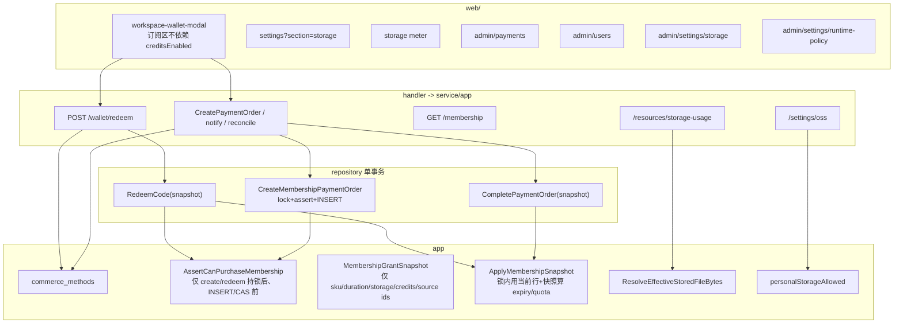
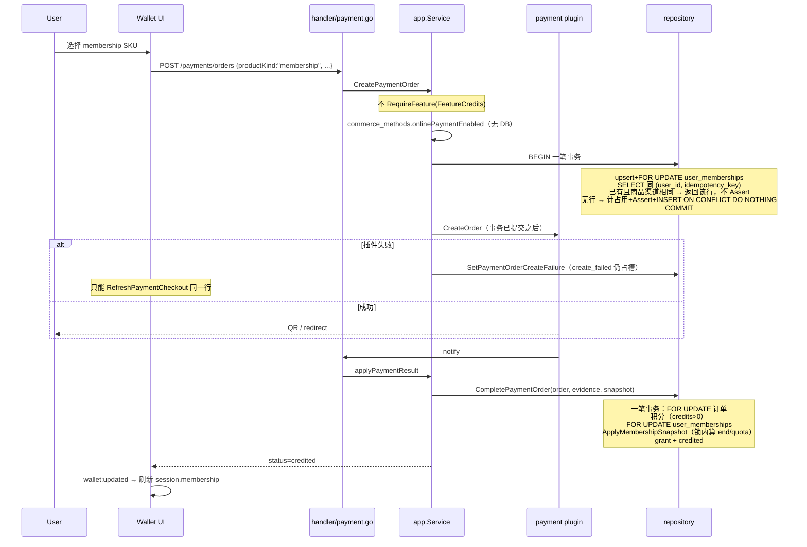
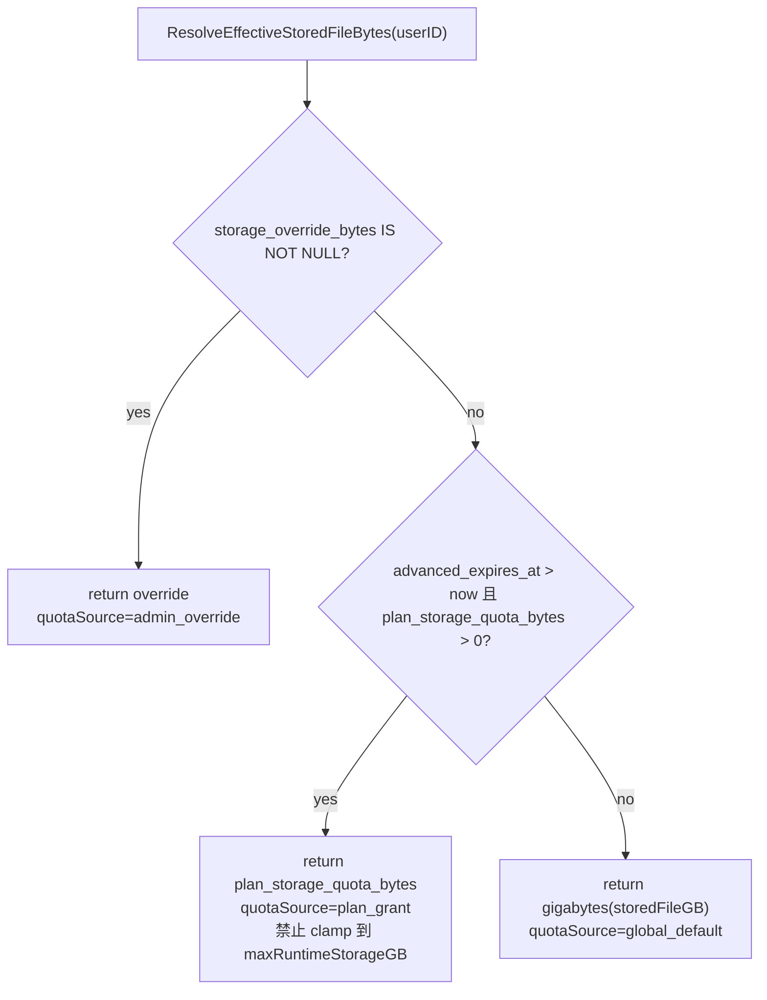

# 影策会员订阅、存储配额与 R2 配置设计

| 字段 | 内容 |
| --- | --- |
| 文档标题 | Yingce Membership, Storage Quota, and R2 Storage |
| 作者 | 影策工程 |
| 日期 | 2026-09-18 |
| 状态 | Draft |
| 产品 | 影策 / Open AI Canvas |
| 仓库 | 任务指定 https://github.com/hyc0122/canvas；仓库内 `AGENTS.md` 写的是 `ddcat-ai/open-ai-canvas` |
| 生产站点 | https://canvas.jiasuapi.com（运维约定，非本仓库可验证事实） |
| 数据目录 | Compose 以 `${CANVAS_DATA_PATH:-backend-data}:/data` 与 `CANVAS_BACKEND_DATA_DIR=/data` 为准（`docker-compose.deploy.yml`）。`/opt/canvas` bind-mount `/storage` 是运维主机约定，**不在** compose 文件中 |
| 范围 | 仅影策自身会员与存储。**不复用** NewAPI（`ai.jiasuapi.com`）的月/年/日/小时订阅 |

---

## Overview

影策当前只有「积分钱包 + 积分充值商品 + 微信/支付宝支付插件 + 仅发放积分的兑换码」，以及一套**全站统一**的账号文件配额（`runtime_policy.resource.storedFileGB`，默认 20GB）。平台对象存储已支持 S3 兼容（含 Cloudflare R2 **预设**），个人对象存储只要登录即可配置，**没有会员态、没有按人配额、没有订阅 SKU**。

本设计在影策内新增独立的会员体系：

1. **永久订阅（基础）**：一次购买、永不过期；解锁画布基础能力承诺与「我的存储空间」；**发放 0 积分**。
2. **高级订阅（月卡 / 季卡 / 年卡）**：限时权益；购买时发放 300 / 1200 / 3600 积分；平台存储额度 1GiB / 5GiB / 3TiB。剩余 **> 30 天禁止再买任何高级 SKU**（升/降级都不行）。剩余 ∈ (0, 30] 天允许 **任意** 高级 SKU（含年卡改月卡）。用户/兑换入账 **覆盖** 为所买 SKU 的容量与 sku；管理员赠送仍用 max 容量/保较高档。
3. **存储扩容**：前台只展示、不可下单。本期 **不写**「请联系客服进行充值」（产品无工单模块、无运营客服 QQ 配置）。文案用「存储扩容暂未开放在线购买」。管理员单人覆盖仍是扩容手段。可选预留 `supportTicketUrl` / `supportQq`，有值才展示入口，**禁止写死 QQ 号**。
4. **购买通道**：沿用现有在线支付 **和** 兑换码；管理员全局开关允许哪些充值方式。会员购买 **不依赖** `creditsEnabled`。
5. **配额**：管理员可改全站每人默认容量（仍受 `storedFileGB` 1–999 限制），也可在用户管理中覆盖单人容量（字节，上限 3TiB）。年卡 3TiB **不** 抬高全局默认上限。
6. **R2**：管理员在「存储服务」中选择一等模式 Cloudflare R2（UI 映射到 `provider=s3, s3Preset=r2`，**本文不包含任何密钥**）；永久会员才能真正用个人存储。

这不是 NewAPI 订阅的移植。NewAPI 的额度重置、按小时/按天套餐与影策积分账本、资源落库配额是两套账，禁止共用表、共用 SKU、共用校验逻辑。

---

## Background & Motivation

### 当前状态（代码事实）

| 能力 | 现状 | 关键路径 |
| --- | --- | --- |
| 平台存储 | `system_settings` 键 `oss`；管理员页可选 local / 阿里云 / 腾讯云 / 七牛 / S3；S3 预设含 `r2` | `backend/internal/app/settings.go`（`ossSettingKey = "oss"`）、`web/src/pages/admin/settings/storage-settings-page.tsx`、`web/src/lib/oss-settings.ts` |
| 个人存储 | 登录用户可 `GET/PATCH /api/settings/oss`；S3/R2 另受 `allowUserS3`（`defaultOSSSetting()` 零值 **false**） | `backend/internal/handler/user_data.go`、`web/src/components/layout/user-oss-settings-form.tsx`、设置页 section `storage`（文案「我的对象存储」） |
| 上传落点 | `activeResourceOSSSetting` 只看 `userSetting.Enabled` 与 `allowUserS3`，**不看会员** | `backend/internal/app/resource.go` |
| 账号文件配额 | **全局同一套** `StoredFileGB`，默认 20，校验上限 999GB；**不按用户、不跟会员** | `backend/internal/platform/runtime_policy.go`、`backend/internal/app/storage_quota.go`、`backend/internal/app/upload_quota.go` |
| 分片预检 | handler 用 **全局** `policy.Resource.StoredFileGB<<30` 拒超大文件 | `backend/internal/handler/resource_upload_session.go:148` |
| 用量统计 | `UserStoredFileBytes` 按物理对象去重后对 **全部** `resources.status=ready` 求和 | `backend/internal/repository/repository.go` |
| 积分 | `credit_accounts` + `credit_ledger_entries`；`CreditScale = 1_000_000` | `backend/internal/app/finance.go`、`backend/internal/model/models_finance.go` |
| 在线充值 | `topup_products` 快照金额与积分；订单入账要求 `CreditsMicrocredits > 0`；`CreatePaymentOrder` 还 `RequireFeature(FeatureCredits)` | `backend/internal/app/payment.go`、`backend/internal/repository/payment.go` `CompletePaymentOrder` |
| 兑换码 | 批次只有 `amount_microcredits`；创建时必须 `> 0`；核销只加积分；同样 `RequireFeature(FeatureCredits)` | `RedeemBatch` / `RedeemCode`、`Service.RedeemCredits`、`web/src/pages/admin/components/redemption-codes-panel.tsx` |
| 钱包 UI | `creditsEnabled === false` 时 `workspace-wallet-modal.tsx` **直接 return null** | `web/src/components/layout/workspace-wallet-modal.tsx` |
| 用户管理 | 角色/状态/积分，无会员字段；详情容量用 `quota.storedFileGB * 1024 ** 3` | `backend/internal/app/admin.go`、`web/src/pages/admin/components/admin-user-detail-drawer.tsx` `quotaUsageItems` |
| Schema | 当前版本 **19**（`payment_plugin_version`）；checksum 一经合入不得改 | `backend/internal/database/migrations.go` `CurrentSchemaVersion` |
| 功能开关 | `feature_availability.creditsEnabled` 控制积分中心与任务预授权 | `backend/internal/platform/feature_availability.go` |
| 错误码 | `BadAuthRequest` → HTTP 400 / `reason=invalid_argument`；`ReasonFailedPrecondition` 已定义但无构造函数 | `backend/internal/kernel/errors.go`、`error_codes.go` |
| 生产存储 | 代码默认本地盘（`oss.enabled=false` 时要求 `publicBaseUrl`）；R2 是配置工作 | `UpdateOSSSetting`、`storage_s3.go` |
| 容量展示 | `formatBytes` 单位停在 GB；后端 `formatStorageLimit` 用 `>>30` 打印 `%dGB` | `web/src/lib/image-utils.ts`、`upload_quota.go` |

### 痛点

1. 无法售卖「永久基础 / 限时高级」；VIP/SSVIP 的旧口径已废弃，最新口径是 **永久=基础，月/季/年=高级（积分+存储）**。
2. 年卡 3TiB 不能塞进 `storedFileGB`（1–999）。配额必须走独立字节字段，且解析器不得用 999GB 去 clamp 套餐。
3. 永久套餐发放 0 积分，但 `CompletePaymentOrder`、`topupProductFromRequest`、`AdminCreateRedeemBatch` **拒绝 0 积分**；且支付/兑换/钱包还被 `FeatureCredits` 挡住。
4. 「我的存储空间」对所有登录用户开放；即便锁住 PATCH，热路径 `activeResourceOSSSetting` 仍会把已启用的个人配置当上传目标。
5. 兑换码不能编码套餐 SKU；管理员也不能关掉在线支付或兑换码其中一种。
6. 生产要从本地盘切到 R2，需要把 R2 做成可运营的一等存储选项，但 UI 若把 `mode` 直接当 `provider` 会 POST `provider=r2` 被后端拒绝。

---

## Goals & Non-Goals

### Goals

- 在影策内落地会员 SKU、购买、核销、有效期与存储配额，前后台可运营。
- 永久会员可配置「我的存储空间」；热路径与读写 API 都按会员态执行，而不是只挡 PATCH。
- 高级会员购买时发放一次性积分，并在有效期内提升平台文件配额。
- 管理员可配置全站默认容量，也可覆盖单个会员容量。
- 购买可用现有支付插件与兑换码；管理员可开关通道。会员通道与积分功能开关分离。
- 管理员可在「存储服务」中配置 Cloudflare R2（填写凭据、测试连接、启用），不把密钥写入仓库或本文。
- 存储扩容前台只展示、不可下单；本期无客服 CTA。上线个人存储时生产必须打开 `allowUserS3`。
- Schema **一次** 走版本 20；所有新表和新列进入同一个 checksum；同步 `docs/content/docs/backend/backend-database.mdx` 与 `http-api.mdx`。

### Non-Goals

- 不接入、不同步、不映射 NewAPI 订阅、额度重置或令牌包。
- 不在本期把画布/短剧/任务中心改成「未付费不可用」。未订阅用户继续使用现有功能；永久 SKU 解锁个人存储与商品文案上的基础能力承诺。
- 不做自动续费、签约代扣、发票、退款原路退会员天数（支付失败/关单沿用现有支付状态机；已入账会员不提供 revoke）。
- 不做存储扩容的自助下单。
- 不迁移历史资源到 R2（启用对象存储只影响**新写入**）。搬迁另开任务，复用 `backend/internal/app/storage_migration.go`。
- 不把个人桶做成多配置档案管理；仍是当前「版本追加、最新启用」的 `user_oss_settings`。
- 不在文档或代码默认值中写入任何真实 R2 Account ID / Access Key。
- 不把全局 `maxRuntimeStorageGB` 抬到 4096 来「迁就」年卡。

---

## Key Decisions

1. **影策会员与 NewAPI 订阅完全隔离。** 新表、新 API、新 SKU 只存在于影策。

2. **套餐口径：永久 = 基础；月/季/年 = 高级。** 永久：0 积分、可配个人存储、永不过期。高级：购买时发放积分 + 有效期内平台存储额度。

3. **「剩余时间 > 30 天不允许新订阅」只约束高级套餐，且只在下单/核销开始时执行。** 永久不受此规则。已拥有永久则拒绝再买永久。**入账路径不再调用该规则**。
   - 剩余 **> 30 天**：拒绝任何新的高级购买（升级、降级、同级续费都不行）。
   - **0 < 剩余 ≤ 30 天**：允许 **任意** 高级 SKU，**包括年卡改月卡/季卡**。
   - 已过期（剩余 ≤ 0）：允许任意高级 SKU。

4. **续费时长一律叠加；用户/兑换改买覆盖容量；管理员赠送保高档。** 锁内用当前行 + 快照，禁止事务外预计算 expiry/quota。
   - 时长（所有来源）：`end = max(now, current.AdvancedExpiresAt) + duration`（永久 `ends_at=NULL`）。
   - **用户支付 / 兑换码（`source=payment|redeem`，用户明确改买）：** `advanced_plan_sku = snap.SKU`，`plan_storage_quota_bytes = snap.StorageQuotaBytes`。年卡窗口内改买月卡 → **1GiB + month sku**，到期再加 30 天。积分按所买 SKU 发放。
   - **管理员赠送（`source=admin`）：** `plan_storage_quota_bytes = max(activeCurrentPlanStorage, snap.StorageQuotaBytes)`；若当前高级仍有效且 `rank(current) > rank(snap)` 则保留当前 sku，否则写 snap sku。避免赠送被更低档覆盖，除非用户后付款的改买单后入账。
   - **竞态（诚实记录）：** 待支付月卡 + 管理员赠年卡 + **月卡付款最后完成** → 用户 Apply 覆盖，结果是月卡 1GiB（时长仍叠加）。若只要保住年卡，应先关掉/不要让用户付那张月卡。
   - 积分每次按快照 SKU 发放，过期不回收。`storage_override_bytes` 不参与上述 max/覆盖，仍最高优先。

5. **同一用户同时最多一笔占用会员槽的支付单；创建与占用检查必须在同一事务里完成 INSERT；同一幂等键必须返回已有单而不是 409。**
   - **占用集合**（与现网 `ActivePaymentOrderCount` 对齐并收窄到 `product_kind=membership`）：`created | pending | closing | create_failed`。`create_failed` **占槽**，因为 `SetPaymentOrderCheckout` / `RefreshPaymentCheckout` 可把它拉回 `pending`（`repository/payment.go`、`app/payment.go`）。
   - **一笔 DB 事务（然后才调插件），顺序固定：**
     1. upsert+`FOR UPDATE` `user_memberships`
     2. **先** `SELECT payment_orders WHERE (user_id, idempotency_key)`（现网 `PaymentOrderByIdempotency` / `CreatePaymentOrder` 的幂等合同，`app/payment.go:514-520`、`repository/payment.go:83-98` `ON CONFLICT (user_id, idempotency_key) DO NOTHING`）
        - 已有行且 `product_id`+`provider_id` 相同 → **直接返回该行**（`created=false`），**不跑**占用 Assert（这是超时重试 / 双击，不是第二张单）
        - 已有行但商品或渠道不同 → 409 冲突（与现网「幂等标识已用于不同的商品或支付渠道」相同）
        - 无行 → 继续
     3. 计占用（此时还没有本幂等键的行）→ `AssertCanPurchaseMembership`（占用 > 0 则 409）
     4. `INSERT … ON CONFLICT (user_id, idempotency_key) DO NOTHING`；若冲突则再读已有行返回（并发同 key 的第二把锁）。**禁止** Assert 成功后再无冲突插入却 409。
     5. **commit**。然后事务外 `plugin.CreateOrder`。
   - App 层在开会员事务前可保留现网的 `PaymentOrderByIdempotency` 快路径，**不能**只靠它防双击；锁内查找才是正确性。
   - **禁止**「锁会员行、commit、再另一次 INSERT」。
   - **不同**幂等键且槽已被占 → 409。重试未完成单 = `RefreshPaymentCheckout` 同一行。若 A 为 `create_failed` 且（异常）已存在另一张占用单，刷新 A 必须 409。
   - `maxActivePaymentOrdersPerUser = 5` 仍约束积分充值单。
   - 兑换：`redeemEnabled`（无 DB）→ **一笔** tx：锁 membership → 按 hash 加载码 → 仅 `kind=credits` 时 `RequireFeature(FeatureCredits)` → 会员码 Assert → CAS 码 → 积分/grant/Apply → commit。Assert 不得在 tx 外。

6. **配额生效顺序是覆盖，不是 `max()`，也不是对全局 999GB 取 `min()`。** `admin per-user override` > 有效高级套餐 `plan_storage_quota_bytes` > `gigabytes(runtime_policy.resource.storedFileGB)`。解析器 **禁止** `min(plan, gigabytes(maxRuntimeStorageGB))`。`maxRuntimeStorageGB` 保持 999，只约束管理员全局默认表单。套餐与单人覆盖上限为 `3<<40` 字节。

7. **年卡存储按需求写 3TiB（`3 << 40`），不是 30G。** 写在 `membership_products.storage_quota_bytes` / `user_memberships.plan_storage_quota_bytes`。3TiB 填满的真实刹车是现网日上传默认 2048MB 与单文件 50–999MB，而不是把全局默认改成 4TiB。

8. **积分按次发放，不按月重置。** 永久 0 积分：0 额度 **不写** `credit_ledger_entries`（避免「已到账 0 积分」流水）。生成仍走现有 `BillingOrder` 预授权。

9. **订阅商品与积分充值商品分表。** `topup_products` 继续要求积分 > 0。`membership_products` 允许 0 积分。`payment_orders` 增加 `product_kind` 等快照列（这些列在 **v20 一次加齐**）。

10. **兑换码批次与每条码都带 `kind` + `plan_sku`。** 核销只读 `redeem_codes` 行即可入账。`commerce_methods.redeemEnabled=false` 时 **先于** 哈希/查码返回 403，避免关闭窗口仍能区分码是否存在。

11. **个人存储热路径 = 永久会员（管理员豁免）且平台允许。** `activeResourceOSSSetting`、`GET/PATCH/TEST /settings/oss` 使用同一 `personalStorageAllowed`。非会员已启用的历史行 **立即忽略**。**生产上线个人存储（PR 6/7 同发）时必须把 `system_settings.oss.allowUserS3` 设为 `true`**，这是必做运维步骤，不是可选项；否则永久会员无法配个人 S3/R2。代码默认仍是 false（`defaultOSSSetting()`）。

12. **平台文件配额只统计落在平台存储上的对象。** 目的地是个人 OSS 时，`reserveUserStoredFileQuota` 与 `AssertUploadFitsAccountQuota` **都跳过** 平台存量/`effectiveStoredFileBytes` 比较；分片单文件不受套餐 GiB 限制。日上传仍执行。平台目的地才用 `size > effective` 预检。

13. **R2 不新写存储驱动。** UI `StorageMode "r2"` **显式映射** `{enabled:true, provider:"s3", s3Preset:"r2"}`，检测当前 R2 为 `provider=="s3" && s3Preset=="r2"`。后端枚举仍是 `aliyun|tencent|qiniu|s3`。

14. **本期不把画布改成付费墙。**

15. **容量单位 GiB/TiB（`1<<30` / `1<<40`）。** 会员配额库内用 `int64` 字节。前端 `formatBytes` 与后端 `formatStorageLimit` 增加 TiB/TB 档。

16. **会员商务与 `FeatureCredits` 分离。** `CreatePaymentOrder(productKind=membership)`、会员码核销、`GET /membership*`、钱包订阅区 **不** 调用 `RequireFeature(FeatureCredits)`。积分码核销必须在 **读到 `kind=credits` 之后** 才 `RequireFeature`（查码前检查会误伤永久码）。`creditsEnabled=false` 时隐藏积分充值目录/流水/签到；`redeemEnabled` 时兑换输入框仍显示（可兑会员码）。

17. **已付款订单忽略事后下架。** 入账只看订单快照列（sku/时长/容量/积分），**在锁内** 与当前会员行做叠加。管理员赠送绕过 30 天、SKU 等级、`commerce_methods` 和占用槽；本期 **不做 revoke**。存储扩容只走单人覆盖。

18. **Schema v20 一次包含全部 DDL。** 后续 PR 只使用列，不得再改 v20 checksum。若 PR 1 之后发现缺列，必须 **v21+**，不能改 v20。

---

## Proposed Design

### 概念模型

```text
未订阅用户
  - 画布等现有功能仍可用（本期）
  - 平台文件配额 = 全局默认 storedFileGB（默认 20GiB，上限仍 999）
  - 不能启用「我的存储空间」；已有个人 OSS 行立即不再生效
  - 积分仅来自注册奖励/签到/充值/兑换/管理员调账

永久订阅（SKU permanent）
  - 永不过期；可配置「我的存储空间」
  - 0 积分发放，不写积分流水
  - 平台配额仍走默认，除非另有高级套餐或管理员覆盖

高级订阅（SKU advanced_month | advanced_quarter | advanced_year）
  - 时长 30 / 90 / 365 天
  - 购买入账 300 / 1200 / 3600 积分
  - 有效期内平台配额 1GiB / 5GiB / 3TiB
  - 可与永久并存
  - 剩余 > 30 天：不能再买高级（升/降级都不行）
  - 0 < 剩余 ≤ 30 天：可买任意高级 SKU（含年→月），入账覆盖为新 SKU 容量
  - 已过期：可买任意高级 SKU
```

内置 SKU（管理员可改价格、名称、上下架、排序，**不可改 SKU 语义**：时长/积分/容量硬编码在 service 与种子行）：

| sku | 展示名 | duration_days | credits | storage_quota_bytes | rank |
| --- | --- | ---: | ---: | ---: | ---: |
| `permanent` | 永久订阅 | 0 | 0 | 0 | n/a |
| `advanced_month` | 月卡 | 30 | 300 × `CreditScale` | `1 << 30` | 1 |
| `advanced_quarter` | 季卡 | 90 | 1200 × `CreditScale` | `5 << 30` | 2 |
| `advanced_year` | 年卡 | 365 | 3600 × `CreditScale` | `3 << 40` | 3 |

价格 `amount_fen` 由管理员配置。未定价（0 分）禁止 **在线** 支付，仍可用于兑换码与管理员赠送。

### 架构



### 购买与入账时序



兑换（同一原则，Assert 不得在 tx 外）：

```text
redeemEnabled?（无 DB，关则 403，不哈希）
→ BEGIN
   FOR UPDATE user_memberships（缺行则 upsert 零值）
   按 code_hash 加载 redeem_codes
   kind=credits → RequireFeature(FeatureCredits)；失败用泛化「积分功能未开放」，不再查码外形
   kind=membership → AssertCanPurchaseMembership（不看 FeatureCredits）
   CAS 码 unused→redeemed
   credits>0 写 ledger
   ApplyMembershipSnapshot（仅 membership）
→ COMMIT
```

对账 `payment_reconciliation.go` 必须调用 **同一个** `CompletePaymentOrder(..., snapshot)`；snapshot 只带订单上的 sku/duration/storage/credits，**expiry/quota 在锁内算**；不得只补积分。

### 配额解析



`AccountFileStorageUsage` 增加：

```go
type AccountFileStorageUsage struct {
    UsedBytes                 int64  `json:"usedBytes"`          // 平台对象
    TotalBytes                int64  `json:"totalBytes"`         // 有效配额
    QuotaSource               string `json:"quotaSource"`        // admin_override | plan_grant | global_default
    EffectiveStoredFileBytes  int64  `json:"effectiveStoredFileBytes"`
    PersonalStoredFileBytes   int64  `json:"personalStoredFileBytes,omitempty"`
}
```

`AdminUserDetail` **不要** 把 3072 写进 `quota.storedFileGB`（该字段仍是全局策略，校验 1–999）。并列返回 `effectiveStoredFileBytes`、`quotaSource`、`platformStoredFileBytes`。前端 `quotaUsageItems` 用 `effectiveStoredFileBytes` 做上限。

`handler/resource_upload_session.go` 的全局 `StoredFileGB<<30` 预检 **删除**，改走 service：`svc.AssertUploadFitsAccountQuota(userID, req.Size)`，与 `reserveUserStoredFileQuota` **同一目的地分支**：

- 目的地是 **平台**：若 `size > effectiveStoredFileBytes` 则拒绝（与现网「单文件已大于账号总量」同类）。
- 目的地是 **个人 OSS**（`activeResourceOSSSetting` 命中用户桶且 `personalStorageAllowed`）：**不要** 把 `size` 和平台 `effectiveStoredFileBytes` 比较。分片上传本意就是超过 `ResourceUploadMB`（`reserveChunkedUploadQuota` 把 `singleFileLimit` 设为 `size+1`）。永久会员在 1GiB 月卡上往 **自己的** R2 分片传 2GiB 必须能开 session。真实上限在 merge 时仍走日上传；个人桶不受平台存量/套餐 GiB 限制。

### 平台对象定义与 SQL

`resources.storage_setting_id` 在现网可能是 `storage_locations.id` **或** `user_oss_settings.id`（`activeResourceOSSSetting` 返回 `firstNonEmpty(value.StorageLocationID, userSetting.ID)`）。历史用户 OSS 版本追加，因此过滤必须包含 **该用户全部历史** 个人 ID，不能只用当前启用行。

空/`''` 的 `storage_setting_id` **视为平台对象**（早期本地/平台资源）。无 ID 的历史个人对象会被算进平台容量——接受为 Low 风险（现网测试 `TestHistoricalUserResourceWithoutStorageSettingIDKeepsItsProviderCDN` 覆盖的是读路径，不是配额）。

Postgres 与 SQLite 共用（绑定 `userID` 三次）：

```sql
SELECT COALESCE((
  SELECT SUM(physical_resources.size)
  FROM (
    SELECT MAX(r.size) AS size
    FROM resources r
    WHERE r.user_id = ?
      AND r.status = ?
      AND (
        r.storage_setting_id IS NULL
        OR r.storage_setting_id = ''
        OR r.storage_setting_id NOT IN (
          SELECT id FROM user_oss_settings WHERE user_id = ?
          UNION
          SELECT id FROM storage_locations WHERE scope = 'user' AND owner_id = ?
        )
      )
    GROUP BY COALESCE(NULLIF(r.provider, ''), 'local'), r.endpoint, r.bucket, r.object_key
  ) AS physical_resources
), 0);
```

`status = ?` 传入 `model.ResourceStatusReady`。`NOT IN` 对 NULL 在 SQL 中是 UNKNOWN，所以必须把空 ID 单独放行，不能写成 `NOT (id IN (...))` 单独一句。

个人对象用量（展示用，可选）为总 ready 去重字节减去上述平台字节。

### 预留路径

`reserveUserStoredFileQuota` 在现有 `storageMu` 内：

1. 解析有效平台配额 `storedLimit = ResolveEffectiveStoredFileBytes`。
2. 调 `activeResourceOSSSetting`（已含永久会员闸）。若返回的是 **用户** OSS（`userSetting` 命中且允许），**跳过** `storedBytes+pending+size >= storedLimit`。
3. 无论目的地，继续单文件上限与 `ReserveDailyUpload`。
4. `pendingStorage` 只在走平台配额检查时累加；个人目的地不把 size 记入平台 pending。

测试（PR 2 合同）：

- 个人对象不计入 `UserPlatformStoredFileBytes`。
- 历史 `user_oss_settings.id` 与 `storage_locations(scope=user)` 上的对象都被排除。
- 空 `storage_setting_id` 计入平台。
- 平台已满 + 个人目的地：上传成功（仍受日上传限制；分片路径不受套餐 GiB / `effectiveStoredFileBytes` 限制）。
- 平台已满 + 平台目的地：`quota_exceeded`。
- 个人目的地 + `size > plan quota`（例如 2GiB 文件、1GiB 月卡）：分片 session **可以开始并完成**（日上传除外）。
- 解析器对年卡 3TiB **不** clamp 到 999GiB。

### R2：已有 vs 要补

**已经有的：** `S3Preset="r2"` 与 hint；`newS3Client` 对非 AWS 自动 path-style；`requireTestedS3Location`；个人侧也能选 r2 预设。后端 `ossSettingFromRequest` 只接受 `aliyun|tencent|qiniu|s3`。

**缺少的：** 一等 `StorageMode`；与 `provider` 的映射表；会员闸；按人配额。年卡 3TiB **不** 需要改 runtime policy 上限。

**UI → 后端映射（必须写进 `storage-settings-page.tsx`，禁止 `provider: values.mode`）：**

| UI `mode` | 保存 payload |
| --- | --- |
| `local` | `{enabled:false, provider: 保留已保存 provider 或 aliyun, ... publicBaseUrl}`（与现网 local 行为一致） |
| `aliyun` / `tencent` / `qiniu` | `{enabled:true, provider: mode}` |
| `s3` | `{enabled:true, provider:"s3", s3Preset: aws\|b2\|rustfs\|custom}` |
| `r2` | `{enabled:true, provider:"s3", s3Preset:"r2"}` |

读回：`enabled && provider==="s3" && s3Preset==="r2"` → 选中 R2 磁贴，而不是通用 S3。

必须改的 helper（均在 `storage-settings-page.tsx`）：

- `STORAGE_MODES`：增加 `{mode:"r2", label:"Cloudflare R2", ...}`；通用 S3 说明改为 AWS/B2/RustFS/自定义。
- `formValues`：不能 `mode: setting.provider`；R2 用上面读回规则。
- `providerDraftValues`：比较用 `backendProvider(mode)`（`r2`→`s3`），切到 R2 时默认 `s3Preset:"r2"`、`region:"auto"`。
- `normalizeStoragePayload`：`provider = backendProvider(mode)`，`mode==="r2"` 时强制 `s3Preset:"r2"`。
- `connectionInput`：`provider: backendProvider(values.mode)`，禁止把 `"r2"` 传给测试 API。
- `hasCurrentProviderSecret`：`setting.provider === backendProvider(draftMode)`。
- `validateStorageDraft` / `storageResponseMatches` / `storageConfigurationReady`：密钥匹配同样用 `backendProvider`。
- `storageProviderLabel` / `providerGuidance`：增加 `r2` 文案（Endpoint 为账户级 S3 API 根 URL，Region `auto`）。
- `draftMode === "s3"` 控制的 Path Style / Session Token / 预设下拉：对 `r2` 同样显示 Path Style（可默认自动）；预设下拉在 R2 模式隐藏或锁定为 r2。
- `accessKeyIdLabel` / `accessKeySecretLabel`：`r2` 走 S3 文案。

**不改后端协议。** 运维：`/admin/settings/storage` 选 Cloudflare R2 → 填 Endpoint/Bucket/Access Key → 测试 → 保存。本文不提供凭据。**发个人存储能力时必须在同一变更窗口把 `allowUserS3` 打开并保存**（生产要求）。代码默认 false 只表示未配置，不表示生产保持关闭。

---

## Data Model Changes

新增 **schema 版本 20**，checksum 一经合入不得修改。`CurrentSchemaVersion` 19 → 20。

**v20 一次 AutoMigrate / 加列 / 种子的全部对象：**

- 新表：`membership_products`、`user_memberships`、`membership_grants`
- `payment_orders`：`product_kind`、`plan_sku`、`membership_duration_days`、`storage_quota_bytes`
- `redeem_batches` **与** `redeem_codes`：`kind`、`plan_sku`
- 种子四个 SKU（`enabled=false`，`amount_fen=0`，容量/积分/天数按上表）
- 历史行回填：`UPDATE payment_orders SET product_kind='credit_topup' WHERE product_kind IS NULL OR product_kind=''`；`UPDATE redeem_batches/redeem_codes SET kind='credits' WHERE kind IS NULL OR kind=''`。SQL DEFAULT 不够：PR 1 之后 GORM 会把 Go `""` 写进新列。

GORM 模型：`models_membership.go`（新表 + `MembershipGrantSnapshot` DTO），以及 **PR 1 就改** `models_payment.go`、`models_finance.go`（列 + `BeforeCreate` 规范化），并加入 `database.Models()`。PR 4/5 **不得** 再加列。`repository` 只 import `model`，不 import `app`。

迁移测试：在 `migrations_lineage_test.go`（或新测试）中断言 v20 只应用一次；改 checksum 后 `migrate-schema verify` 拒绝。SQLite 与 Postgres 各跑 AutoMigrate。

### `membership_products`

| 列 | 类型 | 约束 | 说明 |
| --- | --- | --- | --- |
| `id` | char(36) | PK | |
| `sku` | varchar(32) | unique | 仅四值 |
| `name` | varchar(120) | | |
| `description` | varchar(500) | | |
| `amount_fen` | bigint | | 0 = 未定价，禁止在线下单 |
| `credits_microcredits` | bigint | `>= 0` | 永久 0；service 拒绝改语义 |
| `storage_quota_bytes` | bigint | `>= 0` | 永久 0 |
| `duration_days` | int | `>= 0` | 永久 0 |
| `enabled` | bool | index | |
| `sort_order` | int | index | |
| `created_by` / `updated_by` | char(36) | | |
| `created_at` / `updated_at` | timestamptz | | |

管理员 **只有 GET 列表 + PATCH :id**（改 name/description/amount_fen/enabled/sort_order）。禁止 POST 创建第五个 SKU；禁止 PATCH 改 sku/credits/storage/duration。

### `user_memberships`

| 列 | 类型 | 说明 |
| --- | --- | --- |
| `user_id` | char(36) | PK |
| `permanent_active` | bool | |
| `permanent_granted_at` | timestamptz null | |
| `advanced_plan_sku` | varchar(32) | 空 = 无高级 |
| `advanced_expires_at` | timestamptz null | index |
| `plan_storage_quota_bytes` | bigint | 过期后解析器忽略 |
| `storage_override_bytes` | bigint null | NULL = 未覆盖 |
| `storage_override_set_by` | char(36) | |
| `storage_override_set_at` | timestamptz null | |
| `created_at` / `updated_at` | timestamptz | |

缺行视为未订阅。下单/核销时 upsert 零值以便 `FOR UPDATE`。

### `membership_grants`

| 列 | 类型 | 说明 |
| --- | --- | --- |
| `id` | char(36) | PK |
| `user_id` | char(36) | index |
| `source` | varchar(24) | `payment` / `redeem` / `admin` |
| `payment_order_id` | char(36) | unique，可空（Postgres/SQLite 多 NULL 合法） |
| `redeem_code_id` | char(36) | unique，可空 |
| `admin_idempotency_key` | varchar(120) | **非空才写**；唯一索引 `(user_id, admin_idempotency_key)`，NULL 合法、禁止 `''` |
| `product_id` | char(36) | |
| `plan_sku` | varchar(32) | |
| `credits_microcredits` | bigint | 可为 0 |
| `storage_quota_bytes` | bigint | 快照 |
| `duration_days` | int | |
| `starts_at` / `ends_at` | timestamptz | 永久 `ends_at` NULL |
| `note` | varchar(500) | |
| `created_at` | timestamptz | index |

### `payment_orders` 快照列

- `product_kind` varchar(24) 默认 `credit_topup`
- `plan_sku` varchar(32) 默认 `''`
- `membership_duration_days` int 默认 0
- `storage_quota_bytes` bigint 默认 0

回调 **禁止** 再读 `membership_products` 现价。

应用层默认（**PR 1 就落地在 model 层，不改 `payment.go`**）：

- `model.PaymentOrder` 增加 `BeforeCreate`（或 `NormalizeProductKind()` 并在 hook 调用）：`ProductKind` 空 → `credit_topup`。
- `model.RedeemBatch` / `model.RedeemCode` 同样：`Kind` 空 → `credits`。
- `CompletePaymentOrder`（PR 4）读单时仍把空/NULL 当成 `credit_topup`，双保险。

这样 PR 1–4 窗口里现网 `CreatePaymentOrder` 不填 `ProductKind` 时，GORM 也不会写出 `''`。SQL DEFAULT + UPDATE 回填只管 **v20 之前已经存在的行**。

### `redeem_batches` / `redeem_codes`

两表都加 `kind`（默认 `credits`）、`plan_sku`（默认 `''`）。创建批次时把值 **复制到每一条码**。核销事务只加载 `redeem_codes`。

`CreateRedeemBatchRequest`：`kind=credits` 要求 `amountMicrocredits > 0`；`kind=membership` 要求合法 `planSku`，`amountMicrocredits` **强制等于** 该 SKU 的不可变积分（永久 0）。管理端会员批次用 SKU 选择器，不用「积分必须 > 0」的 `draftTotal`。

### `system_settings.commerce_methods`

```json
{ "onlinePaymentEnabled": true, "redeemEnabled": true }
```

缺省两者 true。允许暂时全关（维护黄条）。

### `system_settings.support_contact`（可选，无迁移）

```json
{ "ticketUrl": "", "qq": "" }
```

管理员可在外观/运营设置填写。钱包存储扩容卡解析顺序：**非空 `ticketUrl` → 工单链接**；否则 **非空 `qq` → QQ 入口**；两者皆空 → **只展示「存储扩容暂未开放在线购买」**，不出现「联系客服」。**禁止**在代码或文案里写死 QQ 号。本期影策没有工单模块、也没有已配置的客服 QQ（README 的 QQ 是贡献者邮箱，不是运营客服），因此默认两者为空。

### 配额上限

- **保持** `maxRuntimeStorageGB = 999` 与管理端「账号文件总量」`max: 999`。文案改为「未订阅且无单人覆盖时的每人默认 **平台** 容量」。
- **不** 修改 `selfUseRuntimePolicy` 去对齐年卡。
- 单人覆盖与套餐字节上限 `3<<40`；用户管理表单用 GB/TB 单位选择。

### 迁移策略

1. `migrateSchemaV20` 一次做完上表全部 DDL + 种子 + 上列 UPDATE 回填。
2. 不回填 `user_memberships`。
3. 生产：`CANVAS_AUTO_MIGRATE=false`，compose `migrate` 服务先 `up` 再 `verify`（`docker-compose.deploy.yml`）。
4. 无 down migration。回滚只回滚应用，保留 v20 表。

---

## API / Interface Changes

统一信封 `{ code, data, msg, reason }`。前端判断 `reason`，禁止解析 `msg`。

在 `kernel` 增加：

```go
func FailedPrecondition(message string) *AppError {
    return &AppError{
        Status:  409,
        Code:    409,
        Reason:  ReasonFailedPrecondition,
        Message: message,
    }
}
```

`app/errors.go` 与 `service` 别名导出。**不要** 用 `BadAuthRequest` 表达 30 天锁、永久已拥有、未完成会员单。通道关闭继续 `Forbidden`（403 / `forbidden`）。未定价 SKU 用 `FailedPrecondition`（「订阅商品未定价」）。未知 SKU 仍 `BadAuthRequest`（`invalid_argument`）。30 天窗口内改买低档 **不是** 错误。

OpenAPI（`backend/internal/handler/openapi.yaml`）为上述 409 写 `reason: failed_precondition`。

| reason | HTTP | 场景 |
| --- | --- | --- |
| `failed_precondition` | 409 | 高级剩余 > 30 天；永久已拥有；已有占用会员订单（含 `create_failed`）；刷新占用冲突；SKU 未定价 |
| `forbidden` | 403 | `commerce_methods` 关闭；非永久使用个人存储 |
| `quota_exceeded` | 403 / code 40301 | 平台存储打满 |
| `invalid_argument` | 400 | 未知 SKU、积分充值商品仍要求积分 > 0 等 |

### 会话

`GET /api/auth/session` 增加 `membership`（`creditsEnabled=false` 也返回）：

```json
{
  "membership": {
    "permanentActive": false,
    "advancedPlanSku": "",
    "advancedExpiresAt": null,
    "advancedRemainingSeconds": 0,
    "canPurchaseAdvanced": true,
    "canPurchasePermanent": true,
    "minPurchasableAdvancedSku": "advanced_month",
    "hasOpenMembershipOrder": false,
    "openMembershipOrderId": null,
    "personalStorageAllowed": false,
    "effectiveStoredFileBytes": 21474836480,
    "quotaSource": "global_default",
    "storageOverrideBytes": null
  }
}
```

`use-user-store` 增加 `membership`；`clearSession` 清掉。`wallet:updated`、兑换成功、管理员覆盖后 `invalidateAuthSessionCache` 并重拉 session。

### 用户 API

```
GET  /api/membership
GET  /api/membership/products
POST /api/payments/orders          // productKind 扩展
POST /api/wallet/redeem            // 响应扩展字段，旧客户端忽略多余键
GET  /api/resources/storage-usage
```

`CreatePaymentOrderRequest.ProductKind`：`"credit_topup" | "membership"`；空则只查 `topup_products`（兼容）。

`POST /api/wallet/redeem`：

```json
{
  "account": {},
  "membership": {},
  "granted": { "kind": "membership", "planSku": "advanced_month", "creditsMicrocredits": 300000000 }
}
```

web 与 backend **同发**；字段只增不改。0 积分永久：`account` 仍返回当前账户，`creditsMicrocredits: 0`，不新增 ledger。

通道与积分开关：

- `onlinePaymentEnabled=false`：会员/积分在线下单均 403「在线支付暂未开放」。
- `redeemEnabled=false`：**先于哈希/查库** 403「兑换码暂未开放」。
- `creditsEnabled=false`：积分码在 tx 内读到 `kind=credits` 后 403「积分功能未开放」（不区分码是否存在以外的细节）；会员码不受影响。

### 个人存储

`GET /api/settings/oss`：无权限时投影 `enabled:false`、`personalStorageAllowed:false`、`disabledReason:"requires_permanent_membership"`，不把历史密钥可用性当成可启用。`PATCH`/`TEST` 在 `enabled=true` 时 `Forbidden`。热路径见 KD 11。

### 管理员

```
GET   /api/admin/membership/products
PATCH /api/admin/membership/products/:id     // 仅价格/文案/启用/排序

GET   /api/admin/settings/commerce-methods
PATCH /api/admin/settings/commerce-methods

GET   /api/admin/settings/support-contact
PATCH /api/admin/settings/support-contact  // {ticketUrl, qq}；公开投影给已登录用户钱包，qq/url 可空

PATCH /api/admin/users/:id/storage-quota     // 唯一写入覆盖的路径
{ "storageOverrideBytes": 10737418240 }     // null = 清除；字段必须出现，禁止与省略混淆

GET   /api/admin/users/:id/detail            // + membership + effectiveStoredFileBytes + quotaSource
GET   /api/admin/users                       // + permanentActive, advancedExpiresAt, effectiveStoredFileBytes

POST  /api/admin/users/:id/membership/grant
{ "sku": "advanced_month", "note": "...", "idempotencyKey": "..." }
```

`idempotencyKey` **必填且非空**（缺省/空白 → 400 `invalid_argument`）。唯一约束 `(user_id, admin_idempotency_key)`，与 `idx_payment_user_idempotency` 同形；库中存 NULL 或非空字符串，**禁止存 `''`**（Go 空串当未提供，不要写入 unique 列）。不同用户可以复用同一 key（例如 `"compensate"`）。

**不要** 把 `storageOverrideBytes` 塞进 `UpdateUserRequest` / `PATCH /admin/users/:id`。

管理员赠送：绕过 30 天、`commerce_methods`、商品 `enabled`、占用会员槽。写 `source=admin` + 审计 `membership.grant`。本期无 revoke。积分 > 0 时入账（`CreditLedgerAdminGrant`）。赠送 Apply 用 **max 容量 + 保较高档 sku**。用户支付/兑换 Apply **覆盖** 为快照 sku/容量。因此「待支付月卡 + 管理员年卡 + 月卡最后入账」= 月卡 1GiB（用户改买赢）。

已付款用户订单：SKU 当时 enabled、现在 disabled → 仍入账。

兑换码创建见上；管理 UI 会员批次：SKU 选择器，永久不出现积分 InputNumber。

### 前端主要改动面

| 文件 | 改动 |
| --- | --- |
| `web/src/services/api/payments.ts` | `productKind`、会员商品 |
| `web/src/services/api/wallet.ts` | redeem 扩展；commerce methods |
| `web/src/services/api/auth.ts` | session.membership；AdminUser 摘要；`invalidateAuthSessionCache` |
| `web/src/stores/use-user-store.ts` | `membership`；clearSession |
| `workspace-wallet-modal.tsx` | **不再** `if (!creditsEnabled) return null`；无积分时仍渲染订阅区；`redeemEnabled` 时始终显示兑换框；0 积分成功文案「已开通永久订阅」；30 天窗口内 **不** 禁用低档 SKU；`hasOpenMembershipOrder` 禁用全部订阅购买并指向未完成订单；存储扩容无客服 CTA |
| `workspace-top-bar.tsx` / `workspace-sidebar-footer.tsx` | `creditsEnabled=false` 时提供「订阅」入口打开钱包 |
| `web/src/pages/settings/index.tsx` | 「我的存储空间」；无永久锁定 |
| `user-oss-settings-form.tsx` | 按 GET 投影只读 |
| `payments-page.tsx` | 订阅商品 PATCH + 通道开关 |
| `redemption-codes-panel.tsx` | kind + SKU；永久批次 |
| `users-columns.tsx` / `admin-user-detail-drawer.tsx` | 会员列；容量用 `effectiveStoredFileBytes` |
| `storage-settings-page.tsx` | R2 映射表（见上） |
| `runtime-policy-settings-page.tsx` | **保持 max 999**；改 extra 文案 |
| `image-utils.ts` / `account-storage-usage.ts` | TiB 档 |
| `backend/internal/service/aliases_types.go` 等 | 新类型别名 |
| `backend/internal/handler/api.go` | 注册会员/commerce 路由 |
| `backend/internal/handler/openapi.yaml` | 合同 |

钱包订阅区：

- 未启用 SKU 不展示。
- **`hasOpenMembershipOrder`：** 禁用全部会员购买按钮（含永久与高级），文案「你有一笔未完成的订阅订单」，主按钮跳到该订单收银台（`openMembershipOrderId`，含 `create_failed` 的刷新）。不要让用户点另一 SKU 吃裸 409。
- 永久已购：「已拥有」。
- 高级剩余 > 30 天：全部高级按钮禁用，「当前订阅剩余超过 30 天，暂不可新购」。
- 0 < 剩余 ≤ 30 天：**月/季/年全部可买**（含年→月）。确认文案：「将从到期日叠加时长；平台容量改为所选套餐额度（改买月卡则变为 1GiB）」。
- 「存储扩容」不可下单。有 `supportTicketUrl` 则链到工单；否则有 `supportQq` 则展示 QQ；**都没有则只写「存储扩容暂未开放在线购买」**，不出现联系客服。
- `creditsEnabled=false`：隐藏积分商品与流水；**兑换框在 `redeemEnabled` 时仍显示**。
- 支付成功：`productKind=membership` 且永久 → 「已开通永久订阅」，不要「已到账 0 积分」。订单状态仍用现网 `credited`。

---

## 核心算法（service）

分层（遵守 AGENTS.md：`repository` **不得** import `app`）：

| 类型/函数 | 包 | 理由 |
| --- | --- | --- |
| `UserMembership`、`MembershipGrant`、`MembershipProduct` | `internal/model` | 表模型 |
| `MembershipGrantSnapshot` | `internal/model`（`models_membership.go`） | 入账快照 DTO，无预计算 expiry/quota；repo 签名只依赖 `model` |
| `RedeemHooks` | `internal/repository` | 回调结构体，字段类型为 `model.*` 与 `func`；不含 SKU 数学 |
| `AssertCanPurchaseMembership`、`ApplyMembershipSnapshot`、`advancedRank` | `internal/app` | 业务策略。repo 通过 `func(...)` 回调接收，不 import app |

Handler **不** 实现 30 天或叠加数学。叠加必须看见锁后的当前行，因此 Apply 以回调形式跑在 repository 事务内。

```go
// internal/model/models_membership.go — 只带不可变快照，禁止带预计算的 ends_at / plan_storage_quota_bytes。
type MembershipGrantSnapshot struct {
    Source                 string // payment | redeem | admin
    SKU                    string
    DurationDays           int
    StorageQuotaBytes      int64
    CreditsMicrocredits    int64
    ProductID              string
    PaymentOrderID         string
    RedeemCodeID           string
    AdminIdempotencyKey    string // 非空才写列
    Note                   string
}

// internal/app/membership.go
const MembershipRenewalBlockRemaining = 30 * 24 * time.Hour

var advancedRank = map[string]int{
    "advanced_month": 1, "advanced_quarter": 2, "advanced_year": 3,
}

func (s *Service) AssertCanPurchaseMembership(m model.UserMembership, sku string, now time.Time, openMembershipOrders int) error {
    // 调用方已持有 user_memberships 行锁
    // 1) openMembershipOrders > 0 → FailedPrecondition（create 路径且本次不是同幂等键命中；占用含 create_failed）
    // 2) permanent + m.PermanentActive → FailedPrecondition
    // 3) advanced + remaining > 30d → FailedPrecondition（升/降/续都不行）
    // 4) advanced + remaining ≤ 30d 或已过期 → 任意高级 SKU 通过（含年→月）
    // 5) sku 未知 → BadAuthRequest
    // 不再检查 newRank >= currentRank
}

// 锁内纯函数：current 必须是 FOR UPDATE 之后的行。
func ApplyMembershipSnapshot(current model.UserMembership, snap model.MembershipGrantSnapshot, now time.Time) model.UserMembership {
    next := current
    if snap.SKU == "permanent" {
        next.PermanentActive = true
        if next.PermanentGrantedAt == nil {
            next.PermanentGrantedAt = &now
        }
        return next
    }
    end := now.Add(time.Duration(snap.DurationDays) * 24 * time.Hour)
    if current.AdvancedExpiresAt != nil && current.AdvancedExpiresAt.After(now) {
        end = current.AdvancedExpiresAt.Add(time.Duration(snap.DurationDays) * 24 * time.Hour)
    }
    next.AdvancedExpiresAt = &end
    if snap.Source == "admin" {
        activeStorage := int64(0)
        if current.AdvancedExpiresAt != nil && current.AdvancedExpiresAt.After(now) {
            activeStorage = current.PlanStorageQuotaBytes
        }
        if snap.StorageQuotaBytes > activeStorage {
            next.PlanStorageQuotaBytes = snap.StorageQuotaBytes
        } else {
            next.PlanStorageQuotaBytes = activeStorage
        }
        if current.AdvancedExpiresAt != nil && current.AdvancedExpiresAt.After(now) &&
            advancedRank[current.AdvancedPlanSku] > advancedRank[snap.SKU] {
            next.AdvancedPlanSku = current.AdvancedPlanSku
        } else {
            next.AdvancedPlanSku = snap.SKU
        }
        return next
    }
    // payment | redeem：用户改买，覆盖为快照
    next.PlanStorageQuotaBytes = snap.StorageQuotaBytes
    next.AdvancedPlanSku = snap.SKU
    return next
}
```

### 创建会员支付单：一笔事务然后才调插件

```go
func (r *Repository) CreateMembershipPaymentOrder(
    order *model.PaymentOrder,
    assert func(m model.UserMembership, open int) error,
) (saved *model.PaymentOrder, created bool, err error)
```

事务内顺序（与现网积分充值幂等对齐，并补上会员槽）：

1. upsert+`FOR UPDATE` `user_memberships`
2. `SELECT … WHERE user_id=? AND idempotency_key=?`
   - 命中且 `product_id`+`provider_id` 与本次相同 → `return existing, false, nil`（**不** `assert`）
   - 命中但不一致 → 409「支付幂等标识已用于不同的商品或支付渠道」
   - 未命中 → 下一步
3. 计占用 `product_kind=membership AND status IN (created,pending,closing,create_failed)` → `assert(m, open)`
4. `INSERT ON CONFLICT (user_id, idempotency_key) DO NOTHING`（`repository/payment.go:83-98` 同一写法）。`RowsAffected==0` 再读已有行，`created=false`。会员路径必须显式 `product_kind=membership`（model `BeforeCreate` 不会把它改成 topup）。
5. commit

之后 app 仅当 `created==true` 时调 `plugin.CreateOrder`。`created==false` 表示重试，走现网同一套：已 `pending` 则返回收银台；`create_failed` 则对该行 `RefreshPaymentCheckout` / 再调插件，**不得**再 INSERT。失败 `SetPaymentOrderCreateFailure`（该行继续占槽）。

App 在开 tx 前可保留 `PaymentOrderByIdempotency` 快路径（`app/payment.go:514-520`），双击竞态以锁内步骤 2/4 为准。

`RefreshPaymentCheckout`：若本单 `product_kind=membership` 且 **另外** 存在占用会员单，409。`create_failed` 本行刷新允许（占用的就是自己）。

### 入账事务

现网 `CompletePaymentOrder` / `RedeemCode` 内部自行 `db.Transaction`。禁止在其返回后再写 grant。

```go
// repository/payment.go — 只引用 model，不 import app
func (r *Repository) CompletePaymentOrder(
    providerID, merchantOrderNo string,
    evidence PaymentEvidence,
    snap *model.MembershipGrantSnapshot, // credit_topup 或规范化后的空 kind → nil
    apply func(current model.UserMembership, snap model.MembershipGrantSnapshot, now time.Time) model.UserMembership,
) (*model.PaymentOrder, bool, error)

func (r *Repository) RedeemCode(
    userID, codeHash, redeemedIP string,
    hooks RedeemHooks,
) (*model.CreditAccount, error)

// repository 包内。回调由 app 注入；SKU 等级与 30 天规则不在此文件。
type RedeemHooks struct {
    RequireCreditsFeature func() error
    AssertMembership      func(m model.UserMembership) error
    Snapshot              func(code model.RedeemCode) *model.MembershipGrantSnapshot
    Apply                 func(current model.UserMembership, snap model.MembershipGrantSnapshot, now time.Time) model.UserMembership
}
```

`CompletePaymentOrder` 事务内：

1. `FOR UPDATE` 订单。规范化 `product_kind`：空/NULL → `credit_topup`。
2. 金额/币种。`credit_topup` 要求 `CreditsMicrocredits > 0`。`membership` 允许 0。
3. `credits > 0` 写 ledger；`== 0` 跳过。
4. `snap != nil`：`FOR UPDATE` `user_memberships`（缺则 upsert）→ `next = apply(current, snap, now)` 写回 → 插 `membership_grants`（unique 冲突且已 credited 则幂等成功）。
5. 订单 `credited`。

**不得** 在进 repo 前算好 `AdvancedExpiresAt` / `PlanStorageQuotaBytes` 再打补丁。`applyPaymentResult`、notify、query、close、reconciliation recovered 全部走这个函数；`snap` 从 **订单列** 组装。

管理员赠送：自己开 tx（或 repo `AdminGrantMembership`）：锁 membership → `ApplyMembershipSnapshot` → grant 行（`admin_idempotency_key` 非空）→ 积分。不跑 Assert。

`AssertCanPurchaseMembership` **只** 出现在：`CreateMembershipPaymentOrder` 事务内、`RedeemCode` 事务内（会员码）。入账与赠送不 Assert。

占用扫描器 / credited 缺 grant 扫描器仍作皮带+吊裤。

热路径配额：每次上传读 `user_memberships` PK。`storageMu` 保留。过期无 cron。

---

## Security & Privacy Considerations

| 威胁 | 严重度 | 缓解 |
| --- | --- | --- |
| 客户端提交价格/3TiB | High | 只接受 productId；快照在服务端 |
| 5 张待支付年卡 / create_failed 复活第二张单 | High | 创建事务内 INSERT；占用含 `create_failed`；刷新只针对本行 |
| 重复回调 | High | grant unique(`payment_order_id`) + ledger `reference_key` 同一事务 |
| 关闭兑换窗口探测码 | Medium | `redeemEnabled` 先于哈希 |
| 非会员仍上传到个人桶 | High | `activeResourceOSSSetting` 会员闸；立即忽略历史 enabled |
| R2 密钥 | High | `enc:v1:`；不写仓库/文档 |
| 个人 Endpoint SSRF | High | `validateStorageEndpoint` |
| 年卡 3TiB 费用 | High | 日上传/单文件限制；覆盖可下调；年卡最后上架 |
| `creditsEnabled=false` 误关永久售卖 | Medium | 会员 API 不依赖该开关 |

---

## Observability

日志：`membership.grant`、`membership.purchase_blocked`（reason 含 `remaining_gt_30d|permanent_owned|downgrade|open_order|method_disabled`）、`storage.quota_exceeded`。

指标：`yingce_membership_active{sku}`、`yingce_membership_purchase_total{sku,source,result}`、credited 缺 grant 告警。

审计：`membership.grant`、`membership.storage_override`、`commerce_methods.update`、`membership_product.update`。

---

## Rollout Plan

1. 生产 compose `migrate`：`migrate-schema up` 到 v20，`verify` 后启 backend。数据卷按 `CANVAS_DATA_PATH`。
2. R2：管理员在存储页映射模式下填写并测试；只影响新写入。
3. 订阅商品保持 `enabled=false` 直到 **PR 4 与 PR 7 同一发布列车**（否则可 API 下单但无 30 天 UI）。
4. 定价后先开永久 + 月卡；年卡最后。
5. **必做：** 与 PR 6/7 同发时，管理员在「存储服务」打开「允许个人 S3 兼容存储」并保存，使 `system_settings.oss.allowUserS3=true`。未打开则永久会员无法配个人 S3/R2。不把密钥写入仓库。
6. 紧急下线：SKU `enabled=false` + 关通道。已付款仍入账。无 revoke。
7. PR 2 上线即改变「个人桶是否计入平台容量」——在 `docs/content/docs/progress/pending-test.mdx` 写发布说明，不要等到 PR 8。

回滚：保留 v20 schema，回滚应用入口。

---

## Alternatives Considered

### A. 扩展 `topup_products` 兼做订阅

积分必须 > 0 的校验与商品混排不可接受。**不采用。**

### B. 复用 NewAPI 订阅

需求禁止。**不采用。**

### C. 配额取 `max(默认, 套餐, 覆盖)`

管理员无法给年卡限流。**不采用。**

### D. 高级过期后清零积分

与账本模型冲突。**不采用。**

### E. 为 R2 单独写驱动

现有 S3 客户端足够。**不采用。** UI 必须映射到 `provider=s3`，不能把 mode 当 provider。

### F. 入账时再跑 30 天规则 vs 下单锁

入账再跑会让已付款被拒。锁与 INSERT 分两个事务则并发双插。`create_failed` 不占槽则刷新会变第二张 pending。采用 **一笔事务：锁 + Assert + INSERT**；占用 = `created|pending|closing|create_failed`；入账不 Assert，锁内 Apply。这是 30 天规则可实施的前提，不是可选项。

### G. 抬高 `maxRuntimeStorageGB` 到 4096

全局默认一旦填 3072，免费用户容量可超过年卡（覆盖优先级不是 max）。**不采用。**

### H. 窗口内禁止年→月 / 用户入账也 max 容量

产品已定为窗口内 **允许年→月**。用户/兑换 Apply **覆盖** sku+容量；管理员赠送仍 max+保高档。待支付月卡在赠年卡之后付款，月卡覆盖年卡——接受并写进 KD 4。

---

## Risks

| 风险 | 严重度 | 缓解 |
| --- | --- | --- |
| 年卡 3TiB 写满 R2 费用 | High | 最后上架；日上传 2048MB / 单文件 MB 级；覆盖下调 |
| 本地盘切 R2 后历史仍在数据卷 | Medium | 只影响新写入；搬迁另立项 |
| 旧二进制 credited 但不写 grant | Medium | 同事务后不可达；扫描器补写；先发兼容入账再上架 SKU |
| PR 2 改变个人 OSS 用户可见容量 | Medium | PR 2 发布说明 |
| 无 StorageSettingID 的历史个人对象计入平台 | Low | 按评审接受；文档化 |
| Schema 拆 PR 改 checksum | High | 全部 DDL 在 v20/PR 1 |

---

## Open Questions

产品已锁定、不再作为问题：永久=基础且 0 积分；月/季/年积分与 1GiB/5GiB/3TiB；剩余 > 30 天禁任何高级新购；**0 < 剩余 ≤ 30 天允许任意高级 SKU（含年→月）**；存储扩容本期无客服 CTA（无工单、无运营 QQ）；`allowUserS3=true` 与个人存储同发为必做运维；在线+兑换由管理员开关；全局默认 + 单人覆盖。

1. ~~有效期结束后购买更低档~~ **已关闭：** 过期与 30 天窗口内均允许任意高级 SKU；>30 天一律拒绝。
2. ~~存储扩容客服渠道~~ **已关闭：** 无工单模块、无配置客服 QQ → 不写「联系客服」；预留 `supportTicketUrl`/`supportQq`，有值才展示。
3. **四个 SKU 的人民币价格** 上线前由管理员写入 `amount_fen`，代码不预设。
4. ~~`allowUserS3` 生产是否打开~~ **已关闭：** 发个人存储时必须打开。
5. 未订阅用户画布是否永远免费：本期明确免费；若以后要付费墙，另开 `RequireMembership`，不与本次支付/存储耦合。

已关闭的原问题：30 天方向；3T=3TiB；管理员赠送绕过锁、无 revoke；个人渠道计费按 `ChannelScopeUser`。

---

## References

- `backend/internal/database/migrations.go` — v19
- `backend/internal/database/schema.go` — `Models()`
- `backend/internal/database/migrations_lineage_test.go` — checksum 纪律样例
- `backend/internal/platform/runtime_policy.go` — `StoredFileGB` 默认 20，max 999
- `backend/internal/app/storage_quota.go` / `upload_quota.go`
- `backend/internal/handler/resource_upload_session.go` — 全局 GB 预检（迁走）
- `backend/internal/app/settings.go` — `defaultOSSSetting()` AllowUserS3=false
- `backend/internal/app/resource.go` — `activeResourceOSSSetting`、`StorageSettingID` 双语义
- `backend/internal/model/models_project.go` — `Resource.StorageSettingID`
- `backend/internal/app/storage_s3.go`
- `backend/internal/app/payment.go` / `repository/payment.go` / `payment_reconciliation.go`
- `backend/internal/app/finance.go` / `repository/finance.go`
- `backend/internal/kernel/errors.go` — `BadAuthRequest` vs 需新增的 `FailedPrecondition`
- `backend/internal/service/aliases_types.go` / `aliases_consts.go`
- `backend/internal/handler/api.go` / `openapi.yaml`
- `docker-compose.deploy.yml` — `CANVAS_DATA_PATH`、`CANVAS_AUTO_MIGRATE`、`migrate` 服务
- `web/src/lib/oss-settings.ts`、`storage-settings-page.tsx` helper 列表见 R2 节
- `web/src/lib/image-utils.ts` — `formatBytes` 单位至 GB
- `web/src/pages/admin/components/admin-user-detail-drawer.tsx` — `quotaUsageItems`
- `web/src/components/layout/workspace-wallet-modal.tsx` — `creditsEnabled` 短路
- 测试：`finance_redeem_test.go`、`repository/payment_test.go`、`upload_quota_test.go`、`web/test/oss-settings.test.ts`；**不足**以覆盖会员，各 PR 另附合同

---

## PR Plan

规则：

- **全部 DDL 在 PR 1 / v20。** PR 4/5 只使用列。
- 每个 PR 列出 aliases、handler 路由、OpenAPI、测试合同（若该 PR 改 API）。
- 种子 `enabled=false`，直到 PR 4 与 PR 7 同一发布列车才允许运营上架。
- PR 2 含用户可见配额语义变更的发布说明。

### PR 1 — Schema v20 全量 DDL

- **标题：** `feat(membership): schema v20 membership, payment and redeem columns`
- **影响文件：** `backend/internal/model/models_membership.go`（新：表 + `MembershipGrantSnapshot` DTO）、`models_payment.go`（列 + `BeforeCreate` 规范化 `product_kind`）、`models_finance.go`（列 + `BeforeCreate` 规范化 `kind`）、`backend/internal/database/schema.go`、`migrations.go`、`migrations_lineage_test.go`（及/或新 v20 checksum 测试）、`docs/content/docs/backend/backend-database.mdx`
- **依赖：** 无
- **说明：** AutoMigrate 三张新表 + `payment_orders` 四列 + `redeem_batches`/`redeem_codes` 的 `kind`/`plan_sku` + 四 SKU 种子 `enabled=false` + `UPDATE` 回填空 `product_kind`/`kind`。**不改** `app/payment.go`。空 `ProductKind` 靠 **model `BeforeCreate`**（PR 1 就带）写成 `credit_topup`，兑换 `Kind` → `credits`。`membership_grants` 唯一索引 `(user_id, admin_idempotency_key)`（可空）。
- **测试合同：** 空库 migrate 到 20；改 v20 checksum 被拒；种子四行语义；Postgres 与 SQLite；**GORM `db.Create(&model.PaymentOrder{…})` 不设 `ProductKind`，读回为 `credit_topup`**（测的是 model hook，不是 SQL DEFAULT，也不是 `payment.go`）；历史行 UPDATE 回填测预置 `''`/`NULL`；兑换 `kind` 同理。

### PR 2 — 配额解析与平台字节

- **标题：** `feat(storage): per-user storage quota resolver and platform-only usage`
- **影响文件：** `app/membership.go`（解析 + storage-quota PATCH）、`storage_quota.go`、`upload_quota.go`、`repository` 平台字节 SQL、`admin_audit.go` `AdminUserDetail` 新字段、`handler/resource_upload_session.go`、`handler` 注册 `PATCH /admin/users/:id/storage-quota`、`handler/api.go`、`service/aliases_types.go`、`admin-user-detail-drawer.tsx`、`web/src/services/api/resources.ts`、`account-storage-usage.ts`、`image-utils.ts`、`runtime-policy-settings-page.tsx`（仅文案，**不**改 max 999）、`upload_quota_test.go`、新 `membership_quota_test.go`、`docs/content/docs/progress/pending-test.mdx` 发布说明
- **依赖：** PR 1
- **说明：** 覆盖优先级；禁止 clamp 到 999GB；个人目的地跳过存量预留；管理员单人覆盖唯一 PATCH。无购买时行为=全局默认。
- **测试合同：** 平台字节四类；覆盖 > 套餐；套餐过期回默认；override null 清除；3TiB 不经过 `validateRuntimePolicy`；平台已满 + 个人目的地可传；**个人目的地 + size > effectiveStoredFileBytes 的分片 session 可开始/完成**（日上传除外）；平台目的地 + size > effective 拒绝。

### PR 3 — 管理端 R2 一等模式

- **标题：** `feat(storage): first-class Cloudflare R2 admin storage mode`
- **影响文件：** `storage-settings-page.tsx`（映射与 helper 清单见 R2 节）、`oss-settings.ts`（若有）、`web/test/oss-settings.test.ts`、`web/test/admin-ui-regressions.test.ts`
- **依赖：** 无（可与 PR 1 并行）
- **说明：** UI `r2` → `{provider:"s3", s3Preset:"r2"}`；读回选中 R2 磁贴。不改后端协议，不提交凭据。
- **测试合同：** `normalizeStoragePayload`/`connectionInput` 永不产出 `provider:"r2"`；已存 `s3+r2` 选中 R2 磁贴；通用 S3 + aws 不误选 R2。

### PR 4 — 订阅商品、通道、支付入账事务

- **标题：** `feat(payments): membership products and transactional zero-credit fulfillment`
- **影响文件：** `kernel/errors.go` `FailedPrecondition`、`app/errors.go`、`app/membership.go` Assert/Compute、`app/payment.go`、`repository/payment.go`（签名加 fulfillment）、`payment_reconciliation.go`、`repository/payment_test.go`、新 `membership_payment_test.go`、`handler/payment.go`、`handler/finance.go`（commerce-methods）、`handler/api.go`、`openapi.yaml`、`aliases_types.go` / `aliases_consts.go`、`web/src/services/api/payments.ts`、`payments-page.tsx`
- **依赖：** PR 1、PR 2
- **说明：** 会员下单不 `RequireFeature(FeatureCredits)`。`CreateMembershipPaymentOrder` 一笔事务：锁 → **同幂等键先返回已有行** → 否则占用 Assert → `ON CONFLICT DO NOTHING` INSERT，然后插件。占用含 `create_failed`。`CompletePaymentOrder`/`RedeemHooks` 只引用 `model.*`。0 积分允许；Apply 在锁内。SKU 保持 `enabled=false` 直到与 PR 7 同发。
- **测试合同：** 永久 0 积分无 ledger、有 grant、`credited`；月卡积分+到期；**同一 `idempotencyKey` 并发两次 create → 只有一行，两次调用都拿到该订单、不是 409**；**不同 key 且槽已占用 → 409**；`create_failed` 后再用新 key create 409；刷新该 `create_failed` 行成功；两张 pending 会员单不可共存；剩余 31 天任意高级 409；**剩余 20 天年卡买月卡成功**（sku=month、容量=1GiB、到期叠加 30 天、发放 300 积分）；**pending 月卡 + 管理员年卡 + 月卡付款 → 月卡覆盖为 1GiB**（用户改买最后入账）；**仅管理员赠年卡（无后续用户付款）→ 3TiB 保留**；reconciliation 走同一函数；creditsEnabled=false 仍可下单会员；积分充值回归保持绿。

### PR 5 — 兑换码 SKU

- **标题：** `feat(redeem): membership-plan redemption batches`
- **影响文件：** `app/finance.go`（注入 `RedeemHooks` 回调）、`repository/finance.go`（`RedeemHooks` 定义在 repository，类型用 `model.*`）、`finance_redeem_test.go`、新 redeem 矩阵测试、`handler/finance.go`、`redemption-codes-panel.tsx`、`web/src/services/api/wallet.ts`、aliases、OpenAPI
- **依赖：** PR 4
- **说明：** 码行 denormalize `kind`/`plan_sku`；`redeemEnabled` 先于哈希；**一笔** RedeemCode tx 内锁 membership、按 kind 分支 FeatureCredits、Assert、CAS、Apply。
- **测试合同：** 积分批次行为不变；`creditsEnabled=false` 兑积分码 403（不先查外形）；同状态下永久会员码成功、0 ledger；月卡码；通道关闭不查库；剩余 31 天兑高级码 409；**剩余 20 天年卡兑月卡码成功（覆盖 1GiB）**；重复码。

### PR 6 — 个人存储热路径闸

- **标题：** `feat(oss): gate personal storage on permanent membership`
- **影响文件：** `app/resource.go` `activeResourceOSSSetting`、`app/settings.go` GET/PATCH/TEST、`app/storage_location.go`（用户测连接若有）、`handler/user_data.go`、`user-oss-settings-form.tsx`、`web/src/pages/settings/index.tsx`、资源上传测试
- **依赖：** PR 1、PR 2
- **说明：** 非永久立即忽略已启用个人 OSS；管理员豁免；`allowUserS3` 仍限 S3/R2。发布说明写明生产必须打开该开关。
- **测试合同：** 非永久 enabled 行 → 上传走平台；永久 → 走个人；GET 投影 enabled=false；PATCH enabled=true → 403。

### PR 7 — 钱包订阅 UI 与 session

- **标题：** `feat(wallet): subscription purchase UI and session membership`
- **影响文件：** `handler/auth.go` session、`use-user-store.ts`、`workspace-wallet-modal.tsx`、`workspace-top-bar.tsx`、`workspace-sidebar-footer.tsx`、`web/src/services/api/auth.ts`、钱包测试
- **依赖：** PR 4、PR 5、PR 6
- **说明：** 订阅区不依赖 `creditsEnabled`；剩余 >30 天禁用全部高级；**窗口内不禁用低档 SKU**；永久成功文案；存储扩容无客服 CTA。本 PR 起运营才可 `enabled=true`。与 PR 6 同发时打开 `allowUserS3`。
- **测试合同：** `creditsEnabled=false` 仍打开订阅区且显示兑换框（`redeemEnabled`）；隐藏积分商品；剩余 20 天年卡时月卡按钮 **可点**；剩余 31 天全部高级 disabled；`hasOpenMembershipOrder` 时全部购买按钮 disabled 并指向未完成订单；0 积分成功不展示「0 积分」；无 support 配置时扩容卡无「联系客服」。

### PR 8 — 用户管理赠送、覆盖 UX、文档

- **标题：** `feat(admin): membership grant, user columns, and docs`
- **影响文件：** `users-columns.tsx`、`users-drawer.tsx`（**不要**把覆盖塞进通用 UpdateUser）、`admin-user-detail-drawer.tsx`（若 PR 2 已改容量则本 PR 加会员块与赠送）、`admin.go` 列表投影、`handler` grant 路由、`admin-shell.tsx`、`http-api.mdx`、`todo.mdx` / `pending-test.mdx`、OpenAPI
- **依赖：** PR 2、PR 7
- **说明：** 列表会员摘要；`POST .../membership/grant` 绕过 Assert/通道/占用槽；`idempotencyKey` 必填；唯一 `(user_id, key)`；无 revoke。赠送 Apply 用 max 容量；用户付款 Apply 覆盖。可带 `support-contact` 管理表单。
- **测试合同：** 赠送绕过 30 天与通道关闭；缺 key → 400；两用户同 key 都成功；同一用户重复 key 幂等；仅赠年卡 → 3TiB；pending 月卡 + 赠年卡 + 付月卡 → 1GiB（用户覆盖）；审计事件。
